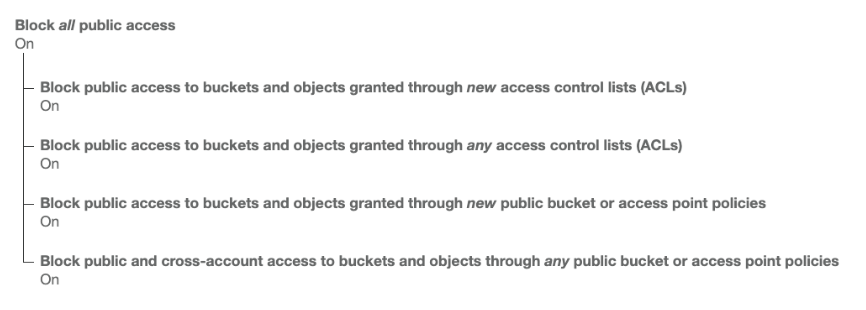
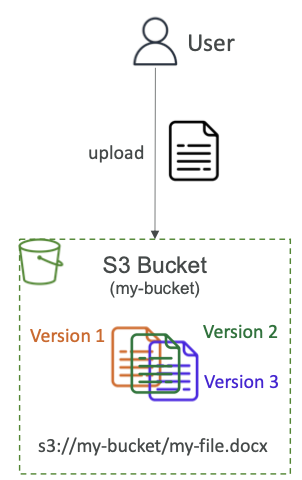

## 10-1-1) Amazon S3

- **Amazon S3 > Buckets > 버킷 만들기**
- `Amazon S3`는 AWS의 핵심 기능 중 하나로, `infinitely scaling` 스토리지로 홍보된다. 많은 웹 사이트들이 이를 중추로 사용하며 많은 AWS 서비스들도 Amazon S3를 결합하여 사용한다.
- 다음과 같은 사용 사례들이 존재한다.
	- 백업 / 스토리지
	- DR (Disaster Recovery)
	- 아카이브
	- 하이브리드 클라우드 스토리지
	- 애플리케이션 호스팅
	- 미디어 호스팅
	- 데이터 레이크 & 빅 데이터 분석
	- 소프트웨어 전송
	- 정적 웹

</br>

### 10-1-1-1) Buckets

- Amazon S3는 `object`(파일)들을 `bucket` (디렉토리)에 저장할 수 있도록 한다.
- **버킷은 전역적으로 (모든 AZ, region, 계정을 통틀어서) 고유한 이름**을 가져야 한다.
	- 대문자, 언더바 금지
	- 3-63 글자수
	- IP 이름 금지
	- 소문자나 숫자로 시작해야 하며
	- `xn--` 접두어 금지
	- `-s3alias` 접미어 금지
- S3는 글로벌 서비스처럼 보이지만 **버킷 자체는 region 단위에서 생성**된다.

</br>

### 10-1-1-2) Objects

- `Object`(files)는 `Key`를 갖는다. key는 경로의 형태로 아래와 같다.
	- s3://my-bucket/<font color="#4bacc6">my_folder</font>/<font color="#4bacc6">another_folder</font>/<font color="#9bbb59">my_file.txt</font>
- `Key`는 prefix와 object 이름으로 구성되어 있는데, 여기서 prefix는 실제 디렉토리 컨셉이 아니라 그냥 슬래시(/)가 포함된 긴 이름의 형태이다.
- Object의 `Value`는 내용에 해당하며 **최대 5TB(5000GB)** 까지 저장 가능하고 **5GB 이상의 오브젝트는 `multi-part upload`를 사용**해야 한다.
- `Metadata` text key / value 쌍의 리스트이며, 시스템이나 사용자 메타데이터가 저장된다.
- `Tags` 고유한 key / value 쌍이며 최대 10개까지 존재한다. 보안이나 Lifecycle 관리에 유용하다.
- `Versioning ID`는 각 오브젝트의  같은 이름의 오브젝트를 버전 관리하기 위한 값이며 랜덤한 Hash 값으로 생성된다. 따로 활성화를 해야 기록된다.

</br>

## 10-1-2) Amazon S3 Security And Bucket Policies

- **Amazon S3 > Buckets > Permissions**
- User-Based
	- **IAM Policies**
		- API 호출을 위해서는 특정한 IAM을 부여받은 유저들만 허용된다. 
		- 혹은 특정한 IAM Instance Role을 부여받은 EC2 Instance들만 접근 가능하다.
- Resource-Based
	- **Bucket Policies**: S3 콘솔로부터 **버킷 전역에 부여되는 규칙으로 계정을 넘어서 적용 가능**하다.
	- **Object Access Control List (ACL)**: 세밀한 적용 (비활성화 가능)
	- **Bucket Access Control List (ACL)**: 덜 보편적이다 (비활성화 가능)
- (User IAM이 허용 **or** 리소스 정책이 허용) **and** 명시적인 부인가 없을 때 (IAM 이나 리소스 정책보다 우선된다.) => S3 오브젝트에 접근이 허용된다.

</br>

### 10-1-2-1) S3 Bucket Policies

- JSON 기반의 정책
	- **Resources**: 버킷과 오브젝트
	- **Effect**: 허용 / 거절
	- **Actions**: API 허용 / 거절
	- **Principal**: 정책이 적용될 계정 / 유저
- 다음의 경우 `Bucket Policies` 를 사용한다.
	- 버킷에 public access를 부여할 때
	- 업로드 시 암호화를 강제할 때
	- 다른 계정에 권한을 부여해줄 때

```json
{
	"Version": "2012-10-17",
	"Statement": [
		{
			"Sid": "PublicRead",
			"Effect": "Allow",
			"Principal": "*",
			"Actions": [
				"s3:GetObject"
			],
			"Resource": [
				"arn:aws:s3:::examplebucket/*"
			]
		}
	]
}
```

</br>

### 10-1-2-2) Bucket settings for Block Public Access

- **법인에서 데이터의 유출을 막기 위해 다음과 같이 설정한다.**
- 버킷이 Public하게 공유되지 않아야 한다면, 모두 On으로 남겨두어야 하며, 계정 단위로 아래와 같이 설정할 수 있다.

<div align="left">
  
</div>
</br>

## 10-1-3) Amazon S3 Static Website Hosting

- **Amazon S3 > Buckets > Properties > Static Website Hosting**
- S3는 정적 웹 호스팅이 가능하며, Internet을 통해 접근가능하도록 할 수 있다.
- 웹사이트 URL은 리전에 따라 다르지만 보통은 다음과 같다.
	- http://<font color="#4bacc6">bucket-name</font>.s3-website-<font color="#4bacc6">aws-region</font>.amazonaws.com
	- http://<font color="#4bacc6">bucket-name</font>.s3-website.<font color="#4bacc6">aws-region</font>.amazonaws.com
- 만약 접근 시 403 Forbidden 에러가 리턴된다면, **버킷 정책중 Public Read를 허용했는지 확인**해봐야 한다.

</br>

## 10-1-4) Amazon S3 Versioning

- **Amazon S3 > Buckets > Properties > Bucket Versioning**
- Amazon S3에서 파일을 버저닝할 수 있다.
- **버킷 단위에서 활성화**할 수 있다.
- 같은 키를 Overwrite되도록 업로드하며 버전이 바뀌면서 히스토리가 기록될 것 이다.
- 다음과 같은 경우에 유용하게 사용될 수 있다.
	- 의도치 않은 삭제를 막을 때 (특정 버전을 복구하여 살려낼 수 있다.)
	- 이전 버전으로 롤백
- **버저닝을 활성화 하기 전의 버저닝되지 않은 파일들의 버전은 `null`로 기록된다.**
- 버저닝을 중단해도 **이전에 기록된 버전은 삭제되지 않는다**.

<div align="left">
  
</div>
</br>

## 10-1-5) Amazon S3 Replication

- **Amazon S3 > Buckets > Replication Rules**
- Replication을 행하고자 하는 **소스 / 타겟 버킷들의 버저닝을 활성화**해야만 한다.
	- Cross-Region Replication (CPR)
		- **컴플라이언스 문제, 접근 지연 감소, 계정간 복사 지원**
	- Same-Region Replication (SRR)
		- **로그 통계, 운영/테스트 계정간 라이브 레플리케이션**
- 버킷들은 서로 다른 AWS 계정일 수도 있다.
- 복사 과정은 **비동기적으로 백그라운드**에서 진행된다.
- S3에 적절한 IAM 권한을 부여해야 한다.
- Replication을 활성화한 뒤부터 새롭게 추가된 오브젝트들만 복사된다.
- Replication Rule 생성 이전의 오브젝터들을 옮기기 위해서는 `Batch Operation`을 설정해야 한다.
- 이를 통해 기존재하던 오브젝트와 복사에 실패한 오브젝트들이 복사되도록 설정할 수 있다.
- **삭제 마커된 오브젝트를 복제하기 위해서는 `Delete marker replication`을 설정**해야 한다.
	- Version ID의 삭제는 복사되지 않는다. (오동작 방지를 위함)
- **`chaining replication`은 없다.**
	- 예를들어, 버킷 1 -> 버킷 2 -> 버킷 3 순으로 **연달아 복사는 불가**하다.

</br>

## 10-1-6) Amazon S3 Storage Class

- **Amazon S3 > Buckets > Properties > Storage Class**
- **Amazon S3 > Buckets > Manamgement > Lifecycle Rules**
- Amazon S3에는 다양한 스토리지 클래스들이 존재하며, 수동으로 혹은 `S3 Lifecycle Configuration`을 통해 변경 가능하다.
- **Duratility (내구성)**
	- **여러 AZ간의 높은 내구성을 가짐**
	- 만약 10,000,000 개의 오브젝트가 S3에 있다면, 10,000년마다 한 번 정도 단일 Object의 손실이 예상된다.
	- 모든 스토리지 클래스에서 동일.
- **Availability (고가용성)**
	- 스토리지 클래스마다 조금씩 다르다.

</br>

### 10-1-6-1) S3 Standard - General Purpose

- **99.9%의 고가용성**
	- 동시에 2개의 시설 고장도 견딜 수 있다.
- 빈번하게 접근되는 데이터에 사용됨
- **저지연, 높은 처리량**
- 빅 데이터 분석 & 모바일 / 게임 애플리케이션 / 콘텐츠 분산 등에 이용하기 적합하다.

</br>

### 10-1-6-2) S3 Storage Classes - Infrequent Access

- **덜 자주 접근되나 빠른 접근 속도**를 위한 데이터에 사용된다.
- S3 Standard보다 비용적으로 저렴하다.
- **Amazon S3 Standard-Infrequent Access (S3 Standard-IA)**
	- 99.9% 고가용성
	- DR (Disaster Recovery), 백업
- **Amazon S3 One Zone-Infrequent Access (S3 One Zone-IA)**
	- 같은 AZ 내에서는 내구성 99.9999...%, 하지만 AZ 장애시 손실 발생
	- 99.5% 고가용성
	- 온프레미스 서버의 세컨더리 백업, 재생성 가능한 데이터 저장

</br>

### 10-1-6-3) S3 Glacier Storage Class

- 아카이빙 / 백업용의 저비용 오브젝트 저장소
- 스토리지 비용 + 오브젝트의 검색 비용으로 책정된다.
- **Amazon S3 Glacier Instant Retrieval**
	- **밀리 세컨드 단위의 회수 속도, 분기에 한번 정도 접근**하는 데이터에 유용
	- 최소 **90일의** 보관 기관
- **Amazon S3 Glacier Flexible Retrieval**
	- 공식적으로 Amazon S3 Glacier를 의미한다.
	- 데이터 회수 기간에 따라 다음과 같이 나뉜다.
		- **Expedited (1~5 분), Standard (3~5 시간), Bulk (5~12 시간) (무료)**
	- 최소 **90일의** 보관 기간
- **Amazon S3 Glacier Deep Archive**
	- Standard (12시간), Bulk (48시간)의 회수 속도
	- 최소 **180일의** 보관 기간

</br>

### 10-1-6-4) S3 Intelligent Tiering

- 소규모의 월간 모니터링과 자동 티어링 비용이 발생한다.
- 오브젝터의 사용량에 따라 Access Tier간에 자동적으로 이동시킨다.
- S3 Intelligent-Tiering 시 발생하는 회수 비용은 없다.
	- Frequent Access tier (automatic): default tier
	- Infrequent Access tier (automatic): 30일간 접근하지 않은 오브젝트
	- Archive Instant Retrieval tier (automatic): 90일간 접근하지 않은 오브젝트
	- Archive Access tier (optional): 90 ~ 700+일간 접근하지 않았을 때 설정 가능
	- Deep Archive Access tier (optional): 180 ~ 700+일간 접근하지 않았을 때 설정 가능
