## 10-2-1) S3 Lifecycle Rules

- **Amazon S3 > Buckets > Lifecycle configuration > Create lifecycle rule**
- 오브젝트들을 스토리지 클래스 간 이동을 자동화시키기 위해서는 `Lifecycle Rules`을 사용해야 한다.
- `Transition Actions`: **오브젝트를 다른 스토리지 클래스로 이동**시키기 위해 설정
	- 오브젝트 생성 60일 뒤에 Standard IA로 이동
	- 6달 뒤에는 Gracier Tier로 이동
- `Expiration Actions`: **특정 기간 이후에 오브젝트를 파기(삭제)** 하기 위해 설정
	- Access 로그 파일을 365일 뒤에 삭제되도록 설정
	- 이전 버전의 파일들을 삭제 (버저닝이 활성화되어 있을 때)
	- 실패한 Multi-Part 업로드 오브젝트를 삭제
- 규칙은 특정 **prefix**에 생성될 수 있다. (e.g. s3://mybucket/mp3/*)
- 규칙은 특정 **Object Tag**에 생성될 수 있다. (e.g. Department: Finance)

</br>

## 10-2-2) Amazon S3 Analytics - Storage Class Analysis

- 당신이 오브젝트를 올바른 스토리지 클래스로 옮기는 것을 결정하도록 도와준다.
- Standard와 Standard IA를 위한 추천 (One-Zone IA나 Gracier로의 이동 분석을 도와주지는 않는다.)
- **Report는 매일 갱신**되며
- 데이터 분석을 보기 위해서는 최초 24 ~ 48시간이 필요하다.

</br>

## 10-2-3) S3 Requester Pays

- 일반적으로, 버킷 소유자는 버킷과 연관된 모든 Amazon S3 스토리지와 데이터 송신 비용을 지불한다.
- **`Requester Pays bucket`을 통해 버킷의 소유자 대신 요청자가 요청과 데이터 다운로드에 대한 비용을 지불**하게 할 수 있다.
- 다른 계정들과 큰 규모의 데이터를 공유할 때 유용한다.
- 이 때 지불을 전가하고자 하는 다른 계정들은 모두 **AWS에 인가되어 있어야 한다**.

<div align="left">
  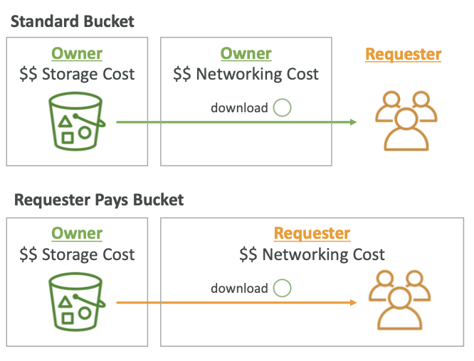
</div>
</br>

## 10-2-4) S3 Event Notification

- **Amazon S3 > Buckets > Properties > Event Notifications**
- **Amazon S3 > Buckets > Properties > Amazon SQS Queue**
- S3:ObjectCreated, S3:ObjectRemoved, S3:ObjectRestore, S3:Replication과 같은 이벤트 발생 시에 대한 알람을 처리하도록 할 수 있다.
- Object 이름으로 필터링 가능하다.
	- 사용사례로는 S3에 업로드되는 이미지의 썸네일 생성에 사용 가능하다.
- 원하는 만큼 S3 이벤트들을 생성할 수 있다.
- S3 이벤트 알람은 통상적으로 수 초내에 발송되지만, 수 분 내에 발송될 수도 있다.

<div align="left">
  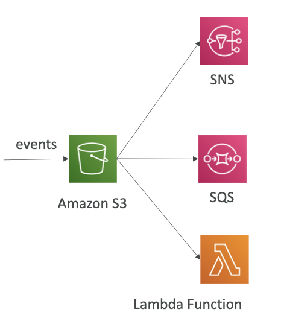
</div>
</br>

- **Amazon SNS Resource (Access) Policy**

```json
{
	"Version": "2012-10-17",
	"Statement": {
		"Effect": "Allow",
		"Action": "SNS:Publish",
		"Principal": {
			"Service": "s3.amazon.com"
		},
		"Resource": "arn:aws:sns:us-east-1:123456789012:MyTopic",
		"Condition": {
			"ArnLike": {
				"aws:SourceArn": "arn:aws:s3:::MyBucket"
			}
		}
	}
}
```

</br>

- **Amazon SQS Queue Resource (Access) Policy**

```json
{
	"Version": "2012-10-17",
	"Statement": {
		"Effect": "Allow",
		"Action": "SQS:SendMessage",
		"Principal": {
			"Service": "s3.amazon.com"
		},
		"Resource": "arn:aws:sqs:us-east-1:123456789012:MyQueue",
		"Condition": {
			"ArnLike": {
				"aws:SourceArn": "arn:aws:s3:::MyBucket"
			}
		}
	}
}
```

</br>

- **Amazon Lamda Resource Policy**

```json
{
	"Version": "2012-10-17",
	"Statement": {
		"Effect": "Allow",
		"Action": "lamda:InvokeFunction",
		"Principal": {
			"Service": "s3.amazon.com"
		},
		"Resource": "arn:aws:lamda:us-east-1:123456789012:MyFunction",
		"Condition": {
			"ArnLike": {
				"aws:SourceArn": "arn:aws:s3:::MyBucket"
			}
		}
	}
}
```

</br>

- **Amazon EventBridge**

<div align="left">
  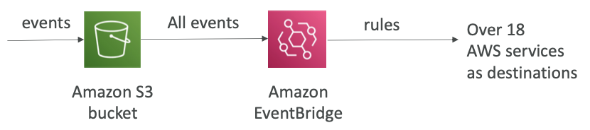
</div>
</br>

- JSON 규칙에 대한 더 발전된 필터링 옵션을 제공한다. (metadata, object size, name ...)
- 여러 목적지에 발송 가능: Step Functinos, Kinesis Streams, Firehose ...
- EventBridge 기능 사용 가능: Archive, Replay Events, Reliable delivary

## 10-2-5) S3 Baseline Performance

- Amazon S3는 자동적으로 많은 요청에 스케일링을 하여 지연이 100-200ms로 유지되도록 한다.
- 당신의 애플리케이션은 버킷의 prefix당 + 초당 최소 3500 PUT/COPY/POST/DELETE 요청 혹은 5500개의 GET/HEAD 요청을 처리할 수 있다.
- 버킷 내에 prefix의 수의 제한은 없다. 따라서 prefix를 적절히 분산한다면 최대 수용 요청 수를 늘릴 수 있다. 

</br>

### 10-2-5-1) Multi-Part upload

- **100MB 이상의 파일 업로드 부터 추천되며, 5GB 이상의 파일에는 무조건 적용**되어야 한다.
- **병렬 업로드**를 통해 전송 속도를 향상시키는데 도움을 준다.

<div align="left">
  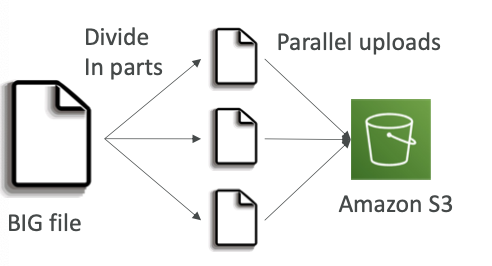
</div>
</br>

### 10-2-5-2) S3 Transer Acceleration

- 타겟 리전 내의 S3 버킷으로 데이터를 전송할 **AWS edge location으로 파일을 전송하여 전송속도를 향상**시킨다. (region to region)
- multi-part upload와 병행하여 사용 가능하다.

<div align="left">
  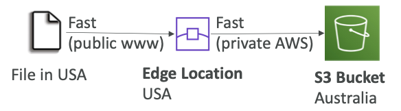
</div>
</br>

### 10-2-5-3) S3 Byte-Range Fetches

- GET Object 요청에서 **Range HTTP 헤더를 사용하면 오브젝트에서 바이트 범위를 가져와 지정된 부분만 전송**할 수 있다.
- Amazon S3에 대한 동시 연결을 사용하여 **동일한 오브젝트 내에서 서로 다른 바이트 범위를 가져올 수 있다**. 이를 통해 전체 오브젝트 요청 한 건에 비해 집계 처리량을 높일 수 있습니다.

<div align="left">
  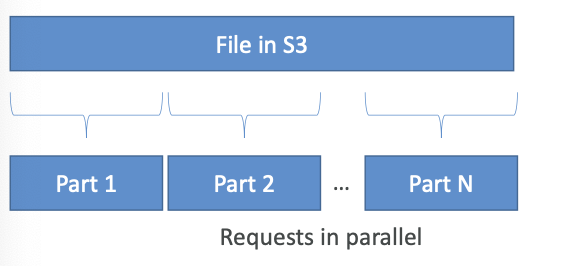
</div>
</br>

- 더 작은 범위의 큰 오브젝트(헤더 부분)을 가져와 요청이 중단되었을 때 애플리케이션의 재시도 횟수를 개선할 수도 있다. 이러한 특성 덕에 실패 회복에 더 강하다.

<div align="left">
  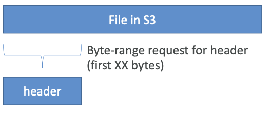
</div>
</br>

## 10-2-6) S3 Batch Operations

- 존재하는 S3 오브젝트에 대한 단일 요청에 bulk operation을 수행할 수 있다.
	- **오브젝트 metadata & 속성 수정**
	- **S3 버킷 간 오브젝트 복사**
	- **암호화되지 않은 오브젝트 암호화**
	- ACL, 태그 수정
	- S3 Glacier로부터 오브젝트 복구
	- 각 오브젝트에서 커스텀한 행동 수행을 위해 Lamda function 발생시키기
- object 리스트로, 수행할 행동, 옵셔널 파라미터들로 구성된 Job
- `S3 Batch Operations`는 재시도, 절차 트래킹, 완료 노티 발송, 리포트 생성 등을 관리한다.
- 오브젝트 리스트와 오브젝트 쿼리 / 필터를 위한 안테나를 사용하기 위해 S3 Inventory를 사용할 수 있다.

<div align="left">
  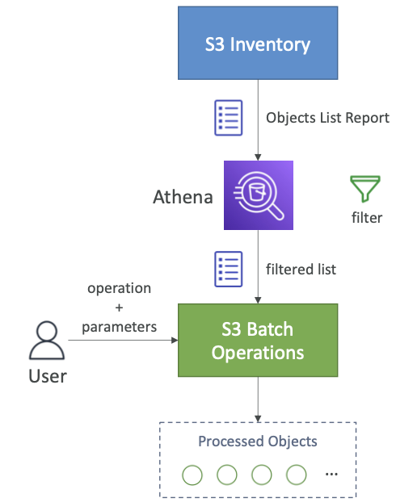
</div>
</br>

## 10-2-5) S3 Storage Lens

- **전체 AWS 조직의 스토리지들을 이해 / 분석 / 최적화할 수 있는 도구**
- 이상 징후를 발견하고, 비용 효율성을 파악하며, AWS 조직 전체에 걸쳐 데이터 보호 모범 사례를 적용한다.
- 조직, 특정 계정, 지역, 버킷 혹은 접두어(prefix)의 데이터 취합
- 기본 대시보드 혹은 자신만의 대시보드 생성
- S3 버킷으로 CSV / Parquet 형태의 일간 메트릭 정보 export 하도록 설정 가능

<div align="left">
  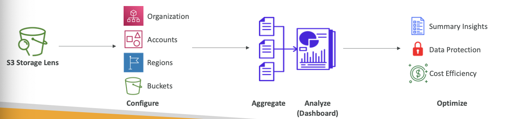
</div>
</br>

### 10-2-5-1) Default Dashboard

- 무료 / advanced metric들에 대한 경향과 인사이트 요약하여 시각화
- Default Dashboard는 멀티 리전/계정 데이터를 보여준다.
- Amazon S3에 의해 사전에 설정됨
- 삭제될 수 없지만, 비활성화는 가능.

<div align="left">
  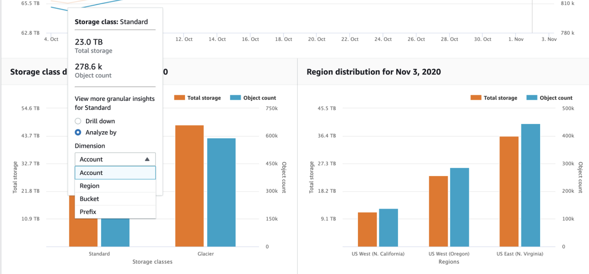
</div>
</br>

### 10-2-5-2) Metrics

- **Summary Metrics**
	- S3 스토리지에 대한 보편적인 인사이트
	- StorageBytes, ObjectCount
	- 빠르게 성장하는 버킷과 prefix 식별하는데 사용
- **Cost-Optimization Metrics**
	- 스토리지 비용을 최적화하고 관리하기 위한 인사이트 제공
	- NonCurrentVersionStorageBytes, IncompleteMultipartUploadStorageBytes...
	- 7일 이상 업로드가 완료되지 못한 버킷 식별, 더 적은 비용의 스토리지 클래스로 전환 가능한 오브젝트 식별 등에 이용할 수 있다.
- **Data-Protection Metrics**
	- 데이터 보호 기능을 위한 인사이트 제공
	- VersioningEnabledBucketCount,MFADeleteEnabledBucketCount, SSEKMSEnabledBucketCount, CrossRegionReplicastionRuleCount...
	- 최선의 데이터 보호 정책을 따르지 않은 버킷 식별
- **Access-management Metrics**
	- S3 오브젝트 소유에 대한 인사이트 제공
	- ObjectOwnershipBucket, OwnerEnforcedBucketCount...
	- 사용중인 버킷들의 오브젝트 소유권 식별
- **Event Metrics**
	- S3 Event Notification에 대한 인사이트 제공
	- EventNotificationEnabledBucketCount
	- 어떤 버킷이 S3 Event Notification이 설정되었는지 식별
- **Performance Metrics**
	- S3 Transfer Acceleration에 대한 인사이트 제공
	- TransferAccelerationEnabledBucketCount
	- S3 Transfer Acceleration 활성화된 버킷 식별
- **Activity Metrics**
	- 어떻게 스토리지가 요청되었는지에 대한 인사이트 제공
	- AllRequests, GetRequests, PutRequests, ListRequests, BytesDownloaded....
- **Detailed Status Code Metrics**
	- HTTP 상태 코드에 대한 인사이트 제공
- **Free Metrics**
	- 모든 사용자에게 자동적으로 이용가능
	- 28개 가량의 메트릭 포함
	- 14일간 쿼리 가능
- **Advanced Metrics and Recommendations**
	- 추가 비용 시의 메트릭과 기능
	- Advanced Metrics - Activity, Advanced Cost Optimization, Advanced Data Protection, Status Code
	- CloudWathcing Publishing - 추가 비용 없이 CloudWatch의 Metric 접근
	- Prefix Aggregation - Prefix단위에서의 Metric 수집
	- 15달간 쿼리 가능

<div align="left">
  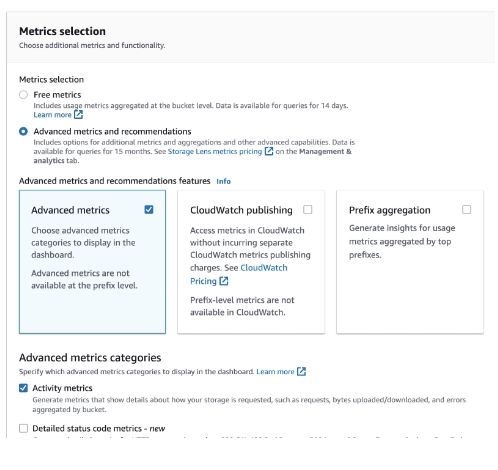
</div>
</br>

### 10-2-5-3) S3 Select 

- **S3 Glacier에 저장된 데이터에 쿼리를 날려서, 필요한 데이터만 다운받을 수 있게 해주는 기능.**
