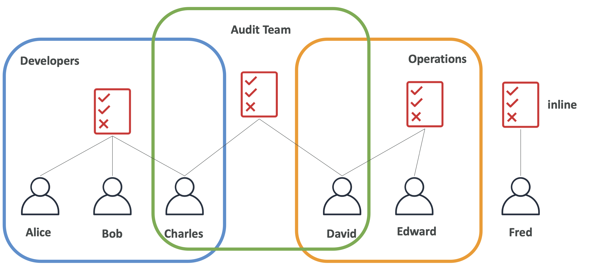

## 1-1-1) Users & Group

- `IAM(Identity and Access Management)`은 사용자를 생성하고 그룹에 배치하여 권한을 조정할 수 있는 글로벌 서비스이다.
- `Root 계정(Root Account)`은 기본적으로 생성되며, 오직 계정을 생성할 때만 사용되어야 하며 공유되어서도 안된다.
- `User`는 조직 내에서 사용되는 한 사람의 계정을 의미하며 `Group`으로 묶일 수 있다. 그룹에 묶이지 않아도 상관은 없고, 여러 그룹에 동시에 존재할 수도 있다.
- `Group`은 같은 권한을 가진 유저들을 포함하며, **다른 그룹이 포함될 수 없다**.

</br>

- 유저와 그룹에는 `policy`라는 권한을 정의하는 JSON 문서가 적용될 수 있다.
- AWS에서는 모든 사용자에게 모든 권한을 허용하지 않는다. 보안 문제를 야기할 수 있기 때문에 최소한의 권한 원칙을 적용한다. (화이트리스트 방식이다.)
- AWS에서는 **각 리소스에 태그를 부여**할 수 있다. (key-value의 형태로 저장 가능하다.)

</br>

## 1-1-2) IAM Policies

- 아래와 같이 각 유저는 그룹에 속할 수 있고, 그룹에 지정된 Policy를 상속받는다. 여러 개의 그룹에 속한 유저는 해당 그룹들의 모든 Policy들을 상속받는다. 어느 그룹에도 속하지 않은 유저는 `inline policy`를 상속받게 지정할 수도 있다.

</br>

<div align="left">
  
</div>
</br>

- Policy는 다음과 같은 요소들로 이루어져 있다.
- `Version`: policy 언어 버전. 항상 2012-10-17를 포함하고 있다.
- `Id`: policy의 식별자 (Optional)
- `Statement`: 각 정책들을 나타낸다 (Required)
	- `Sid`: 각 Statement들을 구분하는 식별자 (Optional)
	- `Effect`: 각 Statement들의 정책 (Allow / Deny)
	- `Principal`: Policy가 적용될 account/user/group.
	- `Action`: Policy가 허용 / 거부될 Action들을 정의
	- `Resources`: Action들이 적용될 Resource들의 리스트.
	- `Condition`: Policy가 적용될 조건 (Optional)
- 간단히 말해 누가(Principal) 대상(Resource)에 작업(Action)을 조건(Condition)에 따라 허용(Effect)할지 말지를 정해 놓은 정책을 말한다. 그런데 이 정책이 적용할 대상은 Identity 가 될 수도 resource 가 될 수도 있다.

</br>

```json
{
	"Version": "2012-10-17",
	"Statement": [
		{
			"Sid": "1",
			"Effect": "Allow",
			"Action": "ec2:Describe*",
			"Resource": "*"
		},
		{
			"Sid": "2",
			"Effect": "Allow",
			"Action": "elasticloadbalancing:Describe*",
			"Resource": "*"
		},
		{
			"Sid": "3",
			"Effect": "Allow",
			"Principal": {
				"AWS": ["arn:aws:iam:123456789012:root"]
			},
			"Action": [
				"cloudwatch:ListMetrics",
				"cloudwatch:GetMetricStatistics",
				"cloudwatch:Describe*"
			],
			"Resource": "*"
		}
	]
}
```
</br>
