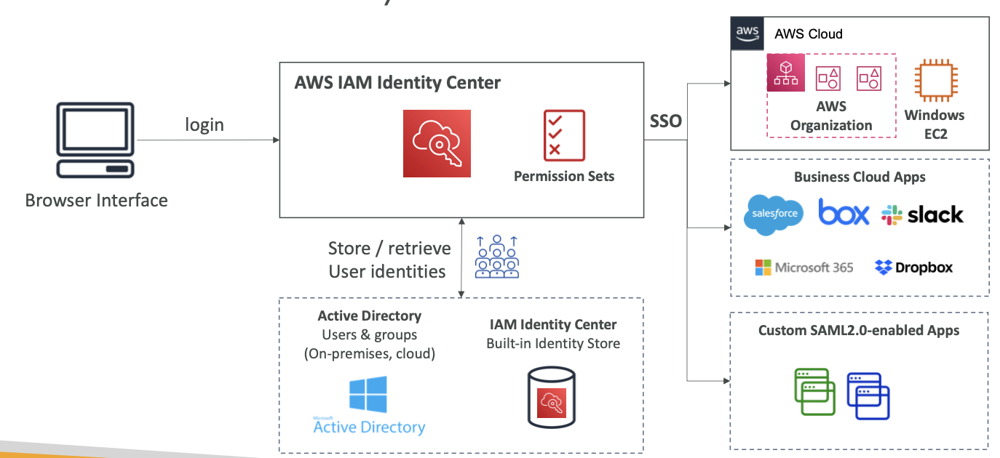
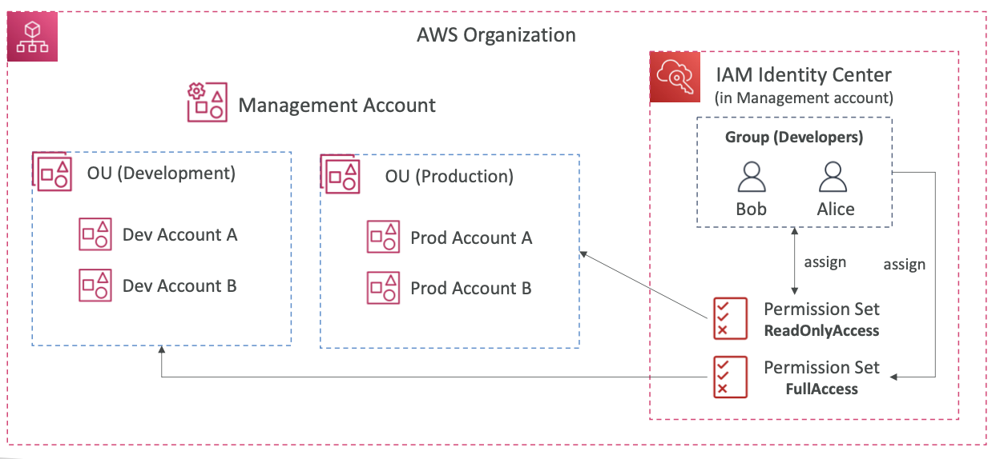
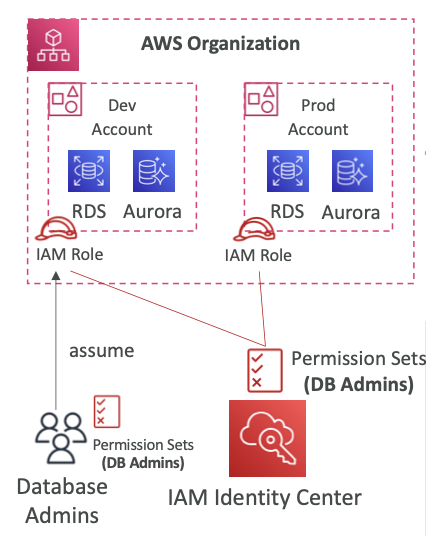

- 한 번의 로그인 (Single Sign-On)으로 다음 서비스들에 자동으로 로그인 연동을 제공
	- AWS accounts in AWS Organizations
	- Business cloud applications (Salesforce, Box, Microsoft 365)
	- SAML2.0-enabled applications
	- EC2 Windows Instances
- 개인정보 제공자들
	- IAM Identity Center내의 빌트인 개인정보 저장소
	- 서드 파티: Active Directory (AD), OneLogin, Okta...

 

  

 

  

 

- **다중 계정 권한**
	- AWS 조직 내의 AWS 계정들 간에 액세스를 관리합니다.
	- 권한 설정 - AWS 접근을 정의하기 위해 하나 혹은 여러 개의 IAM 정책들의 모음을 유저, 그룹에 할당
- **Application 권한 설정**
	- 많은 SAML 2.0 비즈니스 애플리케이션들 (Salesforce, Box, Microsoft 365) 로의 SSO 접근
	- 필요한 URL, 인증, 메타데이터 제공
- **속성 기반 접근 제어 (ABAC, Attribute-Based Access Control)**
	- IAM Identity Center Identity Store에 저장된 유저의 속성에 기반한 세밀한 권한 제어
	- 권한을 정의하고, 속성을 변경하여 AWS 접근을 수정할 때 설정

 

  

 
