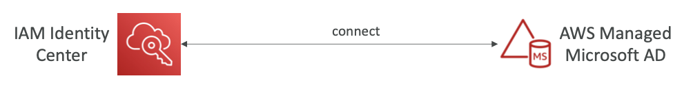
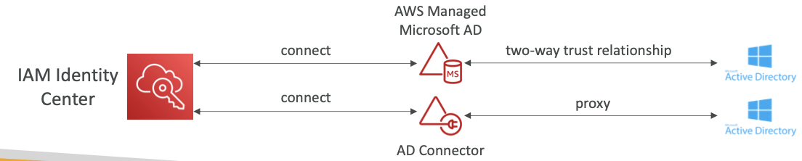

## 1-11-0) What is Microsoft Active Directory (AD)

- AD 도메인 서비스를 사용하는 어떠한 Windows Server에서도 찾아볼 수 있다.
- 오브젝트들의 데이터베이스: 유저 계정, 컴퓨터, 프린터, 파일 공유, 보안 그룹등을 저장
- 중앙화된 보안 관리, 계정 생성, 권한 부여
- 오브젝트들은 트리로 조직된다.
- 트리들의 그룹은 숲(forest)이다.

 

## 1-11-1) AWS Directory Services

- **AWS Managed Microsoft AD**
	- AWS 내에 AD를 생성하고, 유저를 지역적으로 관리, MFA 지원
	- 온프레미스 AD와의 "신뢰" 생성 및 연결
- **AD Connector**
	- 온프레미스 AD로 리다이렉트 해주는 Directory Gateway (proxy)의 역할을 하며, MFA를 지원
	- 온프레미스 AD를 관리
- **Simple AD**
	- AWS의 AD 양립가능한 관리형 디렉토리
	- 온프레미스 AD를 사용 불가능할 때 사용

 

## 1-11-2) IAM Identity Center - Active Directory Setup

- AWS Managed Microsoft AD로의 연결
	- 통합이 기본적으로 제공된다.

  

 

- Self-Managed Directory로의 연결
	- AWS Managed Microsoft AD를 통한 양방향 관계 설정
	- AD Connector 생성

  

 
