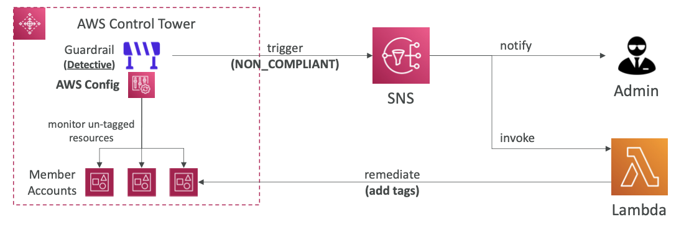

- **모범 사례를 기반으로 안전하고 규정 준수에 적합한 다중 계정 AWS 환경을 손쉽게 설정하고 관리할 수 있는 방법**
- 계정 생성을 위해 AWS Organization을 사용한다.
- 장점
	- 몇 번의 클릭으로 손쉽게 환경 설정 가능
	- `Guardrails`을 사용하여 동작중인 정책 자동화
	- 정책 위반 감지와 수정
	- 상호작용 대시보드를 통한 컴플라이언스 모니터링

 

## 1-12-1) AWS Control Tower - Guardrails

- Control Tower 환경(AWS 계정)에 대한 지속적인 거버넌스를 제공
- 예방형 Guardrail - SCP 사용 (모든 계정에 걸친 리전 제한)
- 감지형 Guardrail - AWS Config 사용 (태그되지 않은 리소스 식별)

  

 
