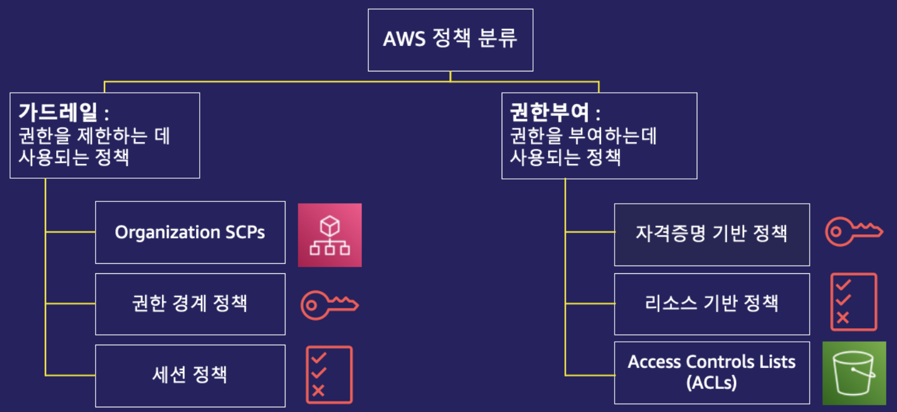
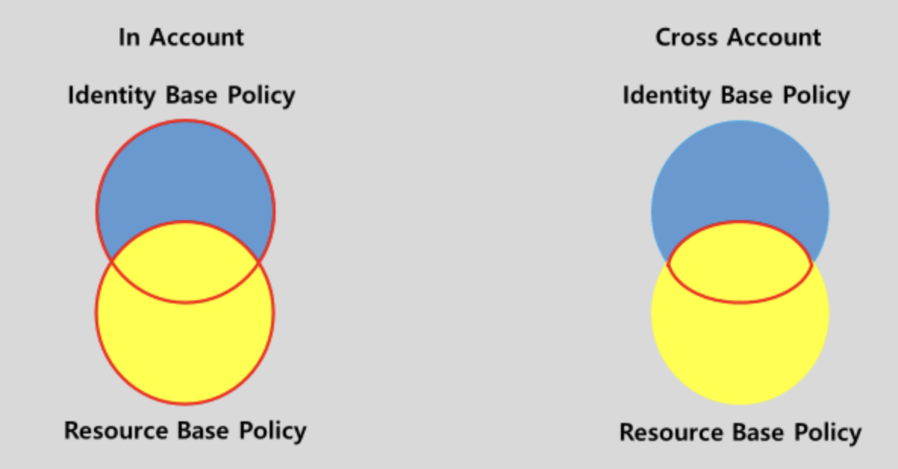

## 1-2-1) IAM Policy 분류

<div align="left">
  
</div>
</br>

- **권한을 제한하는 정책 (Guardrail)**
1. 조직 SCP 정책 (Organization SCPs)
2. 권한 경계 정책 (Permissions boundaries)    
3. 세션 정책 (Session policies)

</br>

- **권한을 부여하는 정책 (Grant)**
1. 자격증명 기반 정책 (Identity-based Policies)
	1. AWS 관리형 정책 (AWS Managed Policies): AWS에서 제공하는 글로벌 적용 가능 정책
    2. 고객 관리형 정책 (Customer Managed Policies): 고객이 직접 생성하여 고객 계정에서만 사용 가능한 정책
    3. 인라인 정책 (In-line policies): 단일 사용자 그룹 역할에 직접 추가하는 정책 (재활용 불가)
2. 리소스 기반 정책 (Resource-based policies)
3. 액세스 제어 리스트 (Access Control Lists, ACLs)

</br>

## 1-2-2) 자격증명 기반 정책

- 자격증명 기반 정책은 보안주체(**IAM User, Group, Role**)이 수행할 수 있는 작업,리소스 및 조건을 제어하는 JSON 권한 정책 문서
- **누가(Principal)** 대상(Resource)에 작업(Action)을 조건(Condition)에 따라 허용여부(Effect)를 결정하는 정책으로, 누가에 해당하는 것은 사용자를 의미한다. 따라서 Principle은 생략될 수 있다.

</br>

### 1-2-2-1) AWS 관리형 정책 (AWS Managed Policies)

- AWS에서 생성 및 관리하는 독립적인 정책이다. 여기에서 독립적인 정책이란 정책 스스로 정책 이름이 포함된 Amazon 리소스 이름(ARN)을 갖고 있다는 것을 의미한다. AWS 에서 대부분 제공되는 정책으로, 글로벌하게 적용된다.

</br>

### 1-2-2-2) 고객 관리형 정책 (Customer Managed Policies)

- 사용자 자신의 AWS 계정에서 관리하도록 생성할 수도 있다. 이러한 정책을 고객 관리형 정책이라고 한다. 이렇게 생성된 정책은 AWS 계정에 속한 다수의 보안 주체 엔터티에 추가할 수 있다.

</br>

### 1-2-2-3) 인라인 정책 (In-line Policies)

- 단일 사용자 그룹 역할에 직접 추가하는 정책 (재활용 불가)

</br>

## 1-2-3) 권한 경계

- 권한 경계는 자격 증명 기반 정책을 통해 IAM 엔터티에 부여할 수 있는 최대 권한을 설정하는 고급 기능이다. 엔터티에 대한 권한 경계를 설정할 경우 해당 엔터티는 자격 증명 기반 정책 및 관련 권한 경계 모두에서 허용되는 작업만 수행할 수 있다. **사용자나 역할을 보안 주체로 지정하는 리소스 기반 정책은 권한 경계에 제한을 받지 않는다**.
- 이미 명시적으로 허용된 넓은 범위의 권한을 특정 사용자 또는 그룹을 대상으로 **허용범위를 제약하는 방법**으로 매우 효과적이다.

</br>

## 1-2-4) 리소스 기반 정책

- **대상(Resource)** 이 누구(Principal) 에 작업(Action)을 조건(Condition)에 따라 허용 여부(Effect)를 결정하는 것을 의미한다. 즉, 리소스가 사용자에게 거는 정책으로, Identity와 다르게 Principle이 지정되어 있어야 한다.
- 지정된 보안 주체에 해당 리소스에 대한 특정 작업을 수행할 수 있는 권한을 부여하고 이러한 권한이 적용되는 조건을 정의한다. 리소스 기반 정책은 인라인 정책입니다. 관리형 리소스 기반 정책은 없다.

</br>

```json
{
	"Version": "2012-10-17",
	"Statement": [
		{
			"Sid": "Statement1",
			"Principal": {"AWS":"arn:aws:iam::본인의AccountID:user/Dev-Intern"},
			"Effect": "Allow",
			"Action": "s3:*",
			"Resource": "버킷ARN/*"
		}
	]
}
```

| 자격증명 기반                             | 리소스 기반                                 |
| ----------------------------------- | -------------------------------------- |
| 사람에게 부여되는 정책                        | 대상에게 부여되는 정책                           |
| Principle을 넣을 필요가 없다.               | 반드시 Principle을 넣어야 한다.                 |
| IAM Console 에서 정책을 부여한다.            | 대상 Console에 가서 설정 가능하다.                |
| IAM Permission Boundaries에 영향을 받는다. | IAM Permission Boundaries에 영향을 받지 않는다. |

</br>

<div align="left">
  
</div>
</br>
