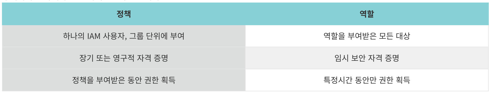

- `IAM Role`은 `IAM User`와 여러 면에서 유사하다. Policy를 통해서 특정 권한을 할 수 있거나 할 수 없도록 하는 자격 증명을 가진다. Policy는 이러한 자격 증명을 **사용자 / 사용자 그룹 / 역할에 부여**가 가능한데, 역할은 한 사람과 연관되지 않고 해당 역할이 필요한 사람이라면 누구든지 맡을 수 있다. 또한 역할에는 그와 연관된 암호 또는 액세스 키와 같은 표준 장기 자격 증명이 없다. 대신에 역할을 맡은 사람에게는 해당 역할 세션을 위한 `임시 보안 자격 증명이 제공`된다.

 

  

 

- 즉, Policy는 한 사람 / 한 그룹 단위로만 적용이 가능하지만, 여러 개의 Policy를 가진 역할은 여러 사용자에게 부여가 가능하다. 또한 Policy는 한 번 부여되면 회수되지 않는 한 영원히 권한을 가지지만, Role은 유효 시간이 지나면 자동으로 회수된다.

 

## 1-5-1 Resource Based Policies vs IAM Role

- IAM 역할은 임시 자격 증명을 사용해 다른 AWS 리소스에 접근할 수 있도록 권한을 부여하는 반면, 리소스 기반 정책은 특정 AWS 리소스(예: S3 버킷, SQS 큐) 자체에 연결되어 해당 리소스에 대한 특정 보안 주체의 접근을 제어합니다. 즉, 역할은 '어떤 신원(Identity)'이 어떤 리소스에 접근할 수 있는지를 결정하는 도구이고, 리소스 기반 정책은 '어떤 리소스'가 어떤 신원으로부터의 접근을 허용하거나 거부하는지를 정의하는 정책입니다.

 