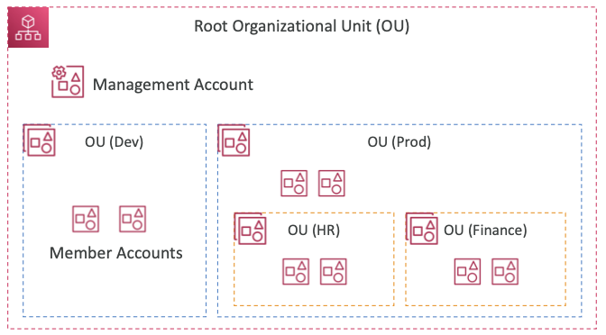
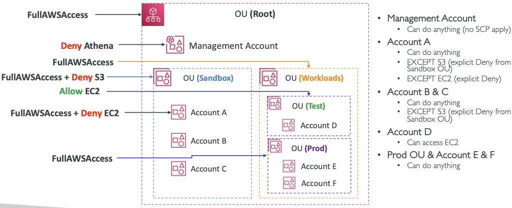
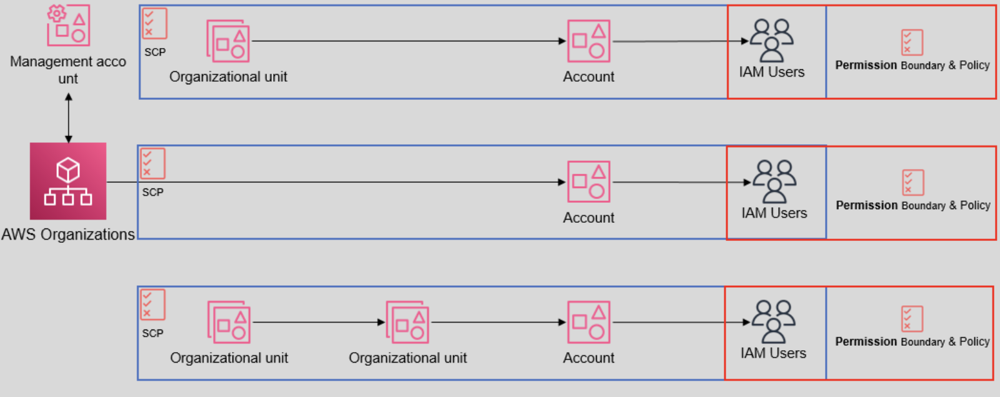

## 1-7-1) AWS Organizations

- 글로벌 서비스
- 여러 개의 **AWS 계정들을 관리하는 것을 허용**한다.
- 메인 계정은 관리용 계정이고, 다른 계정들은 멤버 계정들이다.
- **멤버 계정들은 하나의 조직의 일부만 될 수 있다**.
- 모든 계정에 대한 통합 청구된다. **모든 사용량을 취합하기 때문에 가격 정책에 이점**이 있다.
- 전체 계정에 대한 공유된 예약 자원들과 가격 할인 플랜이 존재한다.
- API를 사용하여 자동화된 AWS 계정 생성이 가능하다.

 

  

 

- **이점**
	- 하나의 계정에 **여러 개의 VPC를 사용하는 것 보다 관리 / 비용 측면의 이점**이 있다.
	- 비용 목적으로 태깅 표준을 사용한다.
	- 모든 계정에 **CloudTrail을** 활성화하여 로그를 중앙 S3 계정에 전달한다.
	- **CloudWatch** 로그들을 중앙 로그 계정에 전달한다.
	- 관리자 목적에서 계정들의 역할을 생성할 수 있다.

 

## 1-7-2) OU (Organization Unit)

- **OU는 AWS Account 들의 그룹 단위**이다.
- OU는 하위 OU를 가질 수 있다. **회사 구조를 반영할 수 있다**.
- 하나의 AWS 계정은 오직 하나의 OU에 속할 수 있다. 다른 OU에는 속할 수 없다.
- OU는 5단계 계증척 구조를 가질 수 있다

 

## 1-7-3) Service Control Policies (SCP)
- SCP는 **OU 또는 AWS account 를 대상으로 적용이 가능하고, SCP는 하위 OU에 상속**이 된다.
- 사용자와 **역할을 제한하기 위해 IAM 정책들이 OU나 계정에 적용**된다.
- 관리 계정에는 정책이 적용되지 않는다. (관리 계정이 차단되는 상황을 막기 위함)
- 루트에서 각 OU를 거쳐 대상 계정으로 직접 연결되는 명시적인 허용이 있어야 한다. (기본적으로 IAM과 같은 어떤 것도 허용하지 않음)
- 서비스 제어 정책 (SCP)는 조직에서 권한을 관리하는 데 사용할 수 있는 조직 정책 유형으로, SCP는 **조직의 모든 계정에 대해 사용 가능한 최대 권한을 중앙에서 관리**한다.

 

  

 

  

 

## 1-7-4) Management Account

- OU를 생성한 계정이다.
- 다른 AWS Account를 초대하거나 OU에서 포함시키거나 제거할 수 있다.
- 오직 하나의 마스터/루트 계정만이 존재한다.
- 이 계정은 SCP 의 영향을 받지 않는다.