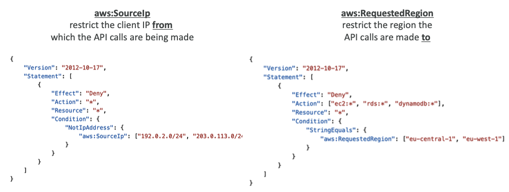
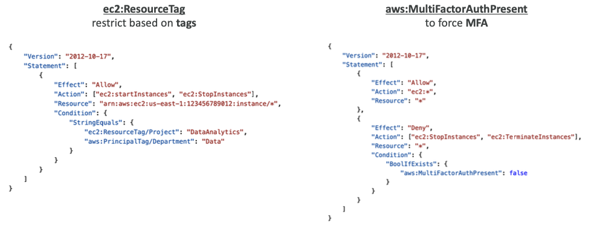
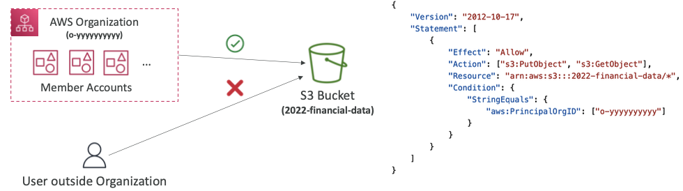

## 1-8-0) AWS Policy Conditions

<div align="left">
  
</div>
</br>

<div align="left">
  
</div>
</br>

## 1-8-1) IAM for S3

- s3:ListBucket 권한은 `arn:aws:s3:::test` -> 특정 서비스에 적용되므로 arn이 S3의 arn으로 적용됨
	- 버킷 레벨 권한
- s3:GetObject,s3:PutObject,s3:DeleteObject 는 `arn:awn:s3:::test/*`에 적용됨.
	- 객체 레벨 권한

</br>

```json
{
	"Version": "2012-10-17",
	"Statement": [
		{
			"Effect": "Allow",
			"Action": ["s3:ListBucket"],
			"Resource": "arn:aws:s3:::test"
		},
		{
			"Effect": "Allow",
			"Action": [
				"s3:PutObject",
				"s3:GetObject",
				"s3:DeleteObject"
			],
			"Resource": "arn:aws:s3:::test/*"
		}
	]
}
```
</br>

## 1-8-2) Resouce Policies

[AWS 글로벌 조건 컨텍스트 키](https://docs.aws.amazon.com/ko_kr/IAM/latest/UserGuide/reference_policies_condition-keys.html#condition-keys-principaltag)
</br>

- `aws:PrincipleOrgID`: **AWS 조직의 멤버가 아닌 계정들이 어떤 리소스로의 접근을 차단하는데 사용될 수 있다**.
</br>

```json
 {
  "Version": "2012-10-17",
  "Statement": {
    "Sid": "AllowPutObject",
    "Effect": "Allow",
    "Principal": "*",
    "Action": "s3:PutObject",
    "Resource": "arn:aws:s3:::amzn-s3-demo-bucket/*",
    "Condition": {"StringEquals":
      {"aws:PrincipalOrgID":"o-xxxxxxxxxxx"}
    }
  }
}
```
</br>

<div align="left">
  
</div>
</br>
</br>

- `aws:PrincipalOrgPaths`: AWS Organizations 경로를 정책의 경로와 비교합니다. 이 보안 주체는 IAM 사용자, IAM 역할, AWS STS 페더레이션 사용자 보안 주체 또는 AWS 계정 루트 사용자일 수 있습니다. 정책에서 이 조건 키는 **요청자가 AWS Organizations의 지정된 조직 루트 또는 조직 단위(OU) 내의 계정 멤버인지 확인합니다.**
</br>

```json
 {
  "Version": "2012-10-17",
  "Statement": {
    "Sid": "AllowPutObject",
    "Effect": "Allow",
    "Principal": "*",
    "Action": "s3:PutObject",
    "Resource": "arn:aws:s3:::amzn-s3-demo-bucket/*",
    "Condition" : { "ForAnyValue:StringLike" : {
     "aws:PrincipalOrgPaths":["o-a1b2c3d4e5/r-ab12/ou-ab12-11111111/ou-ab12-22222222/*"]
    }
  }
}
}}
```
</br>

- 이 키를 사용하여 요청한 보안 주체에 연결된 태그를 정책에서 지정한 태그와 비교합니다. 보안 주체에 둘 이상의 태그가 연결되어 있는 경우 요청 컨텍스트에는 연결된 각 태그 키에 대해 `aws:PrincipalTag` 키가 하나씩 포함됩니다.
</br>

```json
{
  "Version": "2012-10-17",
  "Statement": [
    {
      "Effect": "Allow",
      "Action": [
        "iam:Get*",
        "iam:List*",
        "iam:Generate*"
      ],
      "Resource": "*",
      "Condition": {
        "StringEquals": {
          "aws:PrincipalTag/department": "hr"
        }
      }
    }
  ]
}

```
</br>

## 1-8-3) IAM Roles vs Resource Based Policies

- `Resource Based Policies`란 지정된 보안 주체에 해당 리소스에 대한 특정 작업을 수행할 수 있는 권한을 부여하고 이러한 권한이 적용되는 조건을 정의한다. 리소스 기반 정책은 인라인 정책으로, 관리형 리소스 기반 정책은 없다.

- 여러 계정에 걸쳐서 적용된다.
	- 리소스에 resource-based policy를 적용하거나 IAM Roles를 프록시로서 사용한다.
- `역할(role)`( 사용자, 애플리케이션 또는 서비스)을 맡게 되면, **원래 가지고 있던 권한을 포기하고 해당 역할에 할당된 권한을 갖게 됩니다**.
- `Resource-based policy`를 사용하면, 가지고 있는 권한을 포기하지 않아도 된다.
- Amazon EventBridge의 경우 타겟 리소스에 대한 권한이 필요하다.
	- 규칙을 실행할 때 타겟 리소스의 권한이 필요하다. (리소스의 종류에 따라 필요한 권한의 방식이 다르다.)
	- `Resource-based policy`: Lamda, SNS, SQS, S3 buckets, API Gateway
	- `IAM Role`: EC2 Auto Scaling, Systems Manager Run Command, ECS task
