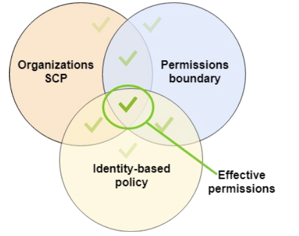

<div align="left">
  
</div>
</br>

- `IAM Permission Boundaries`는 유저와 역할을 지원한다. (not groups)
- IAM 엔티티가 가질 수 있는 최대 권한의 범위를 설정하는 규칙을 관리하기 위해 사용되는 발전된 기능.
- 아래와 같은 Permission Boundaries와 IAM Policy를 갖는 경우, 유저 생성 권한을 갖더라도 권한 범위가 s3, cloudwatch, ec2이므로 실제 행사할 수 있는 권한은 아무것도 없게 된다.

</br>

### IAM Permission Boundaries
```json
{
	"Version": "2012-10-17",
	"Statement": [
		{
			"Effect": "Allow",
			"Action": [
				"s3:*",
				"cloudwatch:*",
				"ec2:*"
			],
			"Resource": "*"
		}
	]
}
```
</br>

### IAM Permissions Through IAM Policy
```json
{
	"Version": "2012-10-17",
	"Statement": [
		{
			"Effect": "Allow",
			"Action": "iam:CreateUser",
			"Resource": "*"
		}
	]
}
```
</br>

- **AWS 조직 SCP들의 조합으로 사용될 수 있다.**
</br>

<div align="left">
  
</div>
</br>
