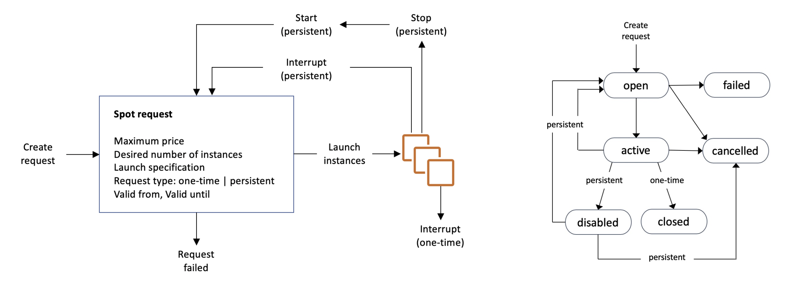

## 2-4-1) EC2 인스턴스 역할

- EC2 인스턴스에 IAM의 역할을 매핑하여 사용할 수 있다. **인스턴스 > 작업 > 보안 > IAM 역할 수정**을 통해 인스턴스의 IAM 역할을 수정할 수 있다.

 

## 2-4-2) EC2 인스턴스 비용 플랜

• On-Demand Instances: 짧은 워크로드, 예측 가능한 가격, 초당 사용량 기준 가격 책정됨
• Reserved (1 & 3 years)
	• Reserved Instances: 장기적인 워크로드 (DB)
	• Convertible Reserved Instances: 장기적 워크로드이나 유연한 자원 변동의 작업
• Savings Plans (1 & 3 years): 가격을 정하여 인스턴스를 예약하여 사용. 장기 워크로드.
• Spot Instances: 짧은 워크로드, 저렴하지만, 인스턴스 손실이 언제든 발생 가능.
• Dedicated Hosts: 물리적 서버 전체를 예약해서 인스턴스 배치 제어 가능.
• Dedicated Instances: 다른 고객이 하드웨어를 공유하지 않음.
• Capacity Reservations: 원하는 기간동안 특정한 AZ에 용량 예약 가능.

 

### 2-4-2-1) On-Demand Instance

- 사용한 만큼 지불함
	- Linux, Windows - 첫 1분 이후 초당으로 가격 측정됨
	- 다른 OS: 시간 당으로 가격 측정됨
- 가장 비싸지만 당장의 금액 지불이 필요 없음.
- 장기 약정도 필요 없음
- 단기적이고 무중단 워크로드 혹은 애플리케이션의 작동을 예측할 수 없을 때 적합하다.

 

## 2-4-2-2) EC2 Reserved Instance

- On-Demand 타입에 비해 72% 할인된 가격을 제공한다.
- 특정한 인스턴스 속성을 예약한다. (인스턴스 타입, 리전, 테넌시, OS)
- 1~3년 단위로 예약 가능하며 연차가 길수록 할인율이 커진다.
- 전체 선결제, 부분 선결제, 선결제 없음을 지정 가능한데, 선결제 비중이 높을 수록 할인율이 크다.
- 사용량이 일정한 애플리케이션에 사용되는 것이 추천된다. (Database)
- 예약 인스턴스를 마켓 플레이스에서 사고 팔 수 있다.

 

### 2-4-2-3) Convertible Reserved Instance

- EC2 인스턴스 타입, 인스턴스 패밀리, OS, 범위, 테넌시의 중도 변경이 가능하다.
- On-Demand 타입에 비해 최대 66%까지 할인된 가격을 제공한다.

 

### 2-4-2-4) EC2 Savings Plan

- 장기간 사용으로 할인을 받을 수 있다. (최대 72%까지)
- 1~3년 동안 시간당 10$로 책정된다.
- Savings Plan을 넘어선 범위는 On-Demand 정책으로 책정된다.
- 특정 인스턴스 패밀리 & 리전에 고정된다. (M5 in us-east-I)
- 다음 요소들은 유연하게 정할 수 있다.
	- Instance Size (m5.xlarge, m5.2xlarge)
	- OS (Linux, Windows)
	- 테넌시 (호스트, 지정, 기본)

 

### 2-4-2-5) EC2 Spot Instances

- On-Demand 타입에 비해 90% 할인된 가격을 제공한다.
- 사용하려는 비용의 최대 가격을 지정하고 Spot 가격이 이를 초과하면 바로 인스턴스를 소실하게 된다.
- 가장 비용 효율적인 인스턴스
- 실패에 대해 가장 탄력성 있는 워크로드에 효율적이다.
	- 배치 잡
	- 데이터 분석
	- 이미지 프로세싱
	- 모든 분산형 워크로드
	- 유연한 시작과 종료 시간을 갖는 워크로드
	- 중요한 작업이나 데이터베이스에는 적합하지 않다.

 

### 2-4-2-6) EC2 Dedicated Hosts

- 활용 사례에 전용으로 할당된 EC2 인스턴스 용량을 가진 물리 서버
- 법적 준수 요건을 따르고 기존 서버에서 사용되는 소프트웨어 라이센스(소켓별, 코어별, VM 소프트웨어 라이센스 별)들을 사용하는 것을 허용한다.
- 코어 및 네트워크 소켓 가시성을 제공하므로, 비용을 그 기반으로 책정하는 경우에 적합하다.
- 물리 서버를 직접 빌리므로 가장 비싼 가격 정책을 제공한다.
	- On-demand – pay per second for active Dedicated Host
	- Reserved - 1 or 3 years (No Upfront, Partial Upfront, All Upfront)
- 라이센스 모델과 함게 제공되는 소프트웨어 (BYOL – Bring Your Own License)
- 강력한 법적 규제 혹은 법규를 준수해야 하는 경우

 

### 2-4-2-7) EC2 Dedicated Instance

- 계정에 할당된 하드웨어에서 돌아가는 인스턴스를 빌리는 정책
- 같은 계정의 다른 인스턴스들과 하드웨어를 공유한다.
- 인스턴스 배치에 대한 통제권은 없다.

 

| 특징                        | Dedicated Instances | Dedicated Hosts    |
| ------------------------- | ------------------- | ------------------ |
| 지정된 물리 서버에 대한 사용이 가능하다    | X                   | X                  |
| 인스턴스 별 결제                 | X                   |                    |
| Host 별 결제                 |                     | X                  |
| 소켓, 코어, 호스트 ID에 대한 가시성 제공 |                     | X                  |
| 호스트와 인스턴스 간의 유연함          |                     | X                  |
| 인스턴스 배치 가능                |                     | X                  |
| 자동 인스턴스 배치                | X                   | X                  |
| 점유 요청을 통해 자원 추가           |                     | 
X
 |

 

### 2-4-2-8) EC2 Capacity Reservations

- 특정 AZ에서 특정 기간 동안 인스턴스 자원을 On-demand로 예약한다.
- 필요할 때 언제든 EC2 자원에 접근 가능하다.
- 시간 약정은 없고, 할인도 없다.
- Regional Reserved Instance와 Saving Plans 와 결합하여 할인 혜택을 받는다.
- 인스턴스를 실행하건 아니건 On-Demand 비율로 비용이 청구된다.
- 특정 AZ에서 실행될 필요가 있는 단기간의 무방해 워크로드에 적합하다.

 

## 2-4-3) Spot Instance And Spot Fleet

- EC2 > 인스턴스 > 스팟 요청

 

### 2-4-3-1) Spot Instance

- On-demand에 비해 90%의 할인을 제공한다.
- **최대 Spot 가격을 정의하고 현재 Spot 가격이 이보다 적으면 인스턴스를 유지한다. (인스턴스 소실 전략)**
	- 시간당 Spot 가격은 Spot 제안과 용량에 따라 달라진다.
	- 만약 현재 Spot 가격 > 설정한 최대 Spot 가격이 되면 인스턴스를 종료하거나 중단하는 선택할 수 있는 시간이 2분 주어진다.
- **다른 전략 (Spot Block)**
	- 지정된 시간 프레임 (1~6시간) 동안 방해 없이 블락된 스팟 인스턴스는 중단되지 않는다.
	- 드문 경우 인스턴스가 회수될 수는 있다.
- 배치 잡, 데이터 분석 혹은 실패 탄력 있는 워크로드에 사용된다.
- 중요한 작업이나 데이터베이스로는 사용하지 않는다.

 

### 2-4-3-2) Spot Instance의 종료 방법

  

 

- Spot Request에는 one-time, 특정 기간동안 영구적인 타입이 존재한다. one-time은 한번만 수행되고 Request가 비활성화되며, 영구 타입의 경우 Request가 취소되지 않는 이상 인스턴스 중단 시 다시 수행된다.
- Spot Instance 요청을 취소하려면 인스턴스가 open, active, disable 상태인 경우에만 취소 가능하다.
- Spot Instance 요청을 취소하는 것은 인스턴스 종료를 의미하지 않는다.
- Spot Instance 요청을 먼저 취소하고 할당된 Spot Instance 자원을 종료해야 한다.

 

### 2-4-3-3) Spot Fleet

- Spot Fleets = **Spot Instance + (optional) On-Demand Instance**들의 집합
- Spot Fleets는 정해진 가격 제한으로 목표 용량을 충족하기 위해 노력한다.
	- 가능한 **런치 풀 (인스턴스 타입, OS, AZ) 등을 정의**한다.
	- 여러 개의 런치 풀을 정해놓고 fleet이 선택할 수 있도록 한다.
	- Spot Fleets는 **상한선 혹은 최대 가격에 도달하면 인스턴스 시작을 중단**한다.
- Spot Instance 할당 전략들
	- **lowestPrice**: 가장 적은 가격 풀로부터 시작하기 때문에 비용이 가장 절감된다. 워크로드가 짧은 경우 적합하다.
	- **diversified**: 모든 풀에 분산된다. 높은 가용성, 긴 워크로드에 적합하다.
	- **capacityOptimized**: 원하는 인스턴스 수에 맞는 최적의 용량을 갖는 풀을 갖게 된다.
	- **priceCapacityOptimized**: 사용 가능한 용량이 가장 큰 인스턴스를 선택하고, 그 중 가격이 가장 낮은 풀을 선택한다.
- Spot Fleet은 여러 개의 런치풀과 여러 개의 인스턴스를 정의하여 가장 낮은 가격에 Spot Instance 요청을 자동적으로 허용한다.
- 간단한 스팟 인스턴스 요청을 하는 경우는 원하는 인스턴스 유형과 AZ를 정확히 알고 있는 경우이다. 스팟 플릿을 요청하는 경우는 조건을 만족하는 모든 인스턴스 유형과 모든 AZ를 선택하라는 경우이다.
