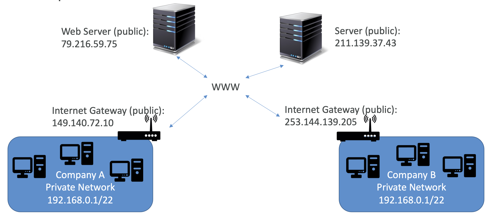

## 3-1) EC2 인스턴스 역할

 

  

 

- Public IP
	- Public IP는 인터넷(WWW)에서 식별될 수 있는 장비를 의미한다.
	- 전체 웹을 통틀어 유일해야만 한다. (두 개의 장비가 같은 Public IP를 가질 수 없음)
	- 쉽게 위치 특정이 될 수 있다.

- Private IP
	- Private IP는 사설 네트워크에서만 식별될 수 있는 장비를 의미한다.
	- IP는 사설망 내에서 유일해야만 한다.
	- 하지만 두 개의 다른 사설망은 같은 IP를 가질 수 있다.
	- 장비들은 NAT와 인터넷 게이트웨이(IGW)를 사용하여 인터넷(WWW)에 접근할 수 있다.
	- 오직 특정 범위의 IP들만 사설망 IP로 사용될 수 있다.

- Elastic IP (고정 Public IP)
	- **네트워크 및 보안 > 탄력적 IP**
	- **작업 > 네트워킹 > IP 주소 관리**
	- 당신이 EC2 인스턴스를 중단하고 재시작하면, Public IP가 변경될 수 있다.
	- 만약 장비의 Public IP를 고정하고자 한다면 `Elastic IP`를 사용하여야 한다.
	- Elastic IP는 삭제하지 않는 한 공용 IPv4 IP이다.
	- 한번에 한 인스턴스에만 부여할 수 있다.
	- Elastic IP를 계정 내의 다른 인스턴스에 재빨리 리매핑하여 인스턴스나 소프트웨어의 실패를 숨길 수 있다.
	- `계정 당 최대 5개의 Elastic IP`를 가질 수 있다. (AWS에 문의하여 더 요청할 수는 있다.)
	- 이러한 기능에도 Elastic IP는 사용하지 않는 것이 추천된다.
		- 좋지 않은 아키텍쳐 선택을 반영한다.
		- 대신 랜덤 IP를 사용하고 DNS를 부여하는 것이 추천된다.
		- 혹은 Public IP를 사용하지 않고 Load Balancer를 사용하는 것이 추천된다.