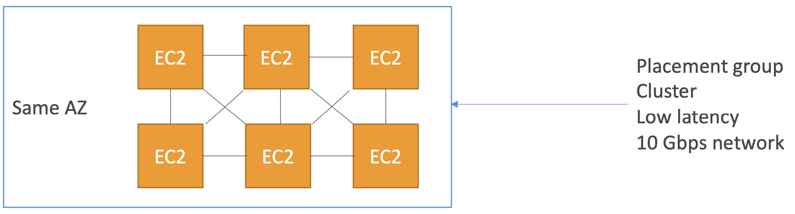
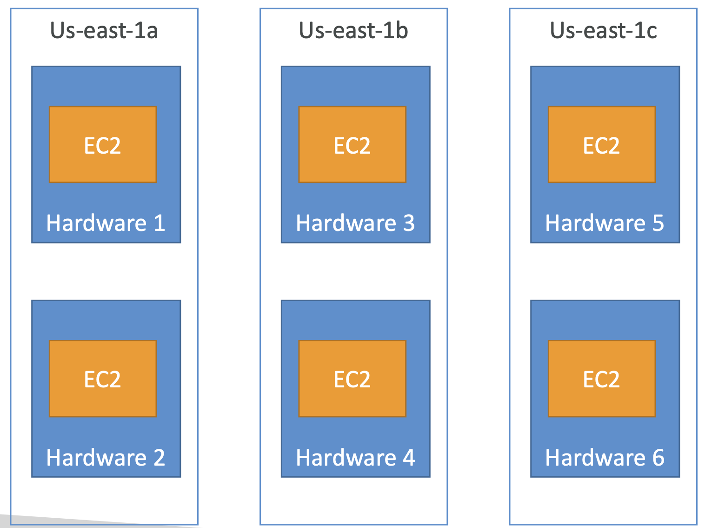
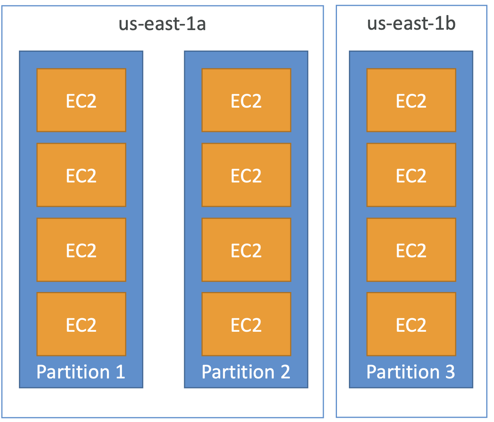

 

  

 

- **네트워크 및 보안 > 배치 그룹**
- 인스턴스 배치 그룹이란 배치 그룹 (placement groups)을 사용하여 인스턴스를 배치하는 전략을 의미한다.
	- **Cluster**: `단일 AZ내의 저지연 그룹내에 인스턴스를 배치`한다. 높은 성능을 제공하지만 가용성이 떨어진다.
	- **Spread**: `다른 하드웨어에 배치`된다. AZ별로 구분된 매치 그룹당 7개의 인스턴스를 배치할 수 있다. 중요 애플리케이션의 경우 분산 그룹 전략을 사용한다.
	- **Partition**: `AZ내 다양한 하드웨어 랙에 의존하는 많은 다른 파티션에 분산 배치`된다. 인스턴스가 분산되어 있지만 다른 실패로부터 격리되지는 않았다.

## 3-2-1) Cluster

 

  

 

- 모든 인스턴스가 같은 AZ 내에 존재한다.
- **장점**: 모든 인스턴스 간 10Gbps 대역폭으로 향상된 네트워크를 활성화할 수 있다. 지연시간이 짧고 처리량이 많은 네트워크를 확보할 수 있다.
- **단점**: AZ에 장애가 발생하면 모든 인스턴스에 영향이 발생한다.
- 사용사례
	- 빠르게 처리되어야 하는 빅데이터 작업
	- 극도의 저지연과 높은 네트워크 처리량이 요구되는 애플리케이션

## 3-2-2) Spread

 

  

 

- 모든 인스턴스는 서로 다른 AZ의 다른 하드웨어에 배치된다.
- **장점**: 
	- 여러 AZ에 걸쳐있기 때문에 실패 리스크를 동시에 감소시킬 수 있다.
	- EC2 인스턴스들은 각각 다른 물리 장비에 존재한다.
- **단점**:
	- 배치 그룹의 **AZ 당 최대 7개의 인스턴스로 제한**된다.
	- 따라서 크기가 너무 크지 않은 애플리케이션에서만 사용될 수 있다.
- 사용사례
	- 가용성을 극대화하고 위험을 줄여야 하는 애플리케이션
	- 인스턴스 오류를 격리해야 하는 중요 애플리케이션

## 3-2-3) Partition

 

  

 

- **여러 AZ의 파티션에 인스턴스를 분산**할 수 있다.
- **AZ 당 최대 7개의 파티션이 존재**할 수 있다.
- 각 파티션은 **실제 하드웨어 랙을 의미**한다. 파티션이 많으면 인스턴스가 여러 하드웨어 랙에 분산되어 서로 랙 실패로부터 안전하다.
- 한 리전 내의 다른 AZ에 걸쳐서 분산이 가능하다.
- 설정으로 수백 개의 인스턴스를 받을 수 있다.
- 다른 파티션 간의 인스턴스들은 서로 다른 하드웨어 랙에 존재하므로 실패로부터 격리된다.
- 인스턴스가 어떤 파티션 내에 존재하는지 확인하기 위해 metadata를 제공한다.
- 사용사례
	- HDFS, HBase, Cassandra, Kafka
 