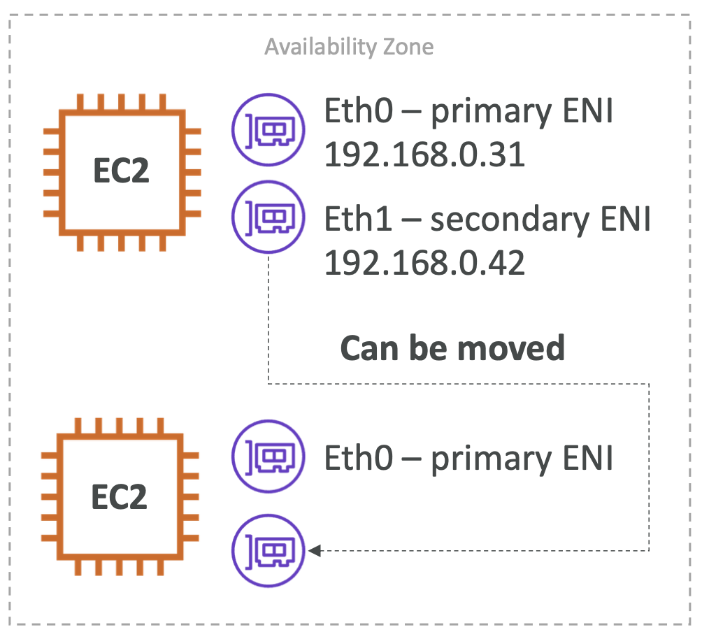

 

  

 

- **인스턴스 > 네트워킹 > 네크워크 인터페이스**
- **네트워크 및 보안 > 네트워크 인터페이스**
- 가상 네트워크 카드를 대표하는 VPC 내의 논리적 부분
- ENI는 다음과 같은 속성들을 가질 수 있다.
	- Primary 가상 IPv4 하나와, 여러 개의 Secondary IPv4
	- 가상 IPv4 하나당 하나의 Elastic IPv4
	- 하나의 Public IPv4
	- 하나 혹은 이상의 보안 그룹들
	- MAC 주소
- ENI를 위의 요소들에 독립적으로 생성하고 EC2 인스턴스 간에 실패 상황에서 떼었다 붙일 수 있다.
- **특정 AZ에 바운드된다.**
