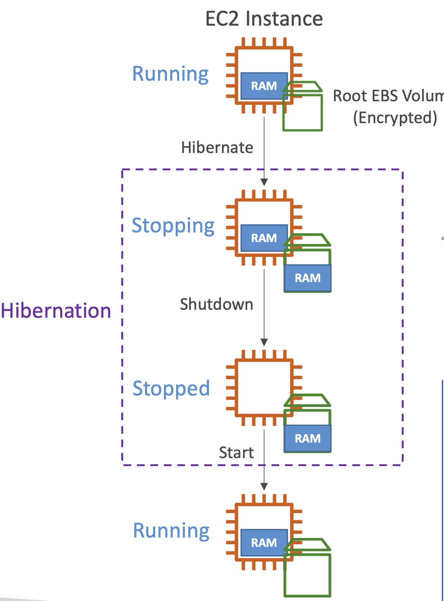

- **인스턴스 시작 > 고급 세부 정보 > 최대 절전 중지 방식 > 활성화**
- **인스턴스 시작 > 스토리지(볼륨) > 고급 > 암호화됨 > 암호화**
- **인스턴스 시작 > 스토리지(볼륨) > 고급 > KMS 키 > 기본값**
- 인스턴스를 중단(stop)하면, 디스크(EBS)의 데이터는 다음 시작까지 보관된다.
- 인스턴스를 종료(terminate)하면, EBS 볼륨들 중 파괴로 설정되어 있는 자료들은 손실된다.
- 인스턴스를 시작하면 다음과 같은 절차를 지나게 된다.
	- 첫 시작: OS 부트 & EC2 유저 데이터 스크립트
	- 이후 시작: OS 부트
	- 애플리케이션이 시작되고, 캐시 데이터가 세팅되므로 시간이 걸린다.
- **EC2 Hibernate Mode (절전 모드)**
	- RAM **메모리는 보존**된다.
	- 따라서 **인스턴스의 부팅이 더 빨라진다**. (OS는 중단되지 않고 재시작된다.)
	- RAM 메모리의 상태가 **root EBS 볼륨에 파일로 저장**된다.
	- **root 볼륨은 EBS 볼륨이어야 하고, 암호화되어야 한다.**
- 사용사례
	- 장기간 동작하는 프로세스
	- RAM 상태 저장
	- 초기화하는데 시간이 걸리는 서비스들

 

  

 

- 다음과 같은 인스턴스 종류를 지원한다: C3, C4, C5, I3, M3, M4, R3, R4, T2, T3 ...
- **인스턴스 RAM 사이즈는 150GB 보다 작아야 한다**.
- 인스턴스 사이즈는 bare metal 인스턴스에서는 지원되지 않는다.
- Amazon Linux 2, Linux AMI, Ubuntu, RHEL, CentOS & Windows…
- Root Volume - **EBS이어야** 하며, **암호화**되어 있어야 하고, RAM 메모리를 저장할 수 있을 만큼 커야 한다.
- On-Demand, Reserved, Spot 인스턴스에서 사용 가능하다.
- 인스턴스는 **60일 이상 절전모드일 수 없다**.
