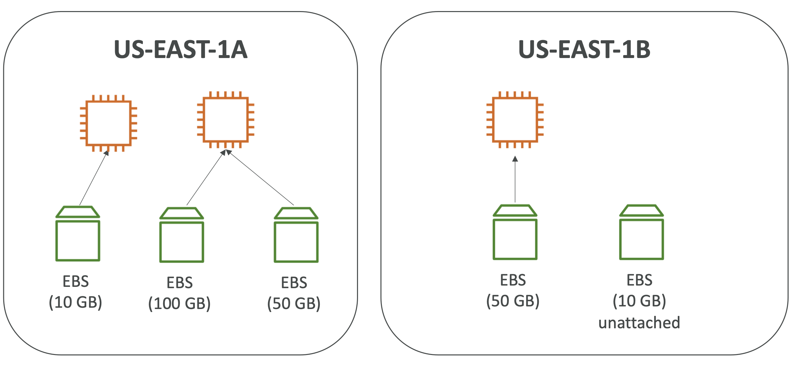
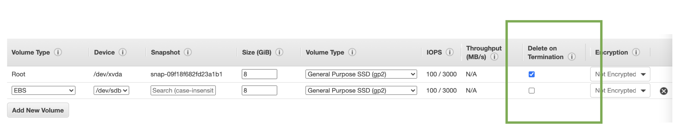

  

 

- **인스턴스 > 스토리지**
- **Elastic Volume Store > 볼륨**
- `EBS(Elastic Block Store)` 볼륨은 인스턴스가 동작중일 때 **인스턴스에 탈부착 가능한 네트워크 드라이브의 일종**이다.
- 인스턴스가 종료한 뒤에도 데이터를 보존하도록 설정 가능하다.
- **하나의 볼륨은 한 번에 하나의 인스턴스에만 매핑 가능하다. (CCP Level)**
	- **반대로, 하나의 인스턴스에는 여러 개의 EBS를 매핑할 수 있다.**
- EBS는 **특정 AZ에 고정**된다. AZ를 넘나들며 볼륨을 매핑하려면 **스냅샷을 사용**해야 한다.
- Free Tier에서는 30GB의 범용 무료 EBS (SSD) 혹은 자기디스크를 달마다 제공한다.
- 인스턴스와 통신하기 위해 네트워크를 사용한다 이에 약간의 지연이 있다.
- **ENI(Elastic Network Interface)와 마찬가지로 EC2 인스턴스에 빠르게 탈부착 가능**하다.
- 프로비저닝을 위해 **사전에 성능을 정의**해야 한다. (GB 사이즈, IOPS(단위 초당 전송 수))
- 프로비저닝된 용량 만큼 비용이 청구된다.
- 프로비저닝 이후 향후 용량 증가를 위해 늘리는 것도 가능하다.

 

  

 

- EC2 인스턴스가 종료될 때 EBS의 행동을 제어할 수 있다.
	- 기본적으로 root EBS 볼륨은 삭제된다. (Delete on Termination True)
	- 기본적으로 추가 부착된 EBS 볼륨은 삭제되지 않는다. (Delete on Termination False)
