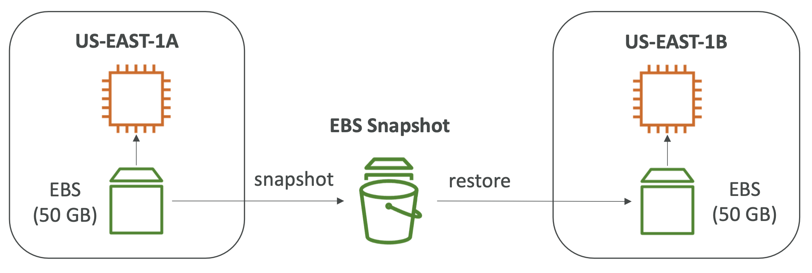

  

 

- **Elastic Block Store > 볼륨 > 작업 > 스냅샷 생성**
- **Elastic Block Store > 스냅샷**
- EBS 스냅샷은 EBS 볼륨의 특정 시점에 대한 백업을 의미한다.
- 스냡샷을 위해 EBS 볼륨을 인스턴스에서 꼭 떼어내야하는 것은 아니나, 추천된다.
- 스냡샷을 **복사하여 다른 AZ 인스턴스에 복구(restore)**할 수 있다.
- EBS 스냅샷의 특징들
	- **EBS Snapshot Archive**
		- 스냅샷을 75% 더 저렴한 `Archive Tier`로 옮긴다. 아카이빙된 스냅샷을 복구하려면 24 ~ 72시간 정도 소요된다.
	- **Recycle Bin for EBS Snapshots**
		- **Elastic Block Store > 스냅샷 > 휴지통**
		- 삭제된 Snapshot을 보존할 수 있는 정책을 설정할 수 있다. 이를 통해 실수로 삭제한 Snapshot에 대한 복구가 가능하다. (하루 ~ 1년까지 설정 가능)
	- **Fast Snapshot Restore (FSR)**
		- **빠르게 스냅샷을 초기화하여 첫 사용에서의 지연을 없애는 기능. 스냅샷이 아주 크고 EBS 또는 볼륨을 빠르게 초기화**해야할 때 유용하다. 대신 비용이 비싸다.