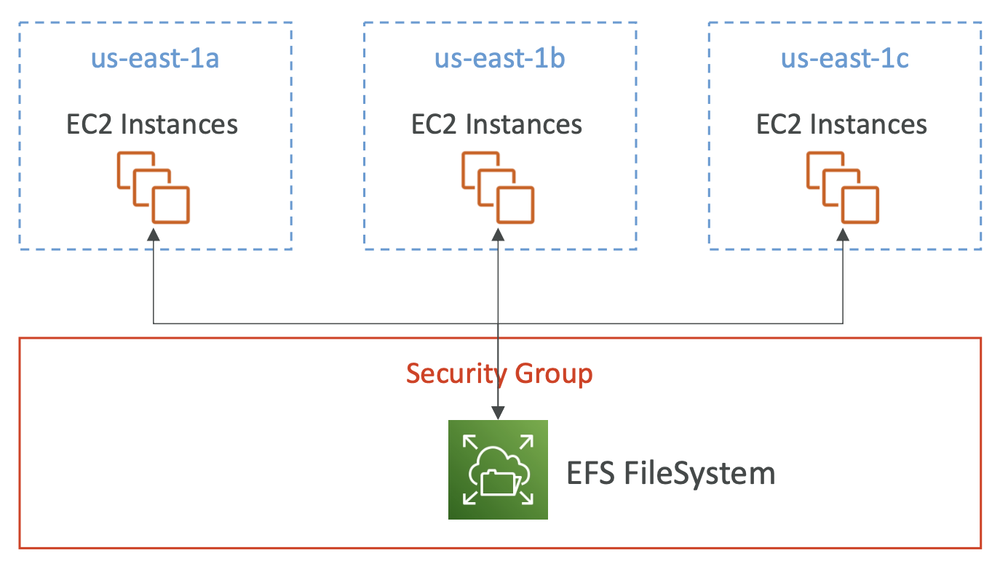

  

 

- **Amazon EFS > 파일 시스템**
- **EC2 > 생성 > 스토리지(볼륨) > 파일 시스템**
- Amazon EFS(Elastic File System)은 많은 EC2 인스턴스에 마운트될 수 있는 네트워크 파일 시스템이다.
- EFS는 **여러 AZ에 속한 인스턴스들에서 모두 사용**할 수 있다.
- 고가용성, 확장 가능하고, gp2에 비해 3배 비싸다. 사용량에 따라 청구되므로 비용을 미리 프로비저닝할 필요가 없다.
- 활용 사례
	- 컨텐츠 관리
	- 웹 서버
	- 데이터 쉐어링
	- 워드 프레싱 (설치형 블로그)
- **NFSv4.1** 프로토콜을 사용한다.
- **EFS로의 접근 제어를 위해 보안 그룹을 사용한다.**
- Linux 기반의 AMI에는 호환된다. (윈도우는 X)
- KMS를 사용하여 미사용 데이터를 암호화한다.
- 표준 파일 API를 가진 POSIX 파일 시스템
- **사전 용량 산정 없이 오토 스케일링되며 사용량에 비례한 비용 산정 방식**이다.

 

## 4-8-1) EFS Performance

### 4-8-1-1) EFS Scale
- 1000개의 동시 NFS 클라이언트들 초당 10 GB+ 처리량
- 자동적으로 PB 단위 네트워크 파일 시스템으로 스케일링된다.

 

### 4-8-1-2) Performance Mode (EFS 생성 시간으로 세팅된다.)
- **범용 (default)** - 지연에 민감한 경우 (웹서버, CMS)
- **MAX I/O** - 더 높은 지연 (지연은 길어짐), 더 높은 처리량, 더 높은 병렬화 (빅데이터, 미디어 프로세싱)

 

### 4-8-1-3) Throughput Mode

- **Bursting** - 스토리지 사이즈에 맞게 처리량이 증가하는 설정. 1TB = 50MiB/s ~ 100MiB/s
- **Provisioned** - 스토리지 사이즈와 상관 없이 처리량 설정
- **Elastic** - 작업양에 따라 처리량 오토 스케일링
	- 읽기에 3GiB/s, 쓰기에 1GiB/s 까지
	- 예측불가한 작업량에 사용됨

 

## 4-8-2) Storage Class

  

 

### 4-8-2-1) Storage Tiers (라이프사이클 관리 기능 - N일 뒤에 파일 이동)

- **Standard**: 자주 접근되는 파일들
- **Infrequent access (EFS-IA)**: 파일을 검색하는데 드는 비용, 저장 비용이 낮음
- **Archive**: 거의 접근되지 않는 파일들 (50% 저렴)
- 각 티어 별 스토리지에 파일을 옮기는 라이프사이클 정책을 구현한다.

 

### 4-8-2-2) 가용성과 내구성

- **Standard**: 다중 AZ, 운영 환경에 적합
- **One Zone**: 하나의 AZ, 개발, 백업에 적합. 기본적으로 세팅할 수 있고, IA(EFS-IA)와 같이 사용 가능.

 

## 4-8-3) EBS vs EFS

| EBS (Elastic Block Store)                                                                                   | EFS (Elastic File System)                          |
| ----------------------------------------------------------------------------------------------------------- | -------------------------------------------------- |
| - 기본적으로 한 번에 한 인스턴스에만 붙일 수 있다. - io1/io2에서는 여러 인스턴스에 붙이기 가능. (최대 16개 인스턴스)                               | - 여러 AZ에 수백개의 인스턴스에 붙일 수 있다.                       |
| - **특정 AZ에 고정**된다. - 여러 AZ에 마이그레이션 하기 위해서는 스냅샷 생성 > 다른 AZ에 스냅샷 복구 (애플리케이션 트래픽이 많은 경우에는 돌리지 않는 것이 좋다.) | **- Linux 인스턴스에서만 사용 가능**                          |
| - gp2: 디스크 사이즈가 커지면 IO 성능도 증가 - gp3 & io1: 디스크 사이즈와 독립적으로 IO 성능 증가 가능                                    | - EBS보다 비싸다 - 비용 절감을 위해 Storage Tier를 활용할 수 있다. |
| - 루트 EBS 볼륨은 인스턴스 종료 시 기본적으로 같이 종료됨 (설정을 변경하에 종료하지 않도록 할 수도 있다.)                                            |                                                    |
|                                                                                                             |                                                    |
