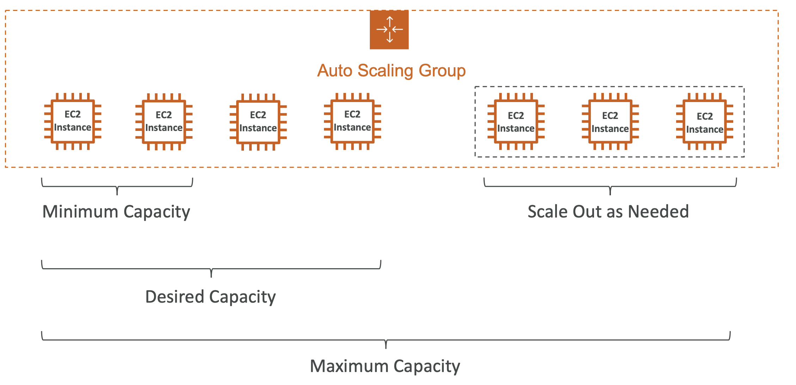
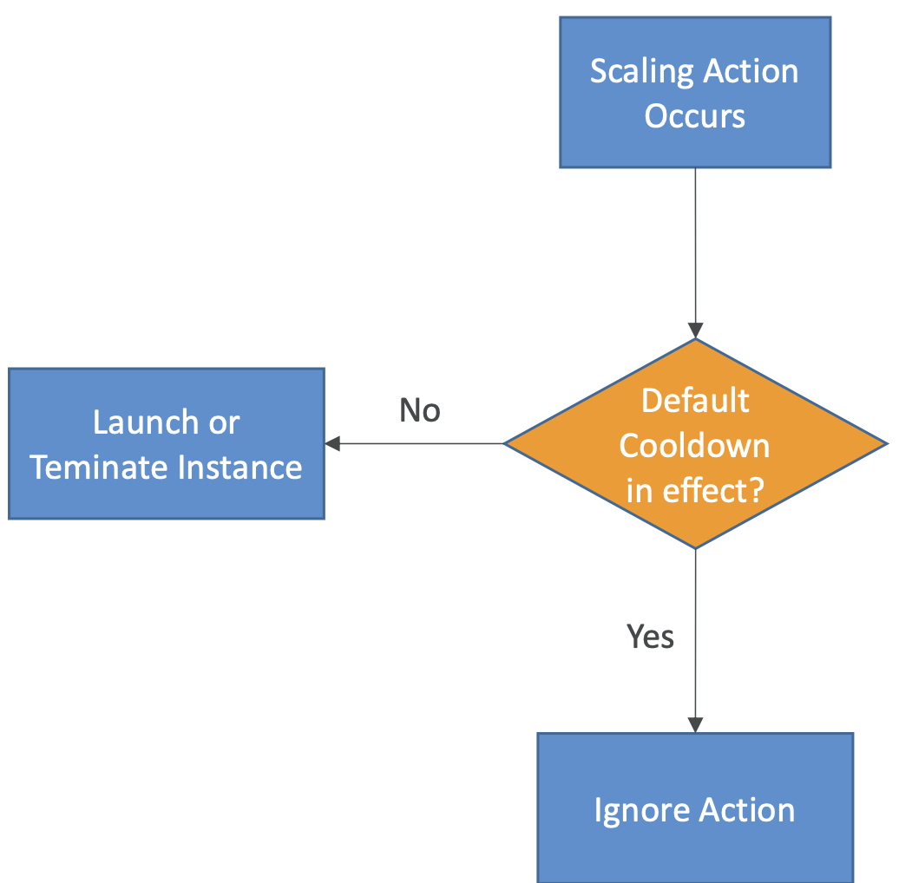

- **EC2 > Auto Scaling > Auto Scaling 그룹**
## 5-10-1) ASG (Auto Scaling Group)

- 서버에 걸리는 부하의 정도에 따라 자동으로 EC2 인스턴스를 스케일 아웃 / 스케일 인 해주는 기능을 의미한다.
- EC2 인스턴스가 동작해야 하는 최소 / 최대 인스턴스 수를 정의하며 스케일 아웃된 인스턴스는 자동으로 로드밸런서에 등록된다.
- 또한, 이전에 생성되었던 **인스턴스에 장애가 발생하면, 즉시 해당 인스턴스를 종료하고 새롭게 인스턴스를 생성**한다.
- ASG의 사용 자체는 비용이 무료이다.

  

 

## 5-10-2) ASG (Auto Scaling Group) 속성

- Launch Template
	- AMI + Instance Type
	- EC2 유저 데이터
	- EBS 볼륨
	- 보안 그룹
	- SSH 키 페어
	- EC2 인스턴스에 부여될 IAM 역할
	- 네트워크 + 서브넷 설정
	- 로드 밸런서
- 최소 / 최대 / 최초 크기
- 스케일링 정책

 

## 5-10-3) CloudWatch Alarm

- CloudWatch Alarm을 기반으로 한 ASG의 스케일링이 가능하다.
- 알람은 평균 CPU 사용량 / 특정 커스텀화된 메트릭을 통해 서버의 메트릭을 모니터링한다.
- 특정 메트릭 상황에 대한 스케일 아웃 / 스케일 인 정책을 설정할 수 있다.

 

## 5-10-4) Auto Scaling Group (ASG) - Scaling Policy

- **Dynamic Scaling**
	- Target Tracking Scaling
		- 특정 메트릭의 사용량이 유지되도록 자동적으로 스케일링 하는 정책
	- Simple / Setup Scaling
		- CloudWatch가 특정 메트릭을 감지하여 자동적으로 스케일링 하는 정책
- **Scheduled Scaling**
	- 알려진 패턴(본인이 알고 있는 스케줄 기반)을 기반으로 스케일링을 예상
- **Predictive Scaling**
	- 과거의 부하 패턴을 분석하여 예측치를 생성하고 예측치에 따라 스케일링 작업을 예약
	- 주기적인 데이터가 있는 경우 유용

 

## 5-10-5) Auto Scaling에 사용하기 좋은 메트릭의 종류들

- CPU 사용량: 인스턴스들의 평균적인 CPU 사용량
- 대상 별 요청 수: EC2 인스턴스들이 안정적인 상태를 유지할 수 있는 요청의 숫자
- 평균 네트워크 In/Out - 업로드 / 다운로드의 수
- 다른 종류의 커스텀한 메트릭들 (CloudWatch를 이용)

 

## 5-10-6) Scale Cooldown

- 스케일링이 동작한 뒤, 쿨다운 주기에 들어선다 (기본 300초)
- 쿨다운 주기동안, ASG는 추가적인 인스턴스를 시작하거나 종료하지 않는다. (메트릭이 안정화 되는 것을 보기 위해)
- 요청을 빠르게 전달하고, 쿨다운 주기를 줄이는 목적의 설정 시간을 줄이기 위해 즉시 사용 가능한 AMI를 사용하는 것이 좋다.

  

 
