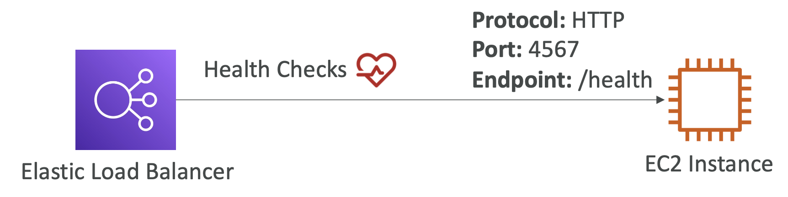
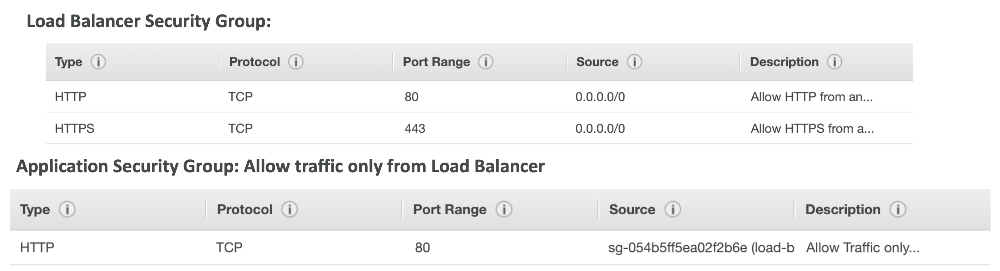

- 여러 개의 다운스트림 인스턴스에 걸쳐 부하를 분산시킴
- **애플리케이션의 단일 엑세스 포인트(DNS 주소)를 노출시킴**
- 다운스트림 인스턴스들의 장애를 원할하게 처리함
- 인스턴스들의 헬스 체크를 할 수 있음
- 웹 사이트에 SSL 종료를 제공함 (HTTPS)
- 쿠키로 고정도(stickiness)를 강화할 수 있음
- **여러 AZ에 걸친 고가용성 제공**
- 클라우드 내 Private 트래픽과 Public 트래픽의 분리가 가능.

 

## 5-2-1) Elastic Load Balancer

- 관리형 로드 밸런서로 AWS에서는 어떠한 경우에도 작동될 것을 보장함.
- AWS가 업그레이드, 유지보수, 고가용성을 관리함
- AWS는 몇 가지 구성 제어장치(knob)들을 제공함
- 자체 로드밸런서에 비해 구축하기 저렴하고 확장성 측면에서의 다양한 이점을 제공함
- 다양한 AWS 서비스들과 통합되어 있다.

 

### 5-2-1-1) Health Check

  

 

- ELB가 인스턴스가 제대로 동작하고 있는지를 확인하기 위해 사용됨.
- 헬스 체크는 **포트와 라우트**에서 이루어진다.
- 응답이 200(Ok)이 아니면, 인스턴스가 healthy 하지 않다고 판단한다. 이렇게 판단된 인스턴스로는 로드밸런서가 요청을 보내지 않는다.

### 5-2-1-2) Types of Load Balancer in ELB

- **CLB (Classic Load Balancer)** (v1 - old generation)
	- HTTP, HTTPS, TCP, SSL (Secure TCP)
- **ALB (Application Load Balancer)** (v2 - new generation)
	- HTTP, HTTPS, WebSocket
- **NLB (Network Load Balancer)** (v2 - new generation)
	- TCP, TLS (Secure TCP), UDP, HTTP, HTTPS
- **Gateway Load Balancer (GWLB)**
	- 네트워크 3계층과 IP Protocol에서 작동
- 몇몇 로드밸런서는 내부용으로만 사용 가능한 것도 있고 외부용까지 모든 경우 사용 가능한 것도 있다.

  

 

- Load Balancer의 보안 그룹은 보통의 경우 모든 소스에서 HTTP, HTTPS 프로토콜로의 접근을 허용한다.
- Load Balancer에 매핑된 인스턴스의 보안 그룹은 HTTP 프로토콜의 80 포트로, Load Balancer의 보안 그룹을 통과한 트래픽에 한해서만 도달할 수 있도록 제한하여 외부에서의 직접적인 접근을 차단한다.
