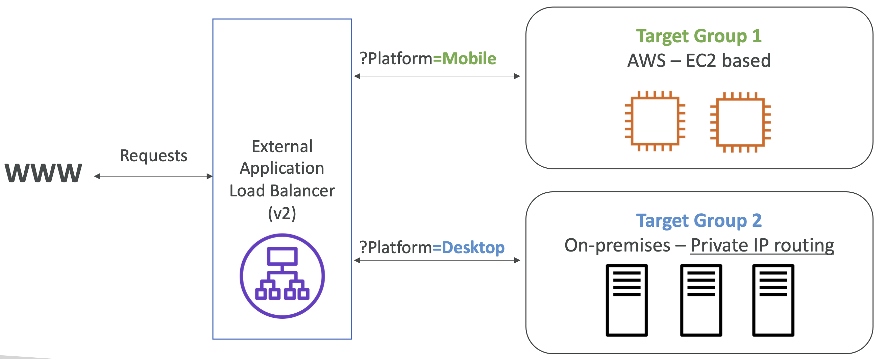

- **EC2 > 로드 밸런싱 > 로드 밸런서**
- ALB (Application Load Balancer)는 네트워크 7계층 (애플리케이션 계층, HTTP, HTTPS, HTTP/2, Web Socket)을 지원한다.
- 여러 머신(target group)에 걸친 여러 HTTP 애플리케이션에 로드밸런싱된다.
- 같은 머신의 여러 애플리케이션에도 로드밸런싱된다. (컨테이너 기반)
- 리다이렉트를 지원한다.
- URL 기반 라우팅 (example.com/users & example.com/posts)
- 클라이언트 IP 기반 라우팅
- hostname 기반 라우팅 (one.example.com & other.example.com)
- 쿼리 파라미터 / 헤더 기반 라우팅
- ALB는 마이크로 서비스나 컨테이너 기반 애플리케이션에 적합하다. (Docker, Amazon ECS)
- ECS내의 동적 포트에 리다이렉트 하기 위해 포트 매핑 기능이 있다.
- **고정된 Hostname을 가진다. (XXX.region.elb.amazonaws.com)**
- 애플리케이션 서버는 **클라이언트의 IP를 직접적으로 확인 불가능**하다.
- **클라이언트의 실제 IP는 헤더의 X-Forwarded-For에서 확인 가능**하다.
- 포트 (X-Forwarded-Port), proto (X-Forwarded-Proto)
- HTTP 기반의 정밀한 에러 탐지가 가능하다.

 

## 5-3-1) Target Group

- Auto Scaling Group에 의해 관리 가능한 EC2 인스턴스 - HTTP
- ECS 자체적으로 관리되는 ECS 태스크 - HTTP
- Lamda 함수 - HTTP 요청이 JSON 이벤트로 번역됨.
- IP Address (사설 IP)
- ALB는 여러 개의 타겟 그룹에 라우팅할 수 있다.
- 헬스 체크는 타겟 그룹 단위에서 이루어진다.

  

 
