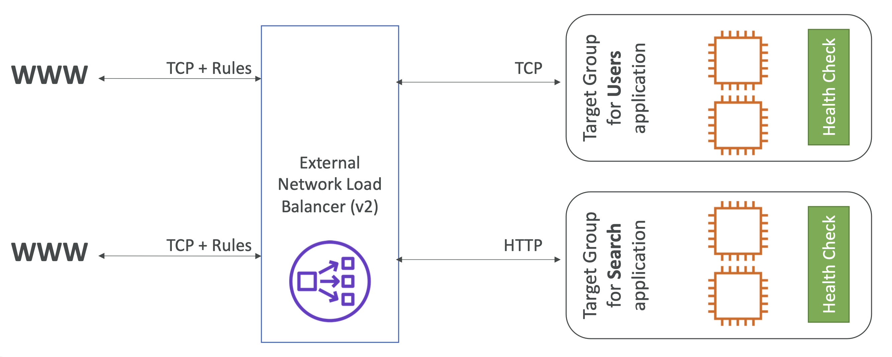

- **EC2 > 로드 밸런싱 > 로드 밸런서**
- NLB (Network Load Balancer)는 네트워크 4계층 (TCP, TLS, UDP)을 지원한다. (HTTP, HTTPS도 지원)
- 초당 수백만개의 요청을 처리한다.
-  **지연 시간도 짧다.**
- **NLB는 AZ당 하나의 IP**를 가지며, **Elastic IP로 고정 IP**를 제공 가능하다. (다른 LB들은 고정 IP를 제공하지는 않는다.)
- TCP, UDP를 사용한 극한의 성능이 필요할 때 사용되며, Free Tier에서는 제공되지 않는다.
- HTTP 기반의 정밀한 에러 탐지가 제대로 동작하지 않을 때도 있다.

 

## 5-4-1) Target Group

- EC2 인스턴스 - HTTP
- 하드 코딩된 IP Address (사설 IP)
- ALB (Application Load Balancer) -> **ALB 앞단에서 고정된 IP를 제공할 수 있다**.
- TCP, HTTP, HTTPS 헬스 체크를 지원한다.

  

 
