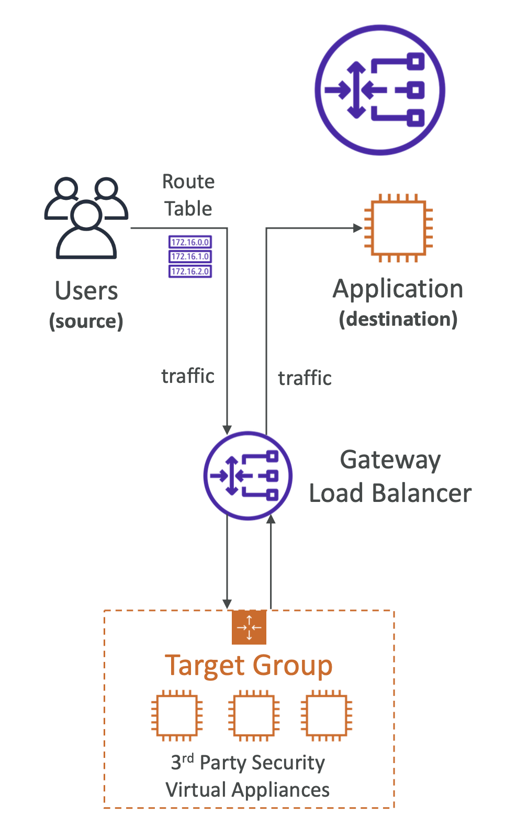

- 배포 및 확장과 AWS 내의 **서드파티 가상 어플라이언스의 묶음을 관리**한다.
- **방화벽 / 침입 감지 / 보안 / 패킷 탐지 시스템 / 부하 분산**
- GWLB (Gateway Load Balancer)는 네트워크 3계층 (IP)을 지원한다.
- 다음과 같은 기능들을 포함한다.
	- 투명한 네트워크 게이트웨이 (모든 트래픽의 출입구가 동일함)
	- 로드 밸런스: 가상 어플라이언스에 부하를 분산
- **6081 포트 (GENEVE) 프로토콜**을 사용한다.

 

## 5-5-1) Target Group

- EC2 인스턴스
- IP Address (사설 IP)

  

 
