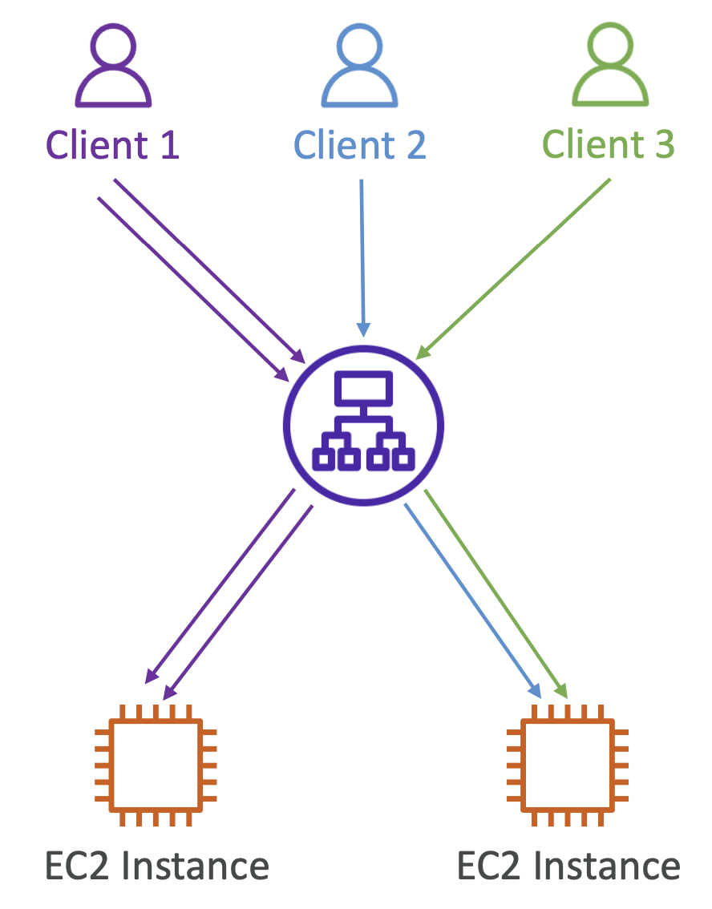

- **EC2 > 로드 밸런싱 > 대상 그룹 > 작업 > 보안 그룹 편집 > 대상 선택 설정 (Target Selection Configuration)**
- `고정 세션` 혹은 `Session Affinity`는 **두 번 이상의 한 클라이언트의 요청이 같은 인스턴스로 전달되어야 한다는 개념**이다. 즉, 같은 클라이언트는 항상 로드밸런서 뒤의 같은 인스턴스로 리다이렉트되도록 한다.
- CLB, ALB, NLB에서 적용 가능한 개념으로, CLB, ALB에서는 요청이 ELB로 전달될 때 쿠키가 같이 전송되며 여기에는 세션의 만료 시간이 기록되어 있다.
- **NLB에서는 쿠키를 사용하지 않는다.**
- 특정 인스턴스에 대해 Stickyness가 큰 유저들이 많이 존재하는 경우, 부하가 불균형할 수 있다.

 

## 5-6-1) Sticky Session - Cookie Names

### 5-6-1-1) Application Based Cookie

- 쿠키의 만료 시간을 애플리케이션 자체적으로 정할 수 있다.

- **Custom Cookie**
	- **애플리케이션 자체적으로 생성하는 사용자 정의 쿠키**
	- 애플리케이션에서 필요로 하는 모든 커스텀 속성이 포함될 수 있다.
	- 각 타겟 그룹 마다 개별적으로 쿠키 이름이 정해져 있어야 한다.
	- AWSELB, AWSALBAPP, AWSALBTG의 이름을 사용해서는 안된다.
- **Application Cookie**
	- **로드밸런서에 의해 생성되는 쿠키**
	- AWSALBAPP이라는 이름을 사용

 

### 5-6-1-2) Duration Based Cookie

- 로드 밸런서에 의해 생성되는 쿠키
- ALB에서는 AWSALB, CLB에서는 AWSELB가 사용된다.
- 로드 밸런서에 의해 생성된 기간이 지나면 만료된다.

  

 
