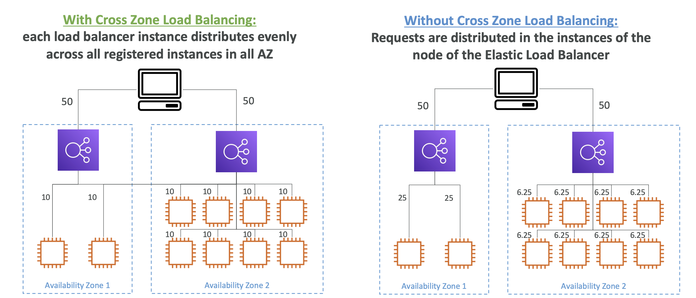

- **EC2 > 로드 밸런싱 > 속성 > 교차 영역 로드밸런싱**
- - **EC2 > 로드 밸런싱 > 대상 그룹 > 대상 선택 설정 **
- 고가용성을 위해 인스턴스(로드밸런서 포함)를 여러 AZ에 걸쳐서 배포한 상황일 때, **Cross Zone Load Balancing을 사용하면, 모든 인스턴스의 개수에 동일한 트래픽이 전달**된다. 만약, 이 설정을 사용하지 않는다면 **AZ단위로 같은 비율로 전달되므로 트래픽이 모든 인스턴스들에 고르게 전달되지 않을 수 있다**.

  

 

- ALB (Application Load Balancer)
	- **기본적으로 활성화되어 있다. (대상 그룹 단위에서 비활성화 가능하다.)**
	- AZ간 데이터 이동에 비용이 청구되지 않는다.
- NLB (Network Load Balancer & Gateway Load Balancer)
	- **기본적으로 비활성화되어 있다.**
	- AZ간 데이터를 옮기려면 비용을 내야 한다.
- CLB (Classic Load Balancer)
	- **기본적으로 비활성화되어 있다.**
	- AZ간 데이터 이동에  비용이 청구되지 않는다.
