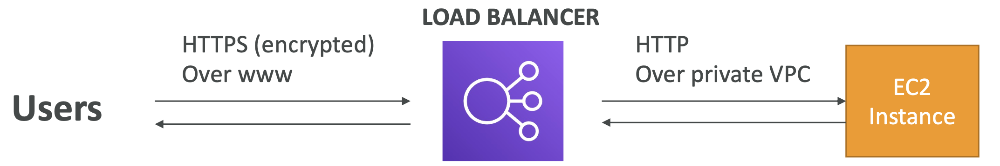
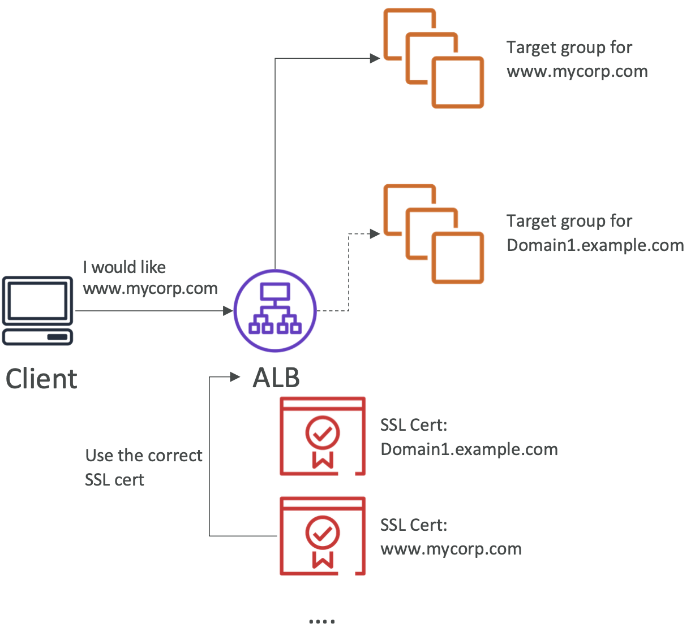

-  **EC2 > 로드 밸런싱 > 로드 밸런서 > 리스너 추가 > 보안 리스너 설정**
- SSL 인증서는 클라이언트와 로드 밸런서 간의 암호화된 통신을 제공한다.
- SSL(Secure Sockets Layer)은 암호화된 통신을 위해 사용된다.
- TLS(Transport Layer Security)는 좀 더 발전된 형태의 SSL을 의미한다.
- Public SSL 인증서는 CA(Certificate Authorities)들에 의해 발급된다.
	- Comodo, Symantec, GoDaddy, GlobalSign, Digicert, Letsencrypt
- SSL 인증서들은 만료일자를 가지며, 만료되면 갱신해야 한다.
- 로드 밸런서는 x.509 인증서를 사용한다.
- **인증서 관리를 위해 ACM(AWS Certificate Manager)를 사용할 수도 있다.**
- HTTPS 리스너
	- 기본 인증서를 지정해야 한다.
	- 여러 도메인을 지원하기 위해 여러 옵셔널 인증서들을 등록할 수 있다.
	- **클라이언트들은 SNI(Server Name Indication)을 사용하여 도달할 호스트네임을 구체화할 수 있다.**
	- 오래된 버전의 SSL/TLS를 지원하기 위해 보안 정책을 구체화할 수 있다.

  

 

## 5-8-1) SNI (Server Name Indication)

- SNI는 **하나의 웹 서버에 여러 개의 SSL 인증서를 로딩할 수 있는 문제를 해결**해준다.
- SNI의 목적은 **하나의 웹 서버가 여러 개의 도메인을 처리할 수 있도록 하기 위함**이다.
- 클라이언트는 첫 SSL 핸드쉐이크에서 타겟 서버의 호스트네임을 인지하도록 요구된다.
- 서버는 정확한 인증서를 찾아서 내려준다.
- ALB & NLB에서만 동작하는 개념이다.

  

 

## 5-8-2) ELB 버전 별 인증서

### 5-8-2-1) CLB (Classic Load Balancer)

- **오직 하나의 SSL 인증서만 지원한다.**
- 여러 개의 인증서의 도메인들을 처리하기 위해서는 여러개의 CLB를 사용해야만 한다.

 

### 5-8-2-2) ALB (Application Load Balancer), NLB (Network Load Balancer)

- **여러 개의 SSL 인증서를 위한 여러 개의 리스너를 지원한다.**
- SNI(Server Name Indication)을 통해 가능하다.
