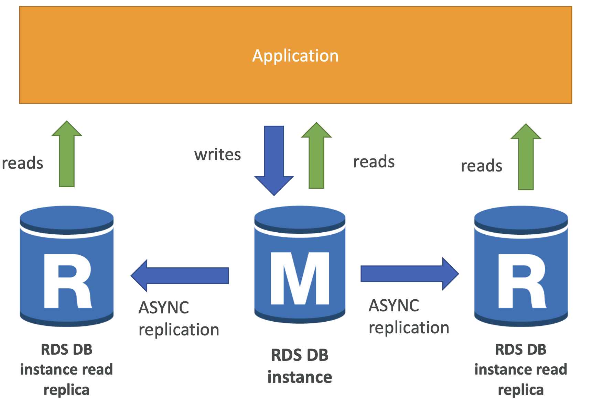
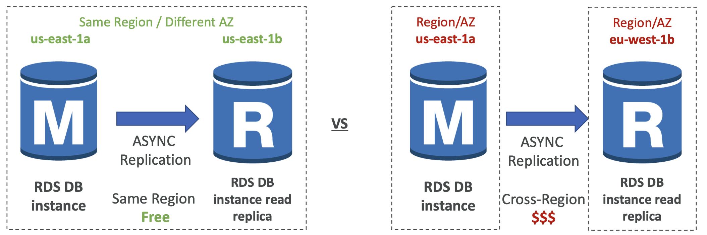
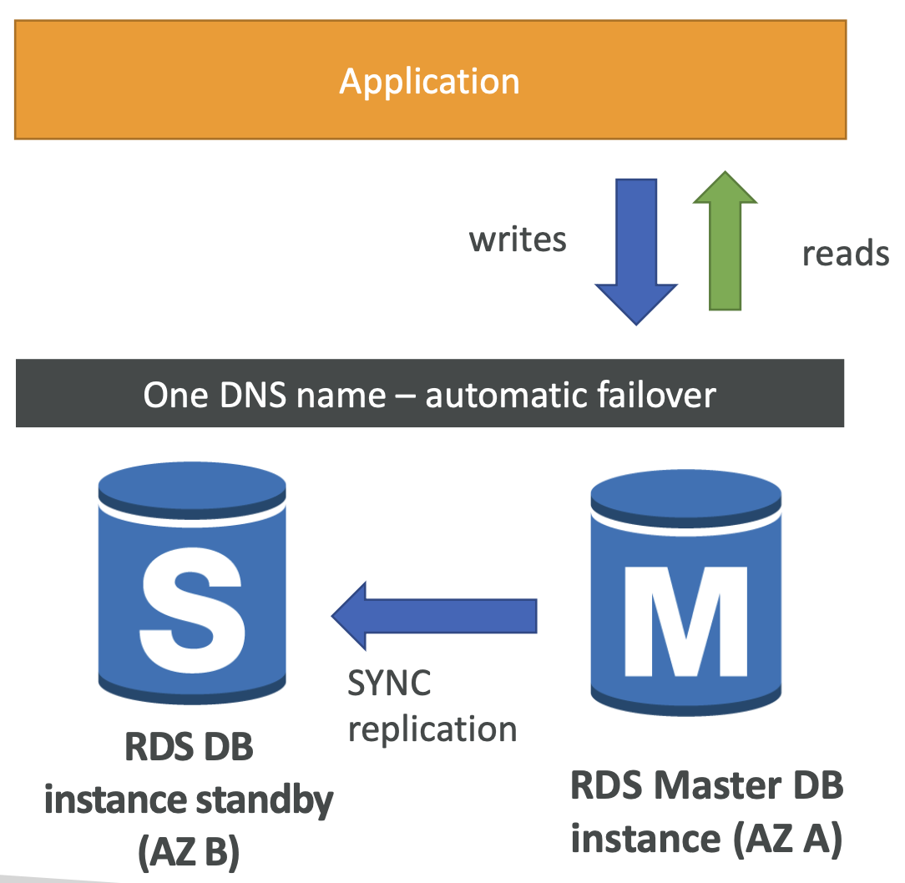
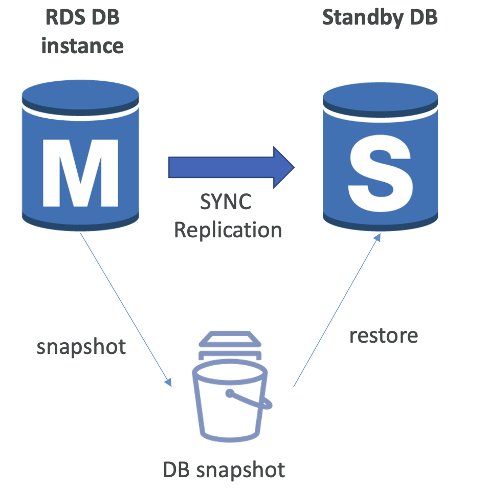

## 6-1-1) Amazon RDS(Relational Database Service)

- RDS(Relational Database Service)는 SQL을 사용하여 AWS 자체적으로 관리하는 관계형 데이터베이스 서비스를 의미한다.
	- PostgreSQL
	- MySQL
	- MariaDB
	- Oracle
	- Microsoft SQL Server
	- IBM DB2
	- Aurora (AWS Property Database)
- 자동화된 프로비저닝, OS 패칭 기능을 제공
- 지속적인 백업과 특정 시점의 복구를 지원
- 모니터링 대시보드
- Read Replicas를 통해 향상화된 읽기 성능을 제공
- **DR(Disaster Recovery)를 위한 멀티 AZ**
- 업그레이드를 위한 Maintenance window
- 수평/수직 스케일링
- **EBS를 통한 스토리지 백업**
- **인스턴스로의 SSH접속만 안됨**

## 6-1-2) Auto Scaling

- RDS DB 인스턴스 스토리지를 동적으로 증가시키는데 도움을 줌
- RDS가 남은 **용량이 없음을 감지하면, 자동적으로 스케일링**함
- 수동으로 데이터베이스 스토리지를 스케일링 하는 것을 방지해줌
- 최대 스토리지 Threshold를 설정해야함
- 다음과 같은 경우 스토리지가 자동적으로 조절됨
	- 남은 용량이 지정된 용량의 10% 미만일 때
	- 저용량으로 최소 5분 지속될 때
	- 마지막 수정으로부터 6시간 지났을 때
- 예측 불가한 워크로드의 애플리케이션에서 유용하다.
- 모든 RDS 엔진에 적용 가능하다.

## 6-1-3) Read Replicas

- **Aurora AND RDS > 데이터베이스 > 작업 > 읽기 전용 복제본 생성**
- RDB에서 읽기만 전용적으로 수행할 수 있는 레플리카를 생성하여 제공할 수 있다.
- **Read Replicas는 최대 15개 까지 생성** 가능하다.
- **단일 AZ, 멀티 AZ, 심지어는 멀티 리전**까지 제공한다.
- 마스터와 레플리카 사이에는 **비동기 복제가 발생**한다. 따라서 읽기의 수행은 일관성있다.
- 레플리카는 마스터 DB로 승격될 수 있다. 이 경우 마스터 DB의 생명주기(lifecycle)을 따르게 된다.
- 애플리케이션은 읽기 복제본을 활용하기 위해 **연결 문자열(connection string)을 업데이트**해야 한다.

  

 

### 6-1-3-1) 사용 사례

- UPDATE, DELETE, INSERT를 주로 수행하는 운영 애플리케이션에 영향이 가지 않게 하기 위해 SELECT만을 사용하는 보고성 / 분석용 / 통계용 작업일 경우 이러한 Read Replicas를 사용하여 마스터 DB에는 영향이 가지 않도록 할 수 있다.

### 6-1-3-2) Read Replicas - Network Cost

- AWS에서 보통 데이터가 타 AZ로 전송되는 경우 비용이 발생한다.
- 하지만 관리형 서비스의 경우 이러한 비용이 발생하지 않는다. **RDS Read Replica의 경우 같은 리전의 다른 AZ더라도 비용이 발생하지 않는다**.
- **다만, 리전간 이동에는 비용이 발생한다.**

  

 

## 6-1-4) RDS Multi AZ (Disaster Recovery)

- **동기 방식의 복제**로, **하나의 DNS 이름을 공유**하는 Active - Stanby 구조로 동작한다.
- 여러 AZ에 걸쳐서 존재할 수 있으므로, 가용성(Availability)를 높일 수 있다.
- AZ / Network / 인스턴스 / 스토리지 장애에 failover를 발생시킨다.
- 애플리케이션 내의 수동 간섭이 없고, 스케일링에 사용되지 않는다.
- **Read Replicas는 재해 복구(DR)를 위한 다중 AZ로 설정**된다.

  

 

### 6-1-4-1) Single AZ에서 다중 AZ로

- DB의 중단 없이 제로 다운타임 동작
- 데이터베이스 동작 수정을 위해서는 몇 번의 클릭으로 가능
- 내부적으로는 다음과 같이 동작한다.
	- 마스터 DB의 스냅샷이 생성됨
	- 새로운 AZ에서 스냅샷을 통해 DB가 복구됨
	- 두 DB 사이의 동기화가 이루어짐

  

 

## 6-1-5) RDS Custom

- 기본적으로 RDS에서 제공하는 DB는 상세한 DB 설정을 건드리거나 기저의 OS에 접근이 불가능한데, RDS Custom은 이를 가능하게 한다.
- OS, DB 사용자  정의가 더해진 관리형 Oracle, Microsoft SQL 서버
- RDS: 자동화 설정, 동작, AWS 내 DB 스케일링
- RDS Custom: 기저 데이터베이스 및 OS에 접근할 수 있으므로
	- 내부 세팅 설정
	- 패치 인스톨
	- 네이티브 기능 활성화
	- SSH, SSM Session Manager를 통해 기저 EC2 인스턴스에 접근
- 사용자 정의(커스텀화)를 수행하려면 자동화 모드를 비활성화하고 DB 스냅샷을 먼저 찍는 것이 좋습니다.
- RDS vs RDS Custom
	- RDS: 전체 DB와 OS가 AWS에 의해 관리됨
	- RDS Custom: 기본 OS와 DB에 관리자 권한으로 접근
