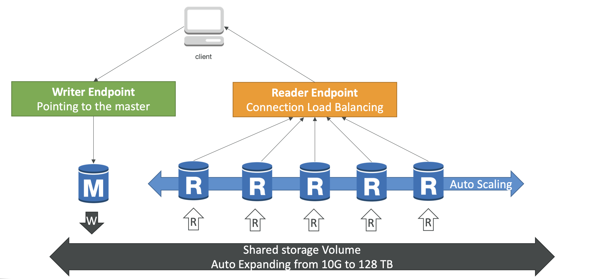
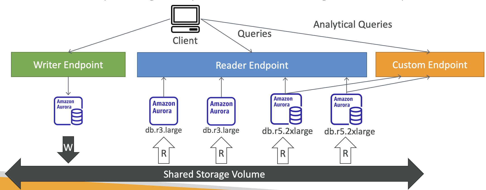
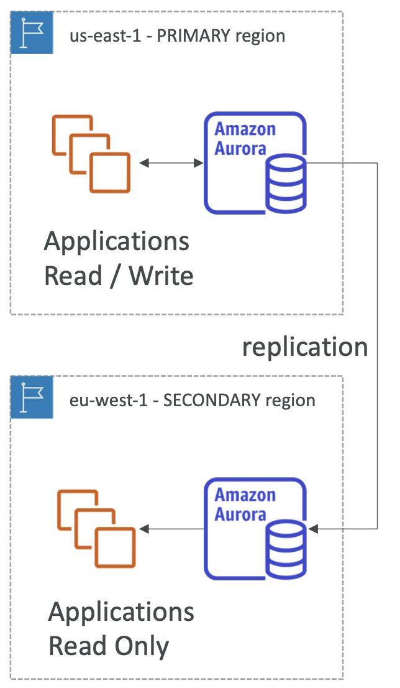

- Amazon Aurora는 오픈 소스는 아닌 AWS 고유 기술로 지원하는 RDB이며, PostgreSQL과 MySQL와 호환되도록 설계되어 있다.
- Amazon Aurora는 **AWS 클라우드에 최적화되어 있어 기존 RDS보다 훨씬 빠른 성능을 제공**해준다.
- Amazon Aurora의 스토리지는 **공유 스토리지로 자동적으로 10 ~ 128테라바이트까지 확장될 수 있다**.
- **읽기 전용 복제본을 15개까지 둘 수 있고, 복제 속도도 훨씬 빠르다. Failover 역시 훨씬 빠르며, 다중 AZ나 네이티브 RDS보다 빠르다**. 또한, 기본적으로 클라우드 네이티브이다 보니 가용성도 높다.
- 비용은 기본 RDS보다 20% 정도 높지만, 스케일링 측면에서 효율적이라 보다 저렴하게 이용할 수도 있다.

 

## 6-2-1) High Availability and Read Scaling

- Amazon Aurora는 **3개의 AZ에 총 6개의 복제본을 저장**한다.
	- 쓰기 동작을 위해서는 **6개 중 4개가 동작**하면 된다.
	- 읽기 동작을 위해서는 **6개 중 3개가 동작**하면 된다.
	- 레플리케이션에 장애가 발생해도 P2P 복제로 자가 치유 된다.
	- 스토리지는 100개의 볼륨에 스트라이프 형태로 저장된다.
- **하나의 Aurora Instance (Master)가 쓰기를 전담**한다.
- 마스터의 장애 시 **failover가 30초 이내에 발생**한다. 이 때 읽기 레플리카 중 하나가 마스터가 된다. (Amazon RDS와 다른 부분)
- 최대 **마스터 + 15개의 읽기 레플리카**를 지원한다.
- **여러 Region**에 걸친 레플리케이션도 제공한다.

 

## 6-2-2) Aurora Cluster

- Aurora Cluster는 크게 마스터와 Read Replicas들로 구성되어 있는데, 마스터만 읽기 / 쓰기를 모두 지원한다.
- 이들은 **공유 스토리지를 공유**하며, 이 스토리지는 10GB에서 128GB까지 자동적으로 확장된다.
- **Writer Endpoint는 이 중 쓰기를 담당하는 마스터를 가리키는(Pointing) 도메인 주소**이며, 클라이언트는 이 주소에 접근하여 마스터를 통해 쓰기 업무를 수행할 수 있다. failover시 가리키는 인스턴스도 변경된다.
- **Reader Endpoint는 Read Replicas들 중 하나로 로드밸런싱되도록 하는데, 최대 15개의 Read Replicas를 오토 스케일링을 통해 조절**할 수 있다.

  

 

## 6-2-3) Amazon Aurora의 특징

- 자동 Fail-over
- 백업과 복원
- 격리와 보안
- 산업 컨플라이언스
- 버튼식 스케일링
- 무중단 형태의 자동화된 패치
- 향상된 모니터링
- 루틴 메인터넌스
- 특정 시점 (스냅샷)으로의 데이터 복구

 

## 6-2-4) Amazon Aurora - Custom Endpoints

- Aurora Instance들의 일부를 사용자 정의 엔드포인트(Custom Endpoint)로 지정할 수 있다.
- 일반적으로 사용자 정의 엔드포인트가 만들어지면, 리더 엔드포인트(Reader Endpoint)는 사용되지 않게 된다.

  

 

## 6-2-5) Amazon Aurora - Serverless

- 실제 사용량 기반의 자동화된 데이터베이스 인스턴스화 및 오토 스케일링
- 빈번하지 않고 간헐적인, 예측 불가한 업무에 적합하다.
- 용량 플래닝이 필요치 않다.
- 초당 비용 결제로 비용 절감 효과가 더 크다.

 

## 6-2-6) Global Aurora

- **Aurora Cross Region Read Replicas:**
	- 재해 복구에 효과적이다.
	- 설치가 간단하다.
- **Aurora Global Database (추천됨):**
	- **1개의 Primary 리전 (Read / Write)**
	- **5개까지의 세컨더리 (Read Only) 리전**, 레플리케이션 랙은 1초 미만
	- **세컨더리 리전당 16개까지의 읽기 레플리카**
	- 지연 감소에 도움이 된다.
	- RTO 1분 이내로 다른 리전을 Primary 리전으로 승격시킬 수 있다.
	- 일반적으로 리전간 레플리케이션은 1초 안애 이루어진다.

  

 

## 6-2-7) Aurora Machine Learning

- 애플리케이션에서 SQL을 통해 **ML 기반의 예측을 제공**한다.
- Aurora와 AWS ML 서비스 간에 간단하고, 최적화되어 있고, 보안이 결합되어 있다.
- 제공 서비스는 다음과 같다.
	- Amazon SageMaker (어떠한 ML 모델도 이용 가능)
	- Amazon Comprehend (세밀한 분석이 목적)
- ML 경험이 없어도 된다.
- 사기 감지, 광고 타게팅, 세밀한 분석, 제품 추천 등
