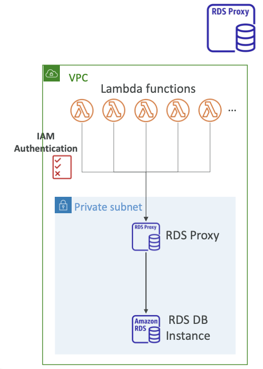

- RDS를 위해 **완전 관리된 데이터베이스 프록시를 제공**한다.
- 데이터베이스와의 **DB 커넥션 풀을 제공하고 공유**한다.
- 데이터베이스 리소스들에 대한 스트레스를 감소시켜 데이터베이스 효율성을 증가시키고 열린 커넥션 수를 감소한다.
- Multi-AZ를 통해 서버리스, 오토 스케일링, 고가용성을 제공한다.
- failover 시간이 66% 감소한다.
- RDS (MySQL, PostgreSQL, MariaDB, MS SQL Server), Aurora (MySQL, PostgreSQL)에서 이용 가능하다.
- 코드 변화 없이 DB Host만 Proxy 주소로 변경하면 된다.
- **DB연결 시 IAM 사용이 강요되고, AWS Secret Manager에서 인증정보가 안전하게 보관된다.**
- Public 접근이 불가능하다. (VPC로부터의 접근만 허용된다.)

  

 
