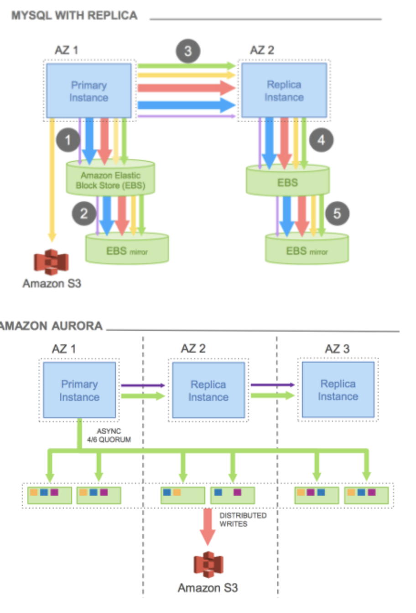

## 6-6-1) Amazon RDS vs Aurora Storage 방식 차이

- **Amazon RDS**
	- RDS는 EBS를 통해 스토리지가 제공되며, 프로비전된 RDS 인스턴스 사이즈와 EBS 볼륨 타입 / 사이즈
	- 오토 스케일링을 통해 용량의 증설이 가능하다.
	- 고가용성을 위해 Read Replication에서 Primary 데이터를 비동기 복제해가는 방식이 적용된다. Read Replication의 수는 최대 15개까지이며, Primary가 다운되면 자동으로 Read Replication 중 하나가 Primary로 승격된다.
	- Read Replication은 단일 AZ, 다중 AZ, 다중 리전을 제공한다.
	- 다중 AZ 옵션을 통해 DR(Disaster Recovery) 지원을 위해 Active-Stanby 구조로 동작한다.

 

- **Amazon Aurora**
	- 데이터베이스의 데이터 용량이 늘어날수록 Aurora 클러스터 볼륨은 자동 확장되며, Aurora 클러스터의 볼륨 크기는 최대 128 tebibytes (TiB)까지 증가할 수 있다.
	- Aurora 역시 Read Replication을 15개까지 지원하며 단일 AZ, 다중 AZ, 다중 리전을 제공한다. 다만 스토리지가 공유 스토리지로서, 3개의 AZ에 총 6개의 레플리케이션을 저장한다.
	- 6개의 레플리케이션 중 4개가 동작해야 쓰기가 정상적으로 가능하고, 3개가 동작해야 읽기가 정상적으로 동작한다.
	- 1개의 Master (Write 전담) + 15개의 Slave (Read 전담)로 클러스터가 구성되며, 각 Write 노드와 Read Replication에는 Endpoint가 제공되어 로드밸런싱 된다. 그 외에 Custom Endpoint가 제공되어 일부 Read Replication에 대한 접근을 제공한다.
	- Failover시 DR은 30초 이내에 이루어 진다.
	- 이외에 `Amazon Aurora Global Database`을 통해 1개의 Primary 리전 (Write 전담), 5개의 Secondary 리전 (Read 전담), Secondary 리전당 16개의 읽기 레플리케이션이 제공 가능하다.
	- 재해 및 복구 기능은 RDS와 유사하나, Amazon Aurora는 Database Cloning 기능을 통해 운영중인 Database에 영향이 없고 스냅샷 복구보다 빠르게 복제본 생성이 가능하다. 이는  `copy-on-write` 프로토콜을 이용하며, 초기에는 원본 스토리지를 같이 사용하다가, 복제가 완료되면 기존의 연결을 끊고 분리된다.

  

 
