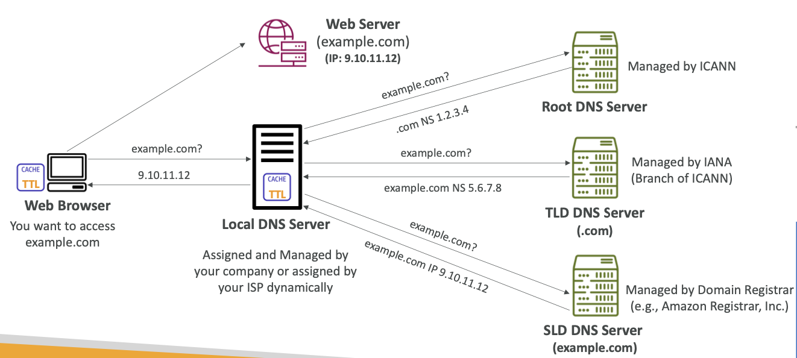
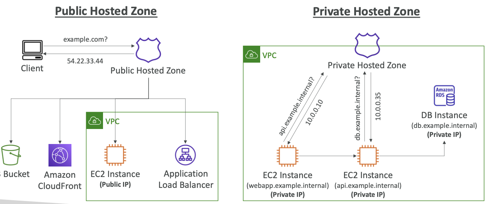
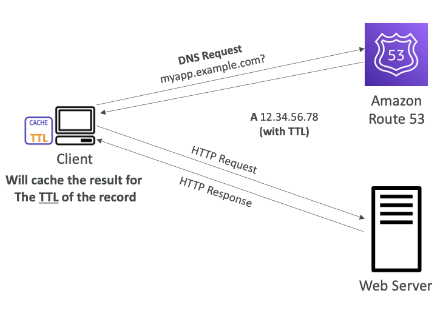
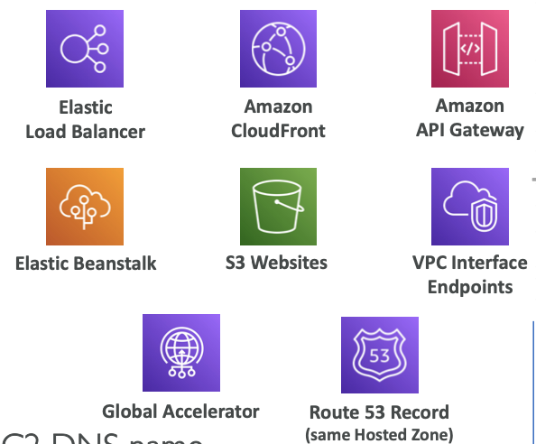

  

 

- **Route 53 > 도메인 > 등록된 도메인**
- 고가용성,  확장가능한, 완전히 관리되고 권위 있는 DNS 이다.
- Route 53은 `Domain Registrar` (도메인 등록 가능 기관) 이다.
- 리소스의 상태를 체크하는 기능을 가졌으며, 오직 AWS 서비스만 100% SLA 가용성을 제공한다.
- 레코드를 통해 특정 도메인으로 라우팅 하는 방법을 정의한다.
- 각 레코들은 다음을 포함한다.
	- 도메인 / 서브 도메인 이름 - example.com
	- 레코드 타입 - A, AAAA
	- 값 - 12.34.56.78
	- 라우팅 정책 - Route 53이 쿼리에 어떻게 응답하는지에 대해
	- TTL - 레코드가 DNS에 얼마나 캐시될지에 대한 시간
- Route 53은 다음 DNS 레코드 타입을 지원한다.
	- A / AAAA / CNAME / NS
	- CAA / DS / MX/ NAPTR / PTR / SOA / TXT / SPF / SRV

 

## 8-1-1) Record Types

- **A**: IPv4에 호스트네임 매핑
- **AAAA**: IPv6에 호스트네임 매핑
- **CNAME**: 다른 호스트네임에 호스트네임 매핑
	- 타겟 도메인 네임은 A / AAAA 레코드를 갖는 도메인 네임이어야 한다.
	- DNS 네임스페이스의 최고 노드 (Zone Apex)의 레코드로 생성할 수 없다.
		- example.com으로는 생성 불가하고, www.exmaple.com 으로는 생성 가능.
- **NS**: **Hosted Zone**의 네임 서버
	- 트래픽이 도메인에 라우트 되는지를 제어

 

## 8-1-2) Hosted Zone

- 라우팅 트래픽이 도메인 혹은 서브도메인에 어떻게 도달할지를 정의한 레코드들의 보관소
- **Public Hosted Zones**
	- 라우팅 트래픽이 인터넷에 어떻게 도달할지를 구체화한 레코드들을 보관
- **Private Hosted Zones**
	- 라우팅 트래픽들이 하나 또는 여러개의 VPC에 어떻게 도달할지를 구체화한 레코드들을 보관
- hosted zone에 등록시 매달 $0.50 씩 지불해야 한다.

  

 

## 8-1-3) Records TTL (Time To Live)

- Records TTL (Time to Live)는 Route 53과 통신하는 클라이언트에게 레코드의 쿼리 결과를 특정 시간 동안 캐시해두도록 하는 기능이다. TTL이 걸려 있는 동안 Client는 DNS로 쿼리를 보내지 않고, 캐시된 결과를 사용한다.
- High TTL (e.g. 24시간)
	- Route 53으로의 더 적은 트래픽
	- 기간이 지난 데이터를 받을 수 있음
- Low TTL (e.g. 1분)
	- Route53에 더 많은 트래픽이 몰려 더 많은 비용 발생
	- 기간이 지난 데이터가 더 적음
	- 레코드 변경이 쉬움

  

 

## 8-1-4) CNAME vs Alias

- AWS 리소스 (Load Balancer, CloudFront)는 기본적으로 AWS hostname을 expose한다. 이 때 내가 가지고 있는 도메인으로 매핑하고 싶을 때는 Route 53의 CNAME 혹은 Alias (A, AAAA) 방식을 사용하면 된다.

> **CNAME**
> 	- hostname이 **다른 A,AAAA 레코드의 hostname**을 가르키도록 한다.
> 	- **ROOT 도메인에서는 적용 불가능**하다. (something.domain.com에서는 가능, domain.com에서는 불가능)
> **Alias**
> 	- hostname이 **AWS 리소스**를 가리키도록 한다.
> 	- ROOT 도메인이던 NON ROOT DOMAIN이던 동작시킬 수 있다.
> 	- 비용이 무료이다.
> 	- health check를 Native하게 지원한다.

- hostname을 AWS 리소스에 매핑하며, 단순히 DNS 기능의 확장 기능이다.
- 리소스 내의 IP 주소 변화를 자동적으로 인식한다.
- CNAME과 다르게, DNS 네임스페이스의 탑 노드(Zone Apex)도 적용 가능하다.
- **Alias 레코드는 항상 A/AAAA 타입**이어야 한다.
- **TTL은 AWS 자체적으로 관리하므로 설정할 수 없다.**
- 다음과 같은 대상에 지정할 수 있다.
	- Route 53 Records in the same hosted zone
	- Elastic Load Balancers (ELB)
	- API Gateway
	- Elastic Beanstalk Envirionments
	- S3 Websites
	- CloudFront Distributions
	- Global Accelerator
	- VPC Interface Endpoints
- EC2 DNS 이름으로 Alias 레코드를 설정할 수 없다.

  

 