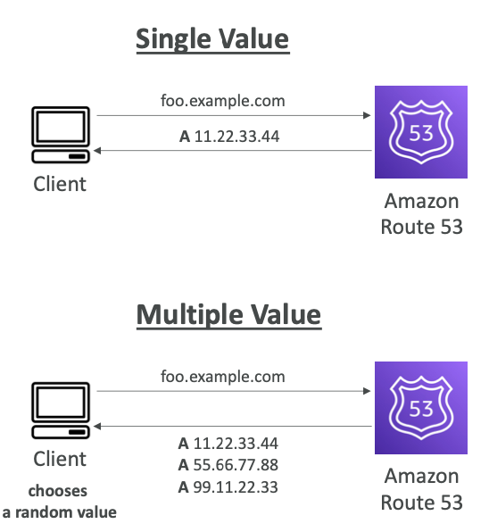
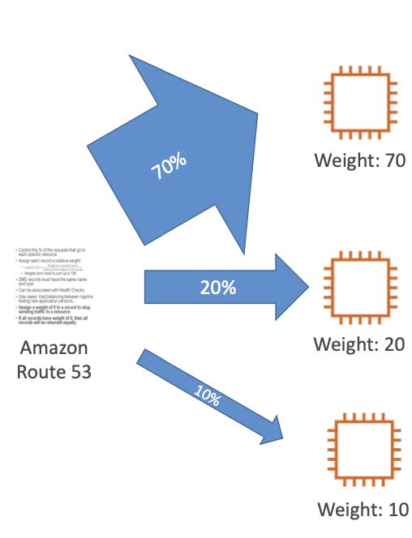
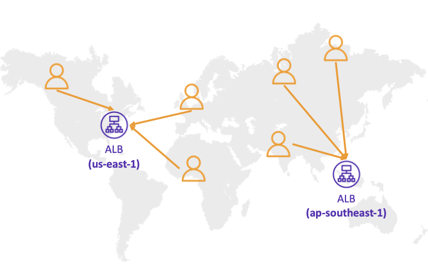
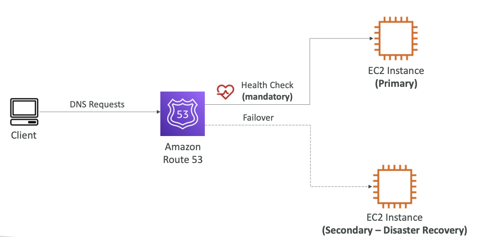
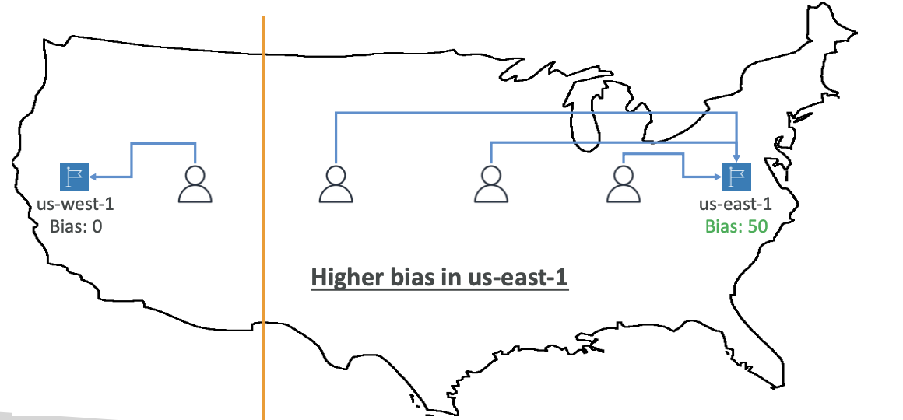

- 라우팅 정책이란 Route 53의 DNS 쿼리 정책을 의미하며, **기본적으로 통용되는 트래픽의 부하 분산의 라우팅이라는 의미와 다르게 DNS 쿼리 응답**을 의미한다.
- Route 53은 다음과 같은 정책들을 지원한다.
	- Simple
	- Weighted
	- Failover
	- Latency Based
	- Geolocation
	- Multi-Value Answer
	- Geoproximity (Route 53 Traffic Flow 기능 사용)

 

## 8-2-1) Simple Routing Policy

- 기본적으로 traffic을 하나의 리소스로 연결하지만, 같은 레코드 내에서 여러 리소스에 매핑할 수도 있다.
- 만약, DNS에서 여러 개의 결과가 리턴되면 클라이언트는 그 중 하나를 랜덤하게 골라서 사용한다.
- Alias가 활성화되어 있으면, 하나의 AWS 리소스만 특정할 수 있다.
- **Health Check와 연동은 불가능**하다.

  

 

## 8-2-2) Weighted Routing Policy

- 각 특정 리소스에 도달할 요청의 비율을 조절할 수 있다. 이는 각 레코드에 **가중치**를 둠으로 써 가능하다.
$$ traffic (\%)\,=\,\frac{Weighted\,for\,a\,specific\,record} {Sum\,of\,all\,the\,weights\,for\,all\,records} $$

- DNS 레코드들은 같은 이름과 타입을 가져야 한다.
- **Health Check에 연동될 수 있다.**
- 특정 레코드의 **가중치만 0으로 두면, 해당 리소스로는 라우팅되지 않는다**.
- **모든 레코드의 가중치를 0으로 두면, 모든 레코드에 동일하게 라우팅된다.**

  

 

## 8-2-3) Latency Based Routing Policy

- **가장 적은 Latency**를 가지는 리소스로 리다이렉트 한다.
- 유저들에게 지연이 가장 우선순위가 높은 경우 유용하며, 유저의 AWS 리전간 트래픽에 기반한다.
- Health Check와 연동 가능하다.

  

 

## 8-2-4) Failover Routing Policy

- 헬스 체크를 통해 **Primary, Secondary 인스턴스를 지정하여 Primary 인스턴스가 fail인 경우 Secondary로만 트래픽이 전달될 수 있도록 하는 방식**이다.

  

 

## 8-2-5) Geolocation Routing Policy

- Latency Based와 다르게, **실제 사용자의 지역에 기반한 라우팅 방식**이다.
- 지역을 대륙 / 국가 / 미국의 각 주를 기반으로 선택할 수 있으며 지역이 겹칠 경우 가장 정밀한 설정대로 라우팅된다.
- Default 레코드를 생성해야만 한다 (어디에도 속하지 않는 트래픽에 대한 처리)
- 헬스 체크와 연동할 수 있다.

 

## 8-2-6) Geoproximity Routing Policy

- 사용자와 리소스의 지리적 장소를 기반으로한 트래픽 라우팅 방식이다.
- 각 **지역별 편향(bias)를 지정** 가능하며, 이를 기반으로 리소스의 트래픽 기준선을 움직일 수 있다.
	- 양수 (1~99): 해당 리소스로 트래픽이 더 많아지게 설정
	- 음수 (-1 ~ -99): 해당 리소스로 트래픽이 덜 많아지게 설정
- 리소스는 다음과 같이 설정 가능하다.
	- 지역 정보가 구체화한 AWS 리소스들
	- 위도/경도 정보를 구체화한 비 AWS 리소스들
- 이 기능을 위해서는 `Route 53 Traffic Flow`를 사용해야 한다.

  

 

## 8-2-7) IP-Based Routing Policy

- **IP CIDR을 설정하여 이를 기반으로한 클라이언트 라우팅**
- 사용자가 **특정 ISP를 통해/특정 지역에서 접속하는 경우에 대한 케이스 분기**로 사용 가능

 

## 8-2-8) Multi-Value Answer Routing Policy

- 여러 리소스로 라우트해야할 때 사용
- Route 53이 여러 리소스를 리턴해준다.
- Simple 방식에서 리턴하는 것과 다르게, 헬스 체크와 연동되어 healty한 리소스들만 리턴해준다.
- 최대 8개까지 리턴할 수 있다.
- **ELB와 다르게 클라이언트 기반 트래픽 분산이므로, ELB의 대체제가 될 수 없다.**
