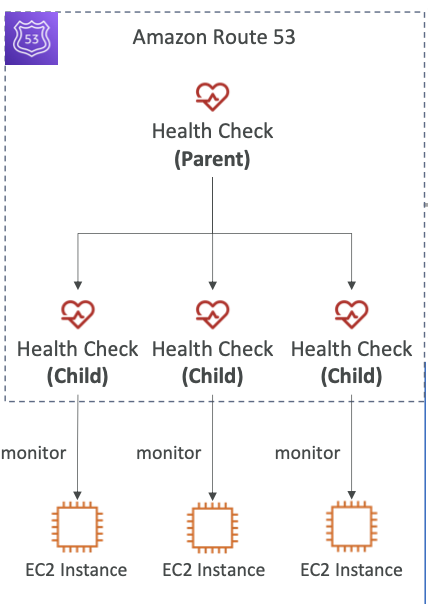
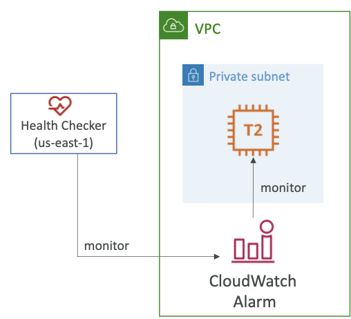

- **Route 53 > 헬스 체크 (상태 확인)**
- HTTP 헬스 체크는 오직 **Public 리소스에 한해서만 사용 가능**하다.
- Route 53의 Health 체크는 자동화된 DNS 실패 회피 방법으로 다음과 같은 종류가 있다.
	- **엔드 포인트를 모니터링**하는 헬스 체크 (application, server, 다른 AWS 리소스)
	- **다른 헬스 체크를 헬스 체크**하는 방식 (Calculated Health Check)
	- **CloudWatch Alarm을 모니터링**하는 헬스 체크 (DynamoDB의 병목 확인, RDS 알람 체크, 커스텀 메트릭)
		- 이는 Private 리소스들을 체크할 때 유용하다.
- 헬스 체크들은 CloudWatch 메트릭과 결합되어 있다.

 

## 8-3-1) Monitor an Endpoint

- 약 15개의 글로벌 헬스 체커들이 엔드포인트 상태를 체크한다.
	- Healthy / Unhealthy Threshold - 3번 (기본)
	- 인터벌 - 30초 (10초도 가능하나 비요이 더 비싸다)
	- HTTP, HTTPS, TCP 지원
	- 18% 이상의 헬스 체커들이 엔드포인트가 Healthy 하다고 보고하면, Route 53은 이를 Healthy하다고 판단하고, 그렇지 않을 경우 Unhealthy 하다고 판단한다.
- 헬스 체크 시 엔드포인트 응답이 2XX 혹은 3XX일때만 통과시킨다.
- 헬스 체크는 응답의 첫 **5120 바이트 텍스트에서 성공/실패를 세팅**할 수 있다.
- Route 53 헬스 체커들의 요청을 허용하기 위해 라우터/방화벽을 설정한다.

 

## 8-3-2) Calculated Health Checks

- **여러 헬스 체크의 결과를 결합하여 하나의 헬스 체크로 보여준다.**
- **OR, AND, NOT** 연산을 통해 취합 가능하다.
- 최대 **256개의 자식 헬스 체크**를 모니터링 할 수 있다.
- 통과 상태로 두기 위해 **얼마나 많은 헬스 체크가 통과되어야 하는지 구체화**할 수 있다.
- 모든 헬스 체크 실패에 대한 확인 없이 웹 사이트의 항상성을 보여준다.

  

 

## 8-3-3) Private Hosted Zones

- **Route 53 헬스 체커들은 VPC외부에 존재**하므로, Private 엔드포인트들에 대한 접근이 불가하다.
- 이들은 **CloudWatch Metric을 생성하여 이를 헬스 체크에 연동하여 알람이 발생하는지를 모니터링**하게 할 수 있다.

  

 
