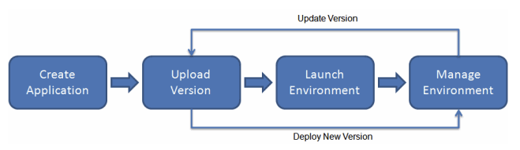
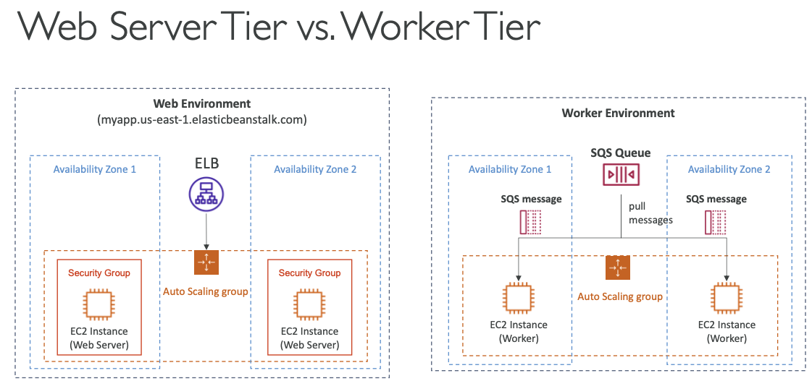

- **Elastic Beanstalk > 애플리케이션 생성 **
- **IAM에서 Beanstalk 관련 role도 생성 필요**

 

## 9-1-1) Elastic Beanstalk

- `AWS Elastic Beanstalk`는 개발자가 **인프라에 대한 고민 없이** 애플리케이션의 개발에만 집중하여, 쉽게 배포하고 할 수 있게 해주는 AWS 서비스이다. 몇 번의 클릭만으로 인프라를 쉽게 생성 가능하다.
- 배포 시 EC2, ASG, ELB, RDS, S3등을 사용한다.
	- 자동적으로 프로비저닝, 로드 밸런싱, 스케일링, 애플리케이션 상태 모니터링, 인스턴스 설정 등을 관리한다.
	- 애플리케이션 코드만 개발자의 책임이다
	- 단일 또는 Multi-AZ를 구성할 수 있다.
- Beanstalk는 기본적으로 무료이나 인스턴스들에 따라 비용을 지불해야 한다.
- Beanstalk는 다음과 같은 요소들로 구성되어 있다.
	- **Application**: Elastic Beanstalk 구성요소들의 집합 (environments, versions, configurations)
	- **Application Version**: 애플리케이션 코드의 버전
	- **Environment**
		- 애플리케이션 버전이 동작하는 AWS 리소스들의 집합 (한 번에 한 애플리케이션 버전)
		- Tiers: Web Server Environment Tier & Worker Environment Tier
		- 여러 개의 환경을 구성할 수 있다. (dev, stg, prd)

  

 

- Go, Java SE, Java with Tomcat, .NET Core on Linux, .NET on Windows Server, Node.js, PHP, Python, Ruby, Packer Builder, Single Container Docker, Multi-Container Docker, Preconfigured Docker등에서 사용 가능하다.

 

## 9-1-2) Web Server Tier VS Worker Tier

  

 

- **Web Server Tier**: 로드 밸런서의 위치를 알고 있는 전통적인 아키텍처로, 로드 밸런서가 트래픽을 오토 스케일링 그룹으로 보내고 여기에 여러 EC2 인스턴스가 위치하고 있어 웹 서버 역할을 한다.
- **Worker Tier**: 작업자 환경을 중심으로 이루어진다. EC2 인스턴스에 직접 액세스하는 클라이언트가 없다. 여기서는 메시지 대기열인 SQS 큐를 사용하며 EC2 인스턴스는 이 큐에서 메시지를 가져와서 처리한다. SQS 큐는 메시지의 수에 따라 스케일링 되며, 다른 Web Server Tier로부터 메시지를 밀어넣을 수 있다.