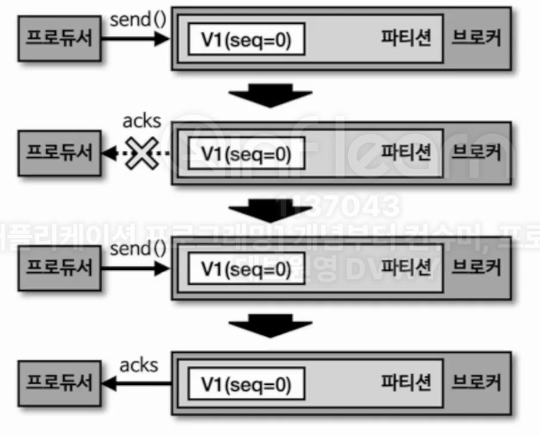
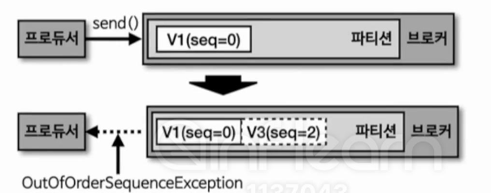

- 멱등성이란 여러 번 연산을 하더라도 동일한 결과를 나타내는 것을 의미한다. 이러한 의미에서 **멱등성 프로듀서는 동일한 데이터를 여러 번 전송하더라도 카프카 클러스터에는 단 한 번만 저장됨**을 의미한다. 기본 프로듀서의 동작 방식은 적어도 한번 전달 (at least once delivery)을 지원한다. 적어도 한번 전달이란 프로듀서가 클러스터에 데이터를 전송하여 저장할 때 적어도 한 번 이상 데이터를 적재할 수 있고 데이터가 유실되지 않음을 의미한다. 하지만 클러스터에 장애가 있을 경우 이러한 특성 때문에 데이터가 중복으로 저장될 수 있다.

</br>

## 7-1-1) 멱등성 프로세스

- 프로듀서가 보내는 데이터의 중복 적재를 막기 위해서 0.11.0 버전 이후부터 프로듀서에서는 `enable.idempotence` 옵션을 사용하여 정확히 한 번 전달 (exactly once delivery)을 지원한다. 이 옵션의 기본 값은 false이며 정확히 한 번 전달을 하기 위해서는 true로 변경되어야 한다. 카프카 3.0.0부터는 기본 값이 true(acks = all)로 변경되므로, 신규 버전에서 프로듀서의 동작에 유의하여야 한다.
- 명시적으로 멱등성 프로듀서 설정을 켜기 위해서는 `ENABLE_IDEPOTENCE_CONFIG` 설정을 true로 해줘야 한다.

</br>

## 7-1-2) 멱등성 프로듀서의 동작

- 멱등성 프로듀서는 기본 프로듀서와 달리 데이터를 브로커로 전달할 때 프로듀서 PID (Producer Unique ID)와 시퀀스 넘버(Sequence Number)를 함께 전달한다. 그러면 브로커는 프로듀서의 PID와 시퀀스 넘버를 확인하여 동일한 메시지의 적재 요청이 오더라도 단 한 번의 데이터 적재만 수행하므로 정확히 한 번 브로커에 데이터가 적재되도록 한다.

> PID(Producer Unique ID): 프로듀서의 고유한 ID
> SID(Sequence ID): 레코드의 전달 번호 ID

</br>

## 7-1-3) 멱등성 프로듀서가 아닌 경우

<div align="left">
  
</div>
</br>

- 멱등성 프로듀서가 아닌 경우 send()를 통해 브로커에 데이터가 적재되더라도, acks를 프로듀서가 받지 못한 경우 중복된 데이터가 적재될 수도 있다.

## 7-1-4) 멱등성 프로듀서인 경우

<div align="left">
  
</div>
</br>

- SID, PID 조합 때문에 한 번 적재된 데이터는 다시 적재하지 않는다.

## 7-1-5) 멱등성 프로듀서의 한계

- 멱등성 프로듀서는 동일한 세션에서만 정확히 한 번 적재됨을 보장한다. 여기서 말하는 동일 세션이란 PID의 생명 주기를 뜻한다. 만약 멱등성 프로듀서로 동작하는 프로듀서 애플리케이션에 이슈가 발생하여 종료되고 애플리케이션을 재시작하면 PID가 달라진다. 동일한 데이터를 보내더라도 PID가 달라지면 브로커 입장에서는 다른 데이터로 판단하기 때문에 멱등성 프로듀서는 장애가 발생하지 않는 경우에 한해서만 한 번 적재됨을 보장한다.

## 7-1-6) 멱등성 프로듀서로 설정할 경우의 옵션

```java
configs.put(ProducerConfig.ENABLE_IDEMPOTENCE_CONFIG, true);
```
</br>

- 멱등성 프로듀서로 설정하기 위해 `enable.idempotence`를 true로 설정하게 되면 정확히 한 번 적재하는 로직이 동작하기 위해 여러 옵션이 강제된다. 프로듀서의 재전송 횟수를 정하는 retries는 기본 값으로 Integer.MAX_VALUE로 설정되고 acks 옵션은 all로 설정된다. 이렇게 설정되는 이유는 프로듀서가 적어도 한 번 이상 브로커에 데이터를 보냄으로써 브로커에 데이터가 단 한 번만 적재되는 것을 보장하기 위해서이다. 또한, 이러한 설정으로 인해 브로커의 자체 부하도는 올라가게 된다.

## 7-1-7) 멱등성 프로듀서 사용 시 오류 확인

<div align="left">
  
</div>
</br>

- 멱등성 프로듀서의 시퀀스 넘버는 0부터 시작하여 숫자를 1씩 더한 값으로 전달된다. 브로커에서 멱등성 프로듀서가 전송한 데이터의 PID와 시퀀스 넘버를 확인하는 과정에서 시퀀스 넘버가 일정하지 않은 경우에는 OutOfOrderSeqeunceException이 발생할 수 있다. 이 오류는 브로커가 예상한 시퀀스 넘버와 다른 번호의 데이터의 적재 요청이 왔을 때 발생한다. 이 경우 시퀀스 넘버의 역전현상이 발생할 수 있기 때문에 순서가 중요한 데이터를 전송하는 프로듀서는 이에 대한 방안을 고려해야 한다.
