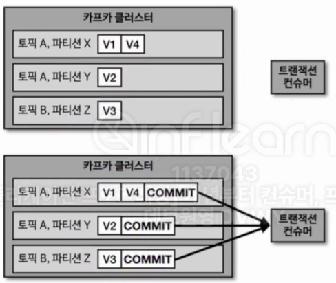

## 7-2-1) 트랜잭션 프로듀서

- 카프카에서 트랜잭션은 다수의 파티션에 데이터를 저장할 경우 모든 데이터에 대해서 동일한 `원자성(atomic)`을 만족시키기 위해 사용된다. 원자성을 만족시킨다는 의미는 다수의 데이터를 동일 트랜잭션으로 묶음으로써 전체 데이터를 처리하거나 전체 데이터를 처리하지 않도록 함을 의미한다. 트랜잭션 프로듀서는 사용자가 보낸 데이터를 레코드로 파티션에 저장할 뿐만 아니라, 트랜잭션의 시작과 끝을 나타내기 위해 `커밋(Commit)`을 의미하는 트랜잭션 레코드를 한개 더 보낸다.

</br>

## 7-2-2) 트랜잭션 프로듀서의 동작

<div align="left">
  
</div>
</br>

- 트랜잭션 컨슈머는 파티션에 저장된 트랜잭션 레코드를 보고 트랜잭션이 완료(commit) 되었음을 확인하고 데이터를 가져간다. 트랜잭션 레코드는 실제 데이터는 가지고 있지 않으며, 트랜잭션이 끝난 상태임을 확인하는 정보만 가지고 있다.

</br>

## 7-2-3) 트랜잭션 프로듀서 설정

- 트랜잭션 프로듀서로 동작하기 위해서는 `transaction.id`를 설정해야 한다. 프로듀서 별 고유한 ID 값을 사용해야 한다. init, begin, commit 순서대로 실행되어야 한다.

```java
public static void main(String[] args) {  
  
    Properties configs = new Properties();  
    configs.put(ProducerConfig.BOOTSTRAP_SERVERS_CONFIG, BOOTSTRAP_SERVERS);  
    configs.put(ProducerConfig.KEY_SERIALIZER_CLASS_CONFIG, StringSerializer.class.getName());  
    configs.put(ProducerConfig.VALUE_SERIALIZER_CLASS_CONFIG, StringSerializer.class.getName());  
    configs.put(ProducerConfig.TRANSACTIONAL_ID_CONFIG, "my-transaction-id");  
  
    KafkaProducer<String, String> producer = new KafkaProducer<>(configs);  
    producer.initTransactions();  
    producer.beginTransaction();  
    String messageValue = "testMessage";  
    ProducerRecord<String, String> record = new ProducerRecord<>(TOPIC_NAME, messageValue);  
    producer.send(record);  
    logger.info("{}", record);  
    producer.flush();  
  
  
    producer.commitTransaction();  
    //producer.abortTransaction();  
  
    producer.close();  
}
```

</br>

## 7-2-4) 트랜잭션 컨슈머의 설정

-  트랜잭션 컨슈머는 커밋이 완료된 레코드만을 읽기 위해 `isolation.level` 옵션을 `read_commited`로 설정해야 한다. 기본 값은 `read_uncommitted`로서 트랜잭션 프로듀서가 레코드를 보낸 후 커밋 여부와 상관 없이 모두 읽는다.

</br>

```java
 public static void main(String[] args) {  
    Properties configs = new Properties();  
    configs.put(ConsumerConfig.BOOTSTRAP_SERVERS_CONFIG, BOOTSTRAP_SERVERS);  
    configs.put(ConsumerConfig.GROUP_ID_CONFIG, GROUP_ID);  
    configs.put(ConsumerConfig.KEY_DESERIALIZER_CLASS_CONFIG, StringDeserializer.class.getName());  
    configs.put(ConsumerConfig.VALUE_DESERIALIZER_CLASS_CONFIG, StringDeserializer.class.getName());  
    configs.put(ConsumerConfig.ISOLATION_LEVEL_CONFIG, "read_committed");  
  
    KafkaConsumer<String, String> consumer = new KafkaConsumer<>(configs);  
  
    consumer.subscribe(Arrays.asList(TOPIC_NAME));  
  
    while (true) {  
        ConsumerRecords<String, String> records = consumer.poll(Duration.ofSeconds(1));  
        for (ConsumerRecord<String, String> record : records) {  
            logger.info("record:{}", record);  
        }  
    }  
}
```
