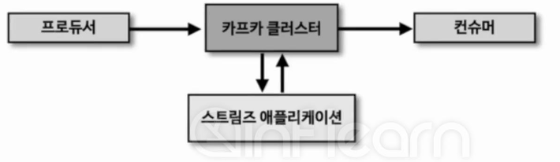
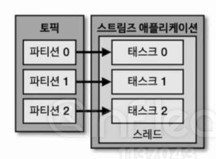
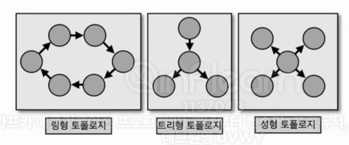
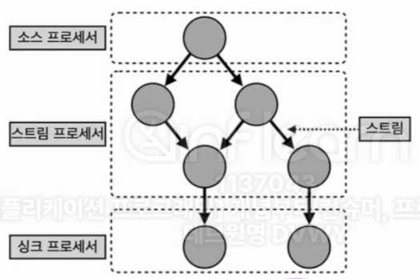

## 8-1-1) 카프카 스트림즈

  

 

- 카프카 스트림즈는 토픽에 적재된 데이터를 실시간으로 변환하여 다른 토픽에 적재하는 라이브러리이다. 스트림즈는 카프카에서 공식적으로 지원하는 라이브러리이다. 매번 카프카 버전이 오를 때마다 스트림즈 자바 라이브러리도 같이 릴리즈된다. 그렇기 때문에 자바 기반 스트림즈 애플리케이션은 카프카 클러스터와 완벽하게 호환되면서 스트림 처리에 필요한 편리한 기능들을 제공한다. 스트림즈 애플리케이션 또는 카프카 브로커에 장애가 발생하더라도 정확히 한번 할 수 있도록 장애 허용 시스템 (fault tolerant system)을 가지고 있어서 데이터 처리 안정성이 매우 뛰어나다.
- 스트림 데이터 처리에 있어 필요한 다양한 기능을 스트림즈 DSL로 제공하며 필요하다면 프로세스 API를 사용하여 기능을 확장할 수 있기 때문이다. **컨슈머와 프로듀서의 조합으로 이와 유사하게 만들 수는 있으나 스트림즈 라이브러리를 통해 제공하는 단 한 번의 데이터 처리나 장애 허용 시스템 등은 컨슈머와 프로듀서의 조합만으로는 구현하기 어렵다.** 다만, 스트림즈가 제공하지 못하는 기능을 구현할 때는 컨슈머와 프로듀서를 조합하여 구현하면 좋다. 예를 들어 소스 토픽 (사용하는 토픽)과 싱크 토픽(저장하는 토픽)의 카프카 클러스터가 다른 경우 스트림즈가 지원되지 않기 때문에 이 경우에는 컨슈머와 프로듀서를 사용해야 한다.

 

## 8-1-2) 카프카 스트림즈 내부 구조

  

 

- 스트림즈 애플리케이션은 내부적으로 스레드를 1개 이상 생성할 수 있으며, 스레드는 1개 이상의 태스크를 가진다. 스트림즈의 **태스크(task)** 는 스트림즈 애플리케이션을 실행하면을 실행하면 생기는 데이터 처리 최소 단위이다. 만약 3개의 파티션으로 이루어진 토픽을 처리하는 스트림즈 애플리케이션을 실행하면 내부에 3개의 태스크가 생긴다. 컨슈머 그룹에서 컨슈머의 병렬 처리를 위해 스레드를 여러 개 실행하는 것과 비슷하다고 볼 수 있다. 컨슈머 스레드와 유사하게 스트림즈 스레드 수를 늘려서 처리량을 늘릴 수 있다.
- 실제 운영 환경에서는 장애가 발생하더라도 안정적으로 운영할 수 있도록 2개 이상의 서버로 구성하여 스트림즈 애플리케이션을 운영한다.

 

## 8-1-3) 토폴로지

  

 

- 카프카 스트림즈의 구조와 사용 방법을 알기 위해서는 **토폴로지(topology)** 와 관련된 개념을 익혀야 한다. 토폴로지란 2개 이상의 노드들과 선으로 이루어진 집합을 의미한다. 스트림즈에서 사용되는 토폴로지는 트리형에 가깝다.

 

  

 

- 카프카 스트림즈에서는 토폴로지를 이루는 노드를 **프로세서(processor)** 라고 하고 노드와 노드를 이은 선을 **스트림(stream)** 이라고 한다. 스트림은 토픽의 데이터를 뜻하는데 컨슈머와 프로듀서에서 활용했던 레코드와 동일하다.
 

> **소스 프로세서**: 데이터를 처리하기 위해 최초로 선언해야 하는 노드로, 하나 이상의 토픽에서 데이터를 가져오는 역할을 한다.
> **스트림 프로세서**: 스트림 프로세서는 다른 프로세서가 반환한 데이터를 처리하는 역할을 한다.
> **싱크 프로세서**: 데이터를 특정 카프카 토픽으로 저장하는 역할을 하며 스트림즈로 처리된 데이터의 최종 종착지이다.

 

## 8-1-4) 스트림즈 DSL과 프로세서 API

- **스트림즈 DSL(Domain Specific Language)** 와 **프로세서 API** 2가지 방법으로 개발 가능하다. 스트림즈 DSL은 프로세싱에 쓰일 만한 다양한 기능들을 자체 API로 만들어 놓았기 때문에 대부분의 변환 로직을 어렵지 않게 구현 가능하다. 스트림즈 DSL로 제공되지 않는 일부 기능들의 경우 프로세서 API를 사용하여 구현할 수 있다.
- 스트림즈 DSL에는 레코드의 흐름을 추상화한 개념인 KStream, KTable, GlobakKTable이 있다. 이 3가지 개념은 컨슈머, 프로듀서, 프로세서 API에서는 사용되지 않고 스트림즈 DSL에서만 사용되는 개념이다.

 

> 스트림즈 DSL
> 	- 메시지 값을 기반으로 토픽 분기 처리
> 	- 지난 10분간 들어온 데이터의 개수 집계
> 프로세서 API
> 	- 메시지 값의 종류에 따라 토픽을 가변적으로 전송
> 	- 일정한 시간 간격으로 데이터 처리
