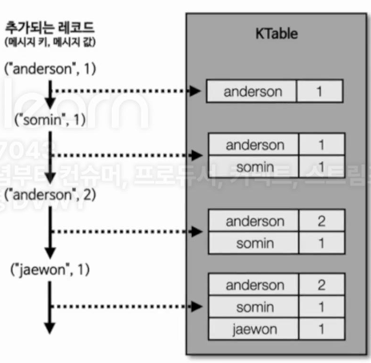
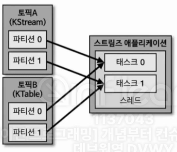
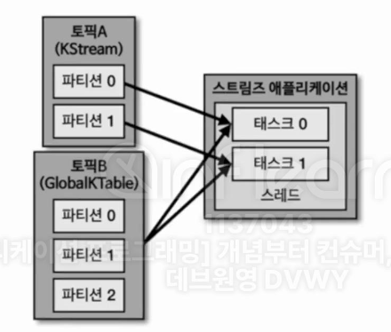

## 8-2-1) KStream

  

 

- `KStream`은 **레코드의 흐름을 표현한 것으로 메시지 키와 메시지 값으로 구성되어 있다**. KStream으로 데이터를 조회하면 토픽에 존재하는(또는 KStream에 존재하는) 모든 레코드가 출력된다. 컨슈머로 토픽을 구독하는 것과 동일하다고 볼 수 있다.
 

## 8-2-2) KTable

  

 

- `KTable`은 KStream과 다르게 메시지 키를 기준으로 묶어서 사용한다. **KTable은 유니크한 메시지 키를 기준으로 가장 최신 레코드를 사용한다**. 그러므로 KTable로 데이터를 조회하면 메시지 키를 기준으로 가장 최신에 추가된 레코드의 데이터가 출력된다. 새로 데이터가 적재될 때 동일한 메시지 키가 있는 경우 데이터가 업데이트 되었다고 볼 수 있다.
 

## 8-2-3) 코파티셔닝(co-partitioning)

  

 

- KStream과 KTable 데이터를 조인한다고 가정하자. KStream과 KTable을 조인하려면 반드시 `코파티셔닝(co-partitioning)`되어 있어야 한다. **코파티셔닝이란 조인을 하는 2개의 데이터의 파티션 개수가 동일하고 파티셔닝 전략(partitioning strategy)를 동일하게 맞추는 작업이다**. 파티션 개수가 동일하고 파티셔닝 전략이 같은 경우에는 동일한 메시지 키를 가진 데이터가 **동일한 태스크에 들어가는 것을 보장**한다.
 

> 파티션 개수, 파티션 전략이 동일해야 코파티셔닝이 가능하다.
 

- 문제는 조인을 수행하려는 두 토픽의 파티션 개수나 파티션 전략이 다를 경우 발생한다. 이런 경우 조인을 수행할 수 없고, 코파티셔닝이 되지 않은 2개의 토픽을 조인하려는 로직이 담긴 스트림즈 애플리케이션을 실행하면 `TopologyException`이 발생한다.
 

## 8-2-4) GlobalKTable

  

 

- 코파티셔닝되지 않은 KStream과 KTable을 조인해서 사용하고 싶다면 KTable을 `GlobalKTable`로 선언하면 된다. GlobalKTable은 코파티셔닝되지 않은 KStream과 데이터를 조인할 수 있다. 왜냐하면 KTable과 다르게 GlobalKTable로 정의된 데이터는 스트림즈 애플리케이션의 모든 태스크에 동일하게 공유되어 사용되기 때문이다.
- 모든 케이스에서 GlobalKTable을 조인하면 KTable에서 조인의 문제를 해결할 수 있으나, GlobalKTable은 파티션에 있는 모든 태스크에 공유되므로 큰 용량을 사용할 경우 부담이 될 수 있다. 따라서 용량이 작은 경우에만 선택적으로 사용하는 것이 바람직하다.
