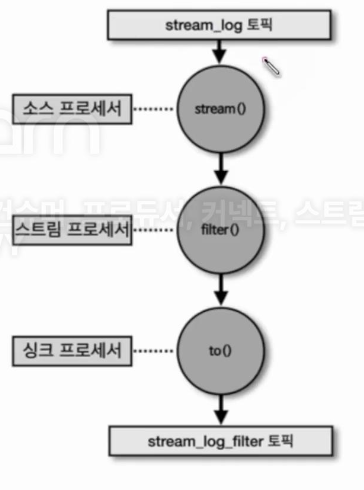
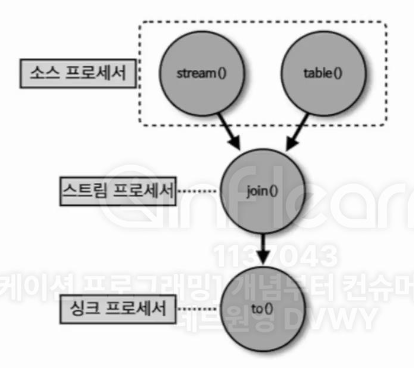

## 8-4-1)  스트림즈 애플리케이션 - 필터

<div align="left">
  
</div>
</br>

```java
package com.example;  
  
import org.apache.kafka.common.serialization.Serdes;  
import org.apache.kafka.streams.KafkaStreams;  
import org.apache.kafka.streams.StreamsBuilder;  
import org.apache.kafka.streams.StreamsConfig;  
import org.apache.kafka.streams.kstream.KStream;  
  
import java.util.Properties;  
  
public class StreamsFilter {  
  
    private static String APPLICATION_NAME = "streams-filter-application";  
    private static String BOOTSTRAP_SERVERS = "my-kafka:19092";  
    private static String STREAM_LOG = "stream_log";  
    private static String STREAM_LOG_FILTER = "stream_log_filter";  
  
    public static void main(String[] args) {  
  
        Properties props = new Properties();  
        props.put(StreamsConfig.APPLICATION_ID_CONFIG, APPLICATION_NAME);  
        props.put(StreamsConfig.BOOTSTRAP_SERVERS_CONFIG, BOOTSTRAP_SERVERS);  
        props.put(StreamsConfig.DEFAULT_KEY_SERDE_CLASS_CONFIG, Serdes.String().getClass());  
        props.put(StreamsConfig.DEFAULT_VALUE_SERDE_CLASS_CONFIG, Serdes.String().getClass());  
  
        StreamsBuilder builder = new StreamsBuilder();  
        KStream<String, String> streamLog = builder.stream(STREAM_LOG);  
		streamLog.filter((key, value) -> value.length() > 5).to(STREAM_LOG_FILTER); 
  
        KafkaStreams streams;  
        streams = new KafkaStreams(builder.build(), props);  
        streams.start();  
  
    }  
}
```

</br>

- `stream()`: 파라미터로 들어온 토픽의 데이터를 KSteram 구조체로 가져오기 위한 소스 프로세서.
- `filter()`: 파라미터로 들어온 필터링 메서드를 사용하여 특정 메시지 값을 필터링하기 위해 사용.
- `to()`: 특정 토픽으로 DSL을 적용한 레코드를 저장한다.

## 8-4-2) KTable과 KStrem을 join()

<div align="left">
  
</div>
</br>

-  KTable과 KStream은 메시지 키를 기준으로 조인할 수 있다. 대부분의 데이터베이스는 정적으로 저장된 데이터를 조인하여 사용했지만 카프카에서는 실시간으로 들어오는 데이터를 조인할 수 있다. 사용자의 이벤트 데이터를 데이터베이스에 저장하지 않고도 조인하여 처리할 수 있다는 장점이 있다. 이를 통해 이벤트 기반 스트리밍 데이터 파이프라인을 구성할 수 있다.
- 키를 기준으로 값을 join하여 처리할 수 있다.

</br>

```java
package com.example;  
  
import org.apache.kafka.common.serialization.Serdes;  
import org.apache.kafka.streams.KafkaStreams;  
import org.apache.kafka.streams.StreamsBuilder;  
import org.apache.kafka.streams.StreamsConfig;  
import org.apache.kafka.streams.kstream.KStream;  
import org.apache.kafka.streams.kstream.KTable;  
  
import java.util.Properties;  
  
public class KStreamJoinKTable {  
  
    private static String APPLICATION_NAME = "order-join-application";  
    private static String BOOTSTRAP_SERVERS = "my-kafka:19092";  
    private static String ADDRESS_TABLE = "address";  
    private static String ORDER_STREAM = "order";  
    private static String ORDER_JOIN_STREAM = "order_join";  
  
    public static void main(String[] args) {  
  
        Properties props = new Properties();  
        props.put(StreamsConfig.APPLICATION_ID_CONFIG, APPLICATION_NAME);  
        props.put(StreamsConfig.BOOTSTRAP_SERVERS_CONFIG, BOOTSTRAP_SERVERS);  
        props.put(StreamsConfig.DEFAULT_KEY_SERDE_CLASS_CONFIG, Serdes.String().getClass());  
        props.put(StreamsConfig.DEFAULT_VALUE_SERDE_CLASS_CONFIG, Serdes.String().getClass());  
  
        StreamsBuilder builder = new StreamsBuilder();  
        KTable<String, String> addressTable = builder.table(ADDRESS_TABLE);  
        KStream<String, String> orderStream = builder.stream(ORDER_STREAM);  
  
        orderStream.join(addressTable, (order, address) -> order + " send to " + address).to(ORDER_JOIN_STREAM);  
  
        KafkaStreams streams;  
        streams = new KafkaStreams(builder.build(), props);  
        streams.start();  
  
    }  
}
```
</br>

- `table()`: 파라미터로 들어온 토픽의 데이터를 KTable 구조체로 가져오기 위한 소스 프로세서.
- `join(Join될 대상 테이블, 메시지 값)`: 테이블을 Join하여 생성할 메시지 값을 지정.

</br>

## 8-4-3) KStream과 GlobalKTable을 join()

- 코파티셔닝되지 않은 토픽 간에 join()을 수행하기 위해서는 리파티셔닝(파티션 개수를 재지정)하거나 GlobalKTable로 선언하여 사용하는 방법이 있다.

</br>

```java
public class KStreamJoinGlobalKTable {  
  
    private static String APPLICATION_NAME = "global-table-join-application";  
    private static String BOOTSTRAP_SERVERS = "my-kafka:19092";  
    private static String ADDRESS_GLOBAL_TABLE = "address_v2";  
    private static String ORDER_STREAM = "order";  
    private static String ORDER_JOIN_STREAM = "order_join";  
  
    public static void main(String[] args) {  
  
        Properties props = new Properties();  
        props.put(StreamsConfig.APPLICATION_ID_CONFIG, APPLICATION_NAME);  
        props.put(StreamsConfig.BOOTSTRAP_SERVERS_CONFIG, BOOTSTRAP_SERVERS);  
        props.put(StreamsConfig.DEFAULT_KEY_SERDE_CLASS_CONFIG, Serdes.String().getClass());  
        props.put(StreamsConfig.DEFAULT_VALUE_SERDE_CLASS_CONFIG, Serdes.String().getClass());  
  
        StreamsBuilder builder = new StreamsBuilder();  
        GlobalKTable<String, String> addressGlobalTable = builder.globalTable(ADDRESS_GLOBAL_TABLE);  
        KStream<String, String> orderStream = builder.stream(ORDER_STREAM);  
  
        orderStream.join(addressGlobalTable,  
                        (orderKey, orderValue) -> orderKey,  
                        (order, address) -> order + " send to " + address)  
                .to(ORDER_JOIN_STREAM);  
  
        KafkaStreams streams;  
        streams = new KafkaStreams(builder.build(), props);  
        streams.start();  
  
    }  
}
```

</br>

- `globalTable(Join될 대상 테이블, 원래 테이블에서 Join의 키로 사용할 값, 메시지 값)`: 파라미터로 들어온 토픽의 데이터를 GlobalKTable 구조체로 가져오기 위한 소스 프로세서.
