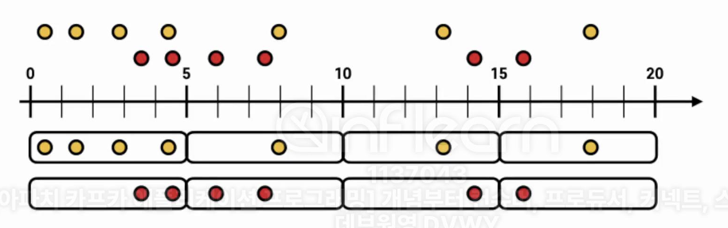
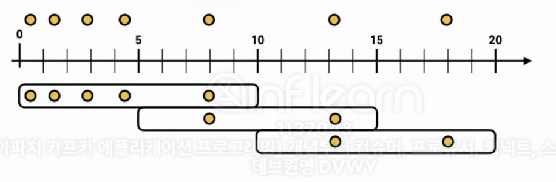
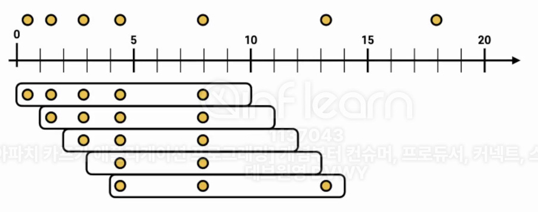
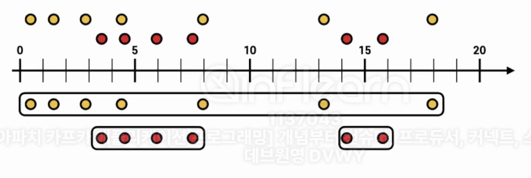

- 스트림 데이터를 분석할 때 가장 많이 활용하는 프로세싱 중 하나는 윈도우 연산이다. 윈도우 연산은 특정 시간에 대응하여 취합 연산을 처리할 때 사용한다. 카프카 스트림즈에서 제공하는 윈도우 프로세싱은 다음과 같이 4가지를 제공한다.
- 모든 프로세싱은 **메시지 키를 기준으로 취합되므로**, 해당 토픽에 동일한 파티션에는 동일한 메시지 키가 있는 레코드가 존재해야지만 정확한 취합이 가능하다. 만약 커스텀 파티셔너를 사용하여 동일 메시지 키가 동일 파티션에 저장되는 것을 보장하지 못하거나 메시지 키를 넣지 않으면 관련 연산이 불가능하다.

 

- 텀블링 윈도우
- 호핑 윈도우
- 슬라이딩 윈도우
- 세션 윈도우

 

## 8-5-1) 텀블링 윈도우

  

 

- 텀블링 윈도우는 서로 **겹치지 않은 윈도우를 특정 간격으로 지속적으로 처리**할 때 사용한다. 윈도우 최대 사이즈에 도달하면 해당 시점에 데이터를 취합하여 결과를 도출한다. 텀블링 윈도우는 단위 시간당 데이터가 필요할 경우 사용할 수 있다.
- 취합하여 데이터를 처리하므로 처리하는 프로세스에 대한 오버헤드를 줄일 수 있다.

 

## 8-5-2) 호핑 윈도우

  

 

- 호핑 윈도우는 일정 시간 간격으로 **겹치는 윈도우가 존재하는 윈도우 연산을 처리할 경우 사용**한다. 호핑 윈도우는 윈도우 사이즈와 윈도우 간격 2가지 변수를 가진다. 윈도우 사이즈는 연산을 수행할 최대 윈도우 사이즈를 뜻하고 윈도우 간격은 서로 다른 윈도우 간 간격을 뜻한다. 텀블링 윈도우와 다르게 동일한 키의 데이터는 **서로 다른 윈도우에서 여러 번 연산될 수 있다**. 

 

## 8-5-3) 슬라이딩 윈도우

  

 

- 슬라이딩 윈도우는 호핑 윈도우와 유사하지만 데이터의 정확한 시간(시스템 시간 / 리코드 시간)을 바탕으로 윈도우 사이즈에 포함되는 데이터를 모든 연산에 포함시키는 특징이 있다.

 

## 8-5-4) 세션 윈도우

  

 

- 세션 윈도우는 동일 메시지 키의 데이터를 한 세션에 묶어 연산할 때 사용한다. 세션의 최대 만료시간에 따라 윈도우 사이즈가 달라진다. 세션 만료 시간이 지나게 되면 세션 윈도우가 종료되고 해당 윈도우의 모든 데이터를 취합하여 연산한다. 그렇기 때문에 세션 윈도우의 사이즈는 가변적이다.

 

## 8-5-5) 윈도우 연산 시 주의할 점

- 카스카 스트림즈는 커밋(기본 값 30초)을 수행할 때 윈도우 사이즈가 종료되지 않아도 중간 정산 데이터를 출력한다. 커밋 시점마다 윈도우의 연산 데이터를 출력하기 때문에 동일 윈도우 사이즈의 데이터는 2개 이상 출력될 수 있다.
- 최종적으로 각 윈도우에 맞는 데이터를 출력하고 싶다면 Windowed를 기준으로 동일 윈도우 시간 데이터는 겹쳐쓰기(upsert)하는 방식으로 처리하는 것이 좋다.
