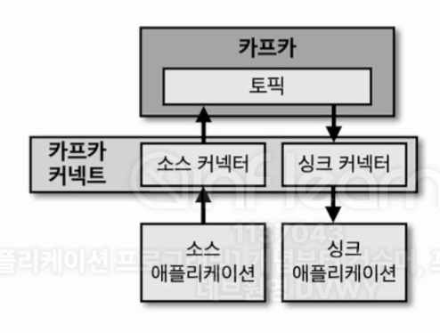
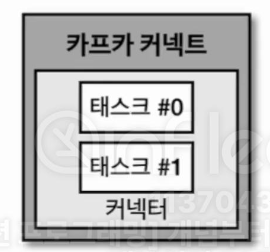
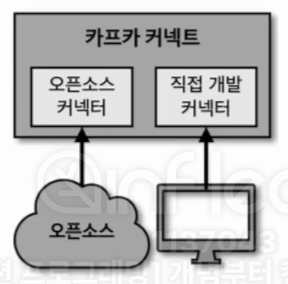

## 9-1-1) 카프카 커넥터 소개

  

 

- 카프카 커넥터는 카프카 오픈소스에 포함된 툴 중 하나로 데이터 파이프라인 생성 시 반복 작업을 줄이고 효율적인 전송을 이루기 위한 애플리케이션이다. 커넥트는 특정한 작업 형태를 템플릿으로 만들어놓은 커넥터를 실행함으로써 반복 작업을 줄일 수 있다.

 

  

 

- 사용자가 커넥트에 커넥터 생성 명령을 내리면 커넥트는 내부에 커넥터와 태스크를 생성한다. 커넥터는 태스크들을 관리한다. 태스크는 커넥터에 종속적인 개념으로 실질적인 데이터 처리를 한다. 그렇기 때문에 데이터 처리를 정상적으로 하는지 확인하기 위해서는 각 태스크 상태를 확인해야 한다.
- 커넥터에서는 설정값을 받고 데이터를 Validation하는 작업을 하고, 태스크에서는 실질적으로 데이터를 처리하는 구현부가 들어간다.

 

## 9-1-2) 소스 커넥터와 싱크 커넥터

- 커넥터는 프로듀서 역할을 하는 `소스 커넥터(source connector)`와 컨슈머 역할을 하는 `싱크 커넥터(sink connector)` 2가지로 나뉜다.
- 예를 들어, 파일을 주고받는 용도로 파일 소스 커넥터와 파일 싱크 커넥터가 있다고 가정하자. 파일 소스 커넥터는 파일의 데이터를 카프카 토픽으로 전송하는 프로듀서 역할을 한다. 그리고 파일 싱크 커넥터는 토픽의 데이터를 파일로 저장하는 컨슈머 역할을 한다. 파일 외에도 일정한 프로토콜을 가진 소스 애플리케이션이나 싱크 애플리케이션이 있다면 커넥터를 통해 카프카로 데이터를 보내거나 카프카에서 데이터를 가져올 수 있다. MySQL, S3, MongoDB 등과 같은 저장소를 대표적인 싱크 애플리케이션, 소스 애플리케이션이라고 할 수 있다.
- 데이터의 파이프라인마다 커넥터를 생성하여 데이터 저장을 파편화시키기보다는 이렇게 커넥터라는 템플릿을 생성하여 여러 번 로직을 구성할 필요 없이 운영측면에서 장점이 있다.

 

> Connect: Connector를 동작하게 하는 프로세서(서버)  
> Connector:  Data Source(DB)의 데이터를 처리하는 소스가 들어있는 jar파일  
> Source Connector: data source에 담긴 데이터를 topic에 담는 역할(Producer)을 하는 connector  
> Sink Connector: topic에 담긴 데이터를 특정 data source로 보내는 역할(Consumer 역할)을 하는 connector

 

## 9-1-3) 커넥터 플러그인

  

 

- 카프카 2.6에 포함된 커넥터를 실행할 경우 클러스터 간 토픽 미러링을 지원하는 미러메이커2 커넥터와 파일 싱크 커넥터, 파일 소스 커넥터를 기본 플러그인으로 제공한다. 이외에 추가적인 커넥터를 사용하고 싶다면 플러그인 형태로 커넥터 jar 파일로 추가하여 사용할 수 있다. 커넥터 jar 파일에는 커넥터를 구현하는 클래스를 빌드한 클래스 파일이 포함되어 있다. 커넥터 플러그인을 추가하고 싶다면 직접 커넥터 플러그인을 만들거나 이미 인터넷상에 존재하는 커넥터 플러그인을 가져다 쓸 수도 있다.

 

## 9-1-4) 컨버터, 트랜스폼

- 사용자가 커넥터를 사용하여 파이프라인을 생성할 때 **컨버터(converter)**와 **트랜스폼(transform)** 기능을 옵션으로 추가할 수 있다. 커넥터를 운영할 때 반드시 필요한 설정은 아니지만 데이터 처리를 더욱 풍부하게 도와주는 역할을 한다. 컨버터는 데이터 처리를 하기 전에 스키마를 변경하도록 도와준다. JsonConverter, StringConverter, ByteArrayConverter를 지원하고 필요하다면 커스텀 컨버터를 작성하여 사용할 수도 있다. 트랜스폼은 데이터 처리 시 각 메시지 단위로 데이터를 간단하게 변환하기 위한 용도로 사용된다.
 
