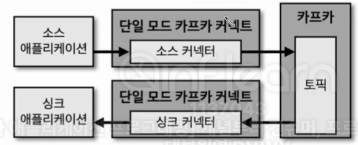
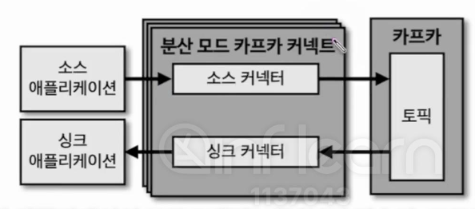

- 카프카 커넥트를 실행하는 방법에는 두 가지 방법이 있다.
> 단일 모드 커넥트(Standalone Mode Kafka Connect): 단일 애플리케이션으로 실행된다. 커넥트를 정의하는 파일을 작성하고 해당 파일을 실행하는 단일 모드 커넥트를 실행하여 파이프라인을 생성할 수 있다.
> 분산 모드 커넥트(Distributed Mode Kafka Connect)

 

## 9-2-1) 단일 모드 커넥트 (Single Mode Kafka Connect)

  

 

- 단일 모드 커넥트는 1개 프로세스만 실행되는 점이 특징인데, 단일 프로세스로 실행되기 때문에 **고가용성 구성이 되지 않아서 단일 장애점(SPOF: Single Point Of Failure)이 될 수 있다**. 그러므로 단일 모드 커넥트 파이프라인은 주로 개발환경이나 중요도가 낮은 파이프라인을 운영할 때 사용한다.

 

## 9-2-2) 분산 모드 커넥트 (Distributed Mode Kafka Connect)

  

 

- 분산 모드 커넥트는 2대 이상의 서버에서 클러스터 형태로 운영함으로써 단일 모드 커넥트 대비 안전하게 운영할 수 있다는 장점이 있다. 2개 이상의 커넥트가 클러스터로 묶이면 1개의 커넥트가 이슈 발생으로 중단되더라도 남은 1개의 커넥트가 파이프라인을 지속적으로 처리할 수 있기 때문이다. 이러한 특성으로 데이터 처리량의 변화에 유연하게 대처가 가능하다. 커넥트가 실행되는 서버 개수를 늘려 무중단으로 스케일 아웃할 수 있기 때문이다.
- 커넥트를 스케일 아웃한 소스/싱크 커넥터의 스케일 업/다운은 Rest API를 통해서 운영 가능하다.

 

## 9-2-3) 커넥트 REST API 인터페이스

- REST API를 사용하면 현재 실행 중인 커넥트의 커넥터 플러그인 종류, 태스크 상태, 커넥터 상태 등을 조회할 수 있다. 커넥트는 8083 포트로 호출할 수 있으며 HTTP 메서드 기반 API를 제공한다.

 

| 요청 메서드 | 호출 path                    | 설명                  |
| ------ | -------------------------- | ------------------- |
| GET    | /                          | 실행 중인 커넥트 정보 확인     |
| GET    | /connectors                | 실행 중인 커넥트 이름 확인     |
| POST   | /connectors                | 새로운 커넥터 생성 요청       |
| GET    | /connectors/{커넥터명}         | 실행 중인 커넥터 정보 확인     |
| GET    | /connectors/{커넥터명}/config  | 실행 중인 커넥터의 설정값 확인   |
| PUT    | /connectors/{커넥터명}/config  | 실행 중인 커넥터 설정값 변경 요청 |
| GET    | /connectors/{커넥터명}/status  | 실행 중인 커넥터 상태 확인     |
| POST   | /connectors/{커넥터명}/restart | 실행 중인 커넥터 재시작 요청    |
