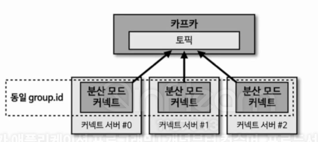

<div align="left">
  
</div>
</br>

- 분산 모드 커넥트는 2개 이상의 프로세스가 1개의 그룹으로 묶여서 운영된다. 이를 통해 1개의 커넥트 프로세스에 이슈가 발생하여 종료되더라도 살아 있는 나머지 1개 커넥트 프로세스가 커넥터를 이어받아 파이프라인을 지속적으로 실행할 수 있다는 특징이 있다.

</br>

## 9-4-1) 분산 모드 커넥트 설정

-  분산 모드 커넥트를 실행하기 위해서는 `connect-distributed.properties` 파일을 수정해야 한다.

</br>

```properties
bootstrap.servers=my-kafka:19092
group.id=connect-cluster

# Serializer, 컨버터 정보
key.converter=org.apache.kafka.connect.json.JsonConverter
value.converter=org.apache.kafka.connect.json.JsonConverter
key.converter.schemas.enable=false
value.converter.schemas.enable=false

# 분산 모드 커넥트에서는 offset, config, status를 담는 토픽이 필요
# 다른 그룹 별로 다른 토픽으로 설정해야 한다
offset.storage.topic=connect-offsets
offset.storage.replication.factor=1
config.storage.topic=connect-configs
config.storage.replications.factor=1
status.storage.topic=connect-status
status.storage.replication.factor=1

offset.flush.interver.ms=10000

# 플러그인 디렉터리 정보
plugin.path=/usr/local/share/java,/usr/local/share/kafka/plugins
```

</br>

- 커넥트를 실행시키고 난 뒤, RestAPI를 통해 쓰레드를 실행시켜 파이프라인을 실행시킨다고 보면 된다.
