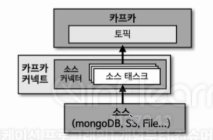

<div align="left">
  
</div>
</br>

- 소스 커넥터는 소스 애플리케이션 또는 소스 파일로부터 데이터를 가져와 토픽으로 넣는 역할을 한다. 오픈소스 소스 커넥터를 사용해도 되지만 라이센스 문제나 로직이 원하는 요구사항과 맞지 않아서 ㅈ기접 개발해야 하는 경우도 있는데, 이때는 카프카 커넥트 라이브러리에서 제공하는 `SourceConnector`와 `SourceTask` 클래스를 사용하여 직접 커넥터를 구현하면 된다. 직접 구현한 커넥터를 빌드하여 jar 파일로 만들고 커넥트 실행 시 플러그인으로 추가하여 사용할 수 있다.

</br>

- **SourceConnector**
	- **태스크를 실행하기 전 커넥터 설정 파일을 초기화하고 어떤 태스크 클래스를 사용할 것인지 정의하는 데에 사용**한다. 그렇기 때문에 SourceConnector에는 실질적으로 데이터 다루는 부분이 들어가지 않는다. SourceTask가 실질적으로 데이터를 다루는 부분이라고 할 수 있다.

</br>

```java
public class TestSourceConnector extends SourceConnector {
    @Override
    public String version() {}
    
	// 파이프라인이 실행될 때 가져오는 Properties 들을 Map 형태로 가져오고 초기화
    @Override
    public void start(Map<String, String> props) {}

	// 사용하고자 하는 Source Task 지정
    @Override
    public Class<? extends Task> taskClass() {}

	// 각 Task 마다 다른 설정을 주고자 할 때 사용
    @Override
    public List<Map<String, String>> taskConfigs(int maxTasks) {}
    
	// 사용할 커넥터의 Config 지정
    @Override
    public ConfigDef config() {}  
    
    // 태스크 종료 시 리소스 해제
    @Override  
    public void stop() {}  
}
```
</br>

- **SourceTask**
	- **소스 애플리케이션 또는 소스 파일로부터 데이터를 가져와서 토픽으로 데이터를 보내는 역할**을 한다. SourceTask만의 특징은 토픽에서 사용하는 오프셋이 아닌 자체적으로 사용하는 오프셋을 사용한다는 점이다. 여기서 사용하는 오프셋은 소스 애플리케이션 또는 소스 파일을 어디까지 읽었는지 저장하는 역할을 한다. 이를 통해 데이터의 중복 전송을 방지할 수 있다.

</br>

```java
public class SingleFileSourceTask extends SourceTask {  
    @Override
    public String version() {}

	// Task에서 사용할 설정을 (커넥터에서) 가져와서 리소스 초기화
    @Override
    public void start(Map<String, String> props) {}

	// 지속적으로 프로듀싱을 위해 호출되는 함수
	// SourceRecord를 리턴하게 되면 이를 토픽으로 보내게 됨
    @Override
    public List<SourceRecord> poll() {}

	// 태스크 종료 시 리소스 해제
    @Override
    public void stop() {}
}
```
</br>

## 9-5-1) 파일 소스 커넥터 구현 예제

- 소스 커넥터를 구현하기 전에 앞서 build.gradle에 connect-api 라이브러리와 빌드된 파일을 jar로 압축하기 위한 스크립트를 작성한다. 카프카 커넥터를 직접 개발하고 플러그인을 추가할 때 주의할 점은 **사용자가 직접 작성한 클래스 뿐만 아니라 참조하는 라이브러리도 함께 빌드하여 jar 파일로 압축하여야 한다는 점이다**. 이렇게 작성하지 않고 빌드한다면 참조하는 클래스를 찾지 못하는 Exception인 `ClassNotFoundException`이 발생한다.

</br>

## 9-5-2) 파일 소스 커넥터 파일 구조

- `FileSourceConnector.java`: 소스 커넥터 구현
- `FileSourceConnectorConfig.java`: 필수는 아니고 설정이나 초기화 부분을 따로 파일로 구현
- `FileSourceConnectorTask.java`: 소스 태스크 구현

</br>

## 9-5-3) 소스 코드

</br>

### 9-5-3-1) 소스 커넥터 설정

```java
public class SingleFileSourceConnectorConfig extends AbstractConfig {  
	
	// Configuration 이름, Default Value, 관련한 정보
    public static final String DIR_FILE_NAME = "file";
    private static final String DIR_FILE_NAME_DEFAULT_VALUE = "/tmp/kafka.txt";  
    private static final String DIR_FILE_NAME_DOC = "읽을 파일 경로와 이름";  
  
    public static final String TOPIC_NAME = "topic";  
    private static final String TOPIC_DEFAULT_VALUE = "test";  
    private static final String TOPIC_DOC = "보낼 토픽명";  

	// ConfigDef  
    public static ConfigDef CONFIG = new ConfigDef()
    .define(DIR_FILE_NAME, Type.STRING, DIR_FILE_NAME_DEFAULT_VALUE, Importance.HIGH, DIR_FILE_NAME_DOC)
    .define(TOPIC_NAME, Type.STRING, TOPIC_DEFAULT_VALUE, Importance.HIGH, TOPIC_DOC);

    public SingleFileSourceConnectorConfig(Map<String, String> props) {  
        super(CONFIG, props);  
    }  
}
```
</br>

### 9-5-3-2) 소스 커넥터 불러오기

```java
public class SingleFileSourceConnector extends SourceConnector {  
  
    private final Logger logger = LoggerFactory.getLogger(SingleFileSourceConnector.class);  
  
    private Map<String, String> configProperties;  
  
    @Override  
    public String version() {  
        return "1.0";  
    }  

	// REST API로 세팅하기 위한 File, Topic 등의 설정
    @Override
    public void start(Map<String, String> props) {  
        this.configProperties = props;  
        try {  
            new SingleFileSourceConnectorConfig(props);  
        } catch (ConfigException e) {  
            throw new ConnectException(e.getMessage(), e);  
        }  
    }  
  
    @Override  
    public Class<? extends Task> taskClass() {  
        return SingleFileSourceTask.class;  
    }  

	// 태스크에 따라 지정한 설정
    @Override  
    public List<Map<String, String>> taskConfigs(int maxTasks) {  
        List<Map<String, String>> taskConfigs = new ArrayList<>();  
        Map<String, String> taskProps = new HashMap<>();  
        taskProps.putAll(configProperties);  
        for (int i = 0; i < maxTasks; i++) {  
            taskConfigs.add(taskProps);  
        }  
        return taskConfigs;  
    }  
  
    @Override  
    public ConfigDef config() {  
        return SingleFileSourceConnectorConfig.CONFIG;  
    }  
  
    @Override  
    public void stop() {  
    }  
}
```
</br>

### 9-5-3-3) 소스 커넥트 태스크

```java
public class SingleFileSourceTask extends SourceTask {  
    private Logger logger = LoggerFactory.getLogger(SingleFileSourceTask.class);  
  
    public final String FILENAME_FIELD = "filename";  
    public final String POSITION_FIELD = "position";  
  
    private Map<String, String> fileNamePartition;  
    private Map<String, Object> offset;  
    private String topic;  
    private String file;  
    private long position = -1;  
  
  
    @Override  
    public String version() {  
        return "1.0";  
    }  

	// 리소스를 초기화
    @Override
    public void start(Map<String, String> props) {  
        try {  
            // Init variables  
            SingleFileSourceConnectorConfig config = new SingleFileSourceConnectorConfig(props);  
            topic = config.getString(SingleFileSourceConnectorConfig.TOPIC_NAME);  
            file = config.getString(SingleFileSourceConnectorConfig.DIR_FILE_NAME);  
            fileNamePartition = Collections.singletonMap(FILENAME_FIELD, file);
            // 소스 커넥터에서는 관리하는 내부 번호를 기록하는 용도
            offset = context.offsetStorageReader().offset(fileNamePartition);
  
            // Get file offset from offsetStorageReader  
            if (offset != null) {  
                Object lastReadFileOffset = offset.get(POSITION_FIELD);  
                if (lastReadFileOffset != null) {
	                // 만약 기존에 저장된 내부 번호가 있다면 해당 번호부터 시작
                    position = (Long) lastReadFileOffset;  
                }  
            } else {
	            // 만약 기존에 저장된 내부 번호가 없다면 0부터 시작
                position = 0;  
            }  
  
        } catch (Exception e) {  
            throw new ConnectException(e.getMessage(), e);  
        }  
    }  
  
    @Override  
    public List<SourceRecord> poll() {
        List<SourceRecord> results = new ArrayList<>();  
        try {  
            Thread.sleep(1000);  

			// 가져가고 싶은 position(내부 번호)부터 데이터를 읽어감
            List<String> lines = getLines(position);  
  
            if (lines.size() > 0) {  
                lines.forEach(line -> {  
                    Map<String, Long> sourceOffset = Collections.singletonMap(POSITION_FIELD, ++position);  
                    SourceRecord sourceRecord = new SourceRecord(fileNamePartition, sourceOffset, topic, Schema.STRING_SCHEMA, line);
                    // 토픽으로 보내고 싶은 데이터는 List<SourceRecord>에 element 추가
                    results.add(sourceRecord);  
                });  
            }
            // 최종적으로 토픽으로 전송되는 List
            return results;  
        } catch (Exception e) {  
            logger.error(e.getMessage(), e);  
            throw new ConnectException(e.getMessage(), e);  
        }  
    }  
  
    private List<String> getLines(long readLine) throws Exception {  
        BufferedReader reader = Files.newBufferedReader(Paths.get(file));  
        return reader.lines().skip(readLine).collect(Collectors.toList());  
    }  
  
    @Override  
    public void stop() {  
    }  
}
```

</br>

## 9-5-4) 중요도 설정 기준

- 커넥터 개발 시 옵션값의 중요도를 Importance enum 클래스로 지정할 수 있다. 이 Importance enum 클래스는 HIGH, MEDIUM, LOW 3가지 종류로 나뉘어 있다.
