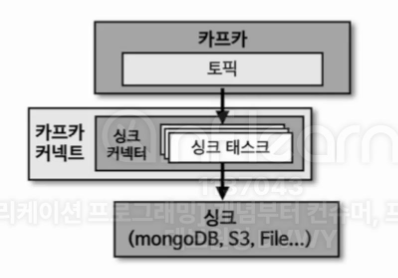

<div align="left">
  
</div>
</br>

- 싱크 커넥터는 토픽의 데이터를 타깃 애플리케이션 또는 타깃 파일로 저장하는 역할을 한다. (컨슈머의 동작 방식과 유사하다.) 카프카 커넥트 라이브러리에서 제공하는 `SinkConnector`와 `SinkTask` 클래스를 사용하면 직접 싱크 커넥터를 구현할 수 있다. 직접 구현한 싱크 커넥트는 빌드하여 jar로 만들고 커넥트의 플러그인으로 추가하여 사용할 수 있다.
</br>

- **SinkConnector**
</br>

```java
public class SingleFileSinkConnector extends SinkConnector { 
    @Override  
    public String version() {}

	// 파이프라인이 실행될 때 가져오는 Properties 들을 Map 형태로 가져오고 초기화
    @Override
    public void start(Map<String, String> props) {}

	// 사용하고자 하는 Sink Task 지정
    @Override
    public Class<? extends Task> taskClass() {}

	// 각 Task 마다 다른 설정을 주고자 할 때 사용
    @Override
    public List<Map<String, String>> taskConfigs(int maxTasks) {}

	// 사용할 커넥터의 Config 지정
    @Override
    public ConfigDef config() {  
        return SingleFileSinkConnectorConfig.CONFIG;  
    }

	// 태스크 종료 시 리소스 해제
    @Override
    public void stop() {  
    }  
}
```
</br>

- **SinkTask**
</br>

```java
public class SingleFileSinkTask extends SinkTask {  
    private SingleFileSinkConnectorConfig config;
    private File file;
    private FileWriter fileWriter;
  
    @Override
    public String version() {}

	// Task에서 사용할 설정을 (커넥터에서) 가져와서 리소스 초기화
    @Override
    public void start(Map<String, String> props) {}

	// 레코드를 가져와서 데이터를 처리
    @Override
    public void put(Collection<SinkRecord> records) {}

	// 매 인터벌마다 flush / 커밋에 대한 내용
    @Override
    public void flush(Map<TopicPartition, OffsetAndMetadata> offsets) {}
  
    @Override
    public void stop() { }
}
```
</br>

## 9-6-1) 싱크 커넥터 소스 코드

</br>

### 9-6-1-1) 싱크 커넥터 설정

- 싱크 커넥터에서 topics라는 기본 설정을 받기 때문에 topic을 따로 세팅할 필요가 없다.

</br>

```java
public class SingleFileSinkConnectorConfig extends AbstractConfig {  
  
    public static final String DIR_FILE_NAME = "file";  
    private static final String DIR_FILE_NAME_DEFAULT_VALUE = "/tmp/kafka.txt";  
    private static final String DIR_FILE_NAME_DOC = "저장할 디렉토리와 파일 이름";  
  
    public static ConfigDef CONFIG = new ConfigDef().define(DIR_FILE_NAME,  
                                                    Type.STRING,  
                                                    DIR_FILE_NAME_DEFAULT_VALUE,  
                                                    Importance.HIGH,  
                                                    DIR_FILE_NAME_DOC);  
  
    public SingleFileSinkConnectorConfig(Map<String, String> props) {  
        super(CONFIG, props);  
    }  
}
```
</br>

### 9-6-1-2) 싱크 커넥터 불러오기

```java
public class SingleFileSinkConnector extends SinkConnector {  
  
    private Map<String, String> configProperties;  
  
    @Override  
    public String version() {  
        return "1.0";  
    }  
  
    @Override  
    public void start(Map<String, String> props) {  
        this.configProperties = props;  
        try {  
            new SingleFileSinkConnectorConfig(props);  
        } catch (ConfigException e) {  
            throw new ConnectException(e.getMessage(), e);  
        }  
    }  
  
    @Override  
    public Class<? extends Task> taskClass() {  
        return SingleFileSinkTask.class;  
    }  
  
    @Override  
    public List<Map<String, String>> taskConfigs(int maxTasks) {  
        List<Map<String, String>> taskConfigs = new ArrayList<>();  
        Map<String, String> taskProps = new HashMap<>();  
        taskProps.putAll(configProperties);  
        for (int i = 0; i < maxTasks; i++) {  
            taskConfigs.add(taskProps);  
        }  
        return taskConfigs;  
    }  
  
    @Override  
    public ConfigDef config() {  
        return SingleFileSinkConnectorConfig.CONFIG;  
    }  
  
    @Override  
    public void stop() {  
    }  
}
```
</br>

### 9-6-1-3) 싱크 커넥터 태스크

```java
public class SingleFileSinkTask extends SinkTask {  
    private SingleFileSinkConnectorConfig config;  
    private File file;  
    private FileWriter fileWriter;  
  
    @Override  
    public String version() {  
        return "1.0";  
    }  
  
    @Override  
    public void start(Map<String, String> props) {  
        try {
	        // 특정 파일에 Write 하고 저장
            config = new SingleFileSinkConnectorConfig(props);  
            file = new File(config.getString(config.DIR_FILE_NAME));  
            fileWriter = new FileWriter(file, true);  
        } catch (Exception e) {  
            throw new ConnectException(e.getMessage(), e);  
        }  
  
    }  

	// 토픽에서 polling되서 처리가 되어야 하는 다수의 레코드
    @Override
    public void put(Collection<SinkRecord> records) {  
        try {  
            for (SinkRecord record : records) {  
                fileWriter.write(record.value().toString() + "\n");  
            }  
        } catch (IOException e) {  
            throw new ConnectException(e.getMessage(), e);  
        }  
    }  

	// 커밋 시점마다 호출되는 메서드
    @Override  
    public void flush(Map<TopicPartition, OffsetAndMetadata> offsets) {  
        try {  
            fileWriter.flush();  
        } catch (IOException e) {  
            throw new ConnectException(e.getMessage(), e);  
        }  
    }  

	// 리소스를 안전하게 반환 및 종료
    @Override  
    public void stop() {  
        try {  
            fileWriter.close();  
        } catch (IOException e) {  
            throw new ConnectException(e.getMessage(), e);  
        }  
    }  
}
```
